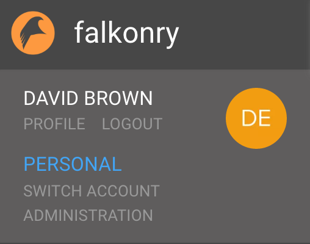
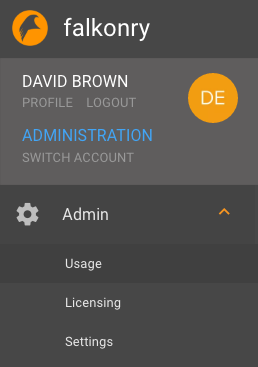
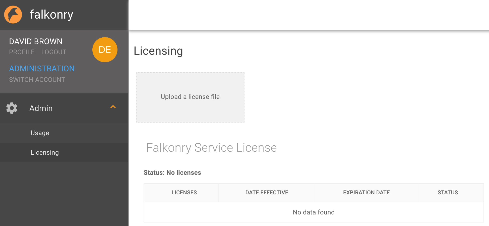
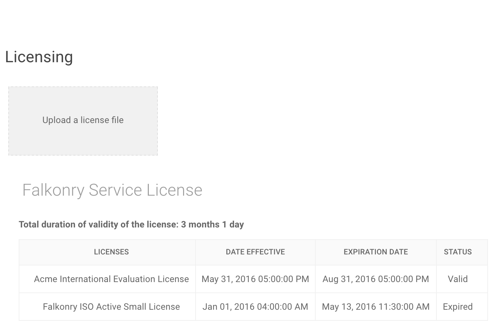

Service Administration
======================

All private deployments are administered by a single administrative user, which is the first 
user to log into the deployment. The administrative user logs in using the same login page as
non-administrative users.

Once the administrative user logs in, they are taken to their *Personal* account. However,
there is a menu option for the user to switch to Service *Administration* as shown in the 
screen below.

   
Clicking on the *Administration* link brings up a different menu that provide administration
options for the private deployment.

   
Within these options, the *Usage* link provides a list of all the accounts created in the
private deployment and the corresponding pipeline activity.

The *License* link provides a list of all the licenses applied to the private deployment
and a means of installing a new license.

.. note::

  A license key can be obtained from Falkonry pursuant to a commercial agreement. Once 
  you have a commercial agreement, you can request your Falkonry contact to provide you a
  suitable license file.
  
A license file has the extension `.license` and contains the following key pieces of 
encrypted information::

- Activation date
- Expiration date
- Licensee email information

Once you have obtained your license file, you can upload it to the server from the 
*License* menu. As soon as a valid license file is uploaded, the server will show the new
license details on the *License* menu.

