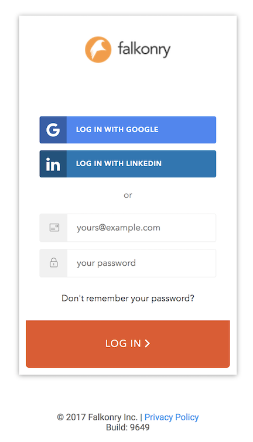
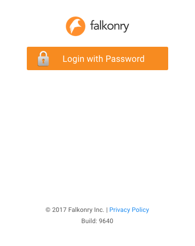
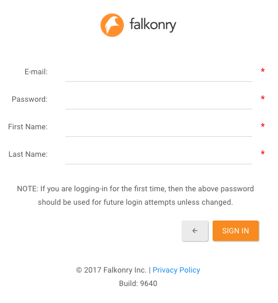
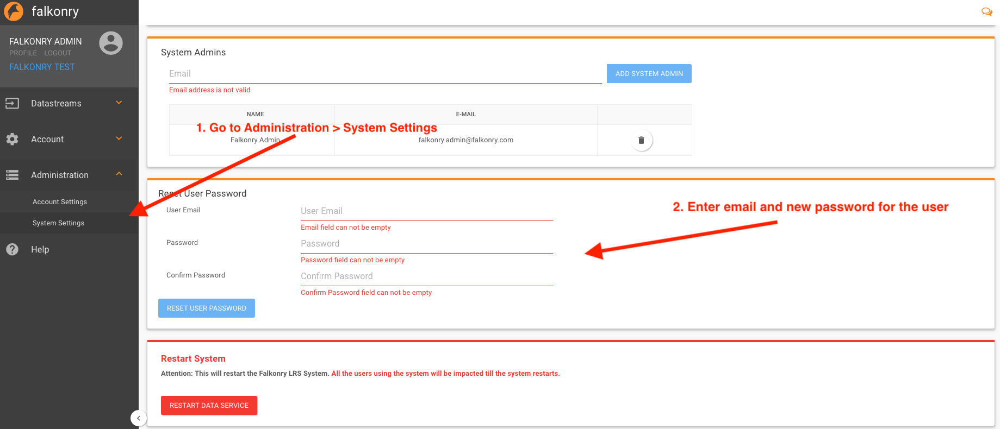
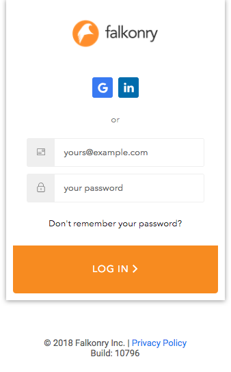
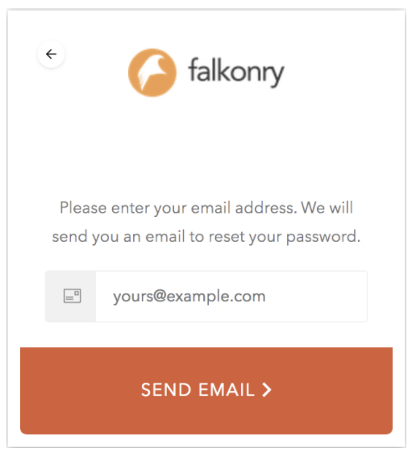
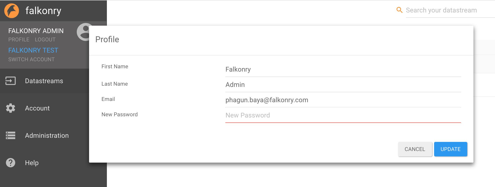

.. _account:

Account and User Management
============================

|   :ref:`Account Setup<account_setup>`
|   :ref:`Resetting Falkonry User password<password_reset>`
|   :ref:`Changing Password<password_change>`

.. _account_setup:

Invited Falkonry Account Setup
-------------------------------

Only the user who receives a personalized email invite from Falkonry can setup an account on Falkonry. Do not forward the Falkonry invitation email to others as it will not work for the other recipients. Once you setup your Falkonry account you will assigned an account administrator role, which allowsyou to invite other team members as users into your Falkonry account. If necessary, you can also assign other team members to be the administrators of your account.
Instructions to invite other team members to your Falkonry account : `Inviting team members <http://help.falkonry.com/en/latest/using/accounts.html>`_
Falkonry will present the following screen during signup.

Falkonry Cloud instance:
^^^^^^^^^^^^^^^^^^^^^^^^

When using the invitation link (from your email), this form will have you email address pre-populated. All you need to do is to set your password. You must remember the password you set on this screen.

 
Falkonry Local instance:
^^^^^^^^^^^^^^^^^^^^^^^^^

Once you select *Login with Password* local Falkonry instance will display:

During signup you will be asked for the password only once.  Please remember this password for your future logins into Falkonry.  If you use any other email id than where you received Falkonry invite, your signup will not work.

In the browser, type the Falkonry service URL supplied to you and signup using your email and a password.  If you still can’t signup, contact Falkonry customer support.

1. You did not receive the email even when the invitation is sent:
Use Falkonry service URL followed by “/signup” in your browser and signup using the email used in the Falkonry invite and a password.

2. If you still can’t signup, or do not have Falkonry service URL, for a local Falkonry instance contact your local Falkonry system administrator.
For Falkonry cloud instance contact Falkonry customer support.

Invited Falkonry User Setup
^^^^^^^^^^^^^^^^^^^^^^^^^^^^

Only the users who receive a personalized Falkonry email invite from Falkonry instance can setup their accounts on Falkonry.  Forwarding your user invite email to others will not work for the recipients.
Falkonry Cloud will present the following screen during signup.

**Falkonry local instance will display:**

**Once you select “Login with Password” local Falkonry instance will display:**

You will be asked for the password only once.  Please remember this password for your future logins into Falkonry.  If you use any other email id than where you received Falkonry invite, your signup will not work.

**When should I use “sign up with Google”?**

If the email service provider of your Falkonry invited email id is Google, then you can use “sign up with Google”.

**When should I use “sign up with LinkedIn”?**

If your Falkonry invited email is linked with LinkedIn profile then you can use “sign up with LinkedIn”.

.. _password_reset:

Falkonry User roles 
----------------------

    +-----------------+--------------------------------------------------------------------------------------------------------------------------------------------------------------+
    |  **Role**       |    **Description**                                                                                                                                           |
    +-----------------+--------------------------------------------------------------------------------------------------------------------------------------------------------------+
    |  View           |    With ‘View’ user role the user can perform view only operations in Falkonry LRS.                                                                          |
    |                 |    This role is very useful for people within organizations who just want to view and inspect Model and output generated by in house Falkonry LRS experts.   |
    |                 |    The user will not be able to perform any Falkonry LRS operations that create/update/delete data or models.                                                |
    +-----------------+--------------------------------------------------------------------------------------------------------------------------------------------------------------+
    |  User           |    User role includes all of ‘View’ role capabilities.                                                                                                       |
    |                 |    In addition, User role will be able to perform all activities related to datastream and models including generating authentication tokens required        |
    |                 |    for API integration. User role will not be able to any administration activities such as inviting other users, resetting other user's passwords           |
    |                 |    or changing user roles.                                                                                                                                   |
    +-----------------+--------------------------------------------------------------------------------------------------------------------------------------------------------------+   
    |  Admin          |    Admin role includes all of ‘User’ role capabilities.  In addition, Admin role will be able to invite new users into the Falkonry LRS account, change      |
    |                 |    roles of existing users, reset users’ passwords, or deactivate users.                                                                                     |
    +-----------------+--------------------------------------------------------------------------------------------------------------------------------------------------------------+

Resetting Falkonry User password 
---------------------------------

On-Prem installation
^^^^^^^^^^^^^^^^^^^^^

If your user account is on your own Falkonry On-Prem installation, only your instance Falkonry administrator can reset your password.  Falkonry cannot reset user passwords in this scenario.  To reset a user’s password in this case contact your Falkonry administrator.  Your Falkonry administrator should:

1. Login to Falkonry as a Falkonry administrator.
2. Select “System Settings” under “Administration” menu. (If you don’t see “Administration” menu, you don’t have administrator privileges).
3. In the “Reset User Password” section provide the “User Email”, and the new “Password” and confirm.
4. Select “RESET USER PASSWORD” button.
5. Notify the user of the new password using your organization security policies.

On Falkonry’s Cloud Instances
^^^^^^^^^^^^^^^^^^^^^^^^^^^^^^

1. On the login page click “Don’t remember your password?” link.
2. Provide your email id you used as Falkonry userid.  Falkonry will e-mail instructions to reset password.  Follow the instructions received in the email.

.. _password_change:

Changing Password
------------------

On-Prem installation
^^^^^^^^^^^^^^^^^^^^^

1. Select “Profile”
2. Provide your new password in this dialog window.

You can also update First Name, Last Name in this window.  Your Email cannot be updated.

On Falkonry’s Cloud Instances
^^^^^^^^^^^^^^^^^^^^^^^^^^^^^^

1. Follow the procedure for “Resetting Falkonry User password - On Falkonry’s Cloud Instances” changing your password.

For more details please contact Falkonry Support at <support AT falkonry>

