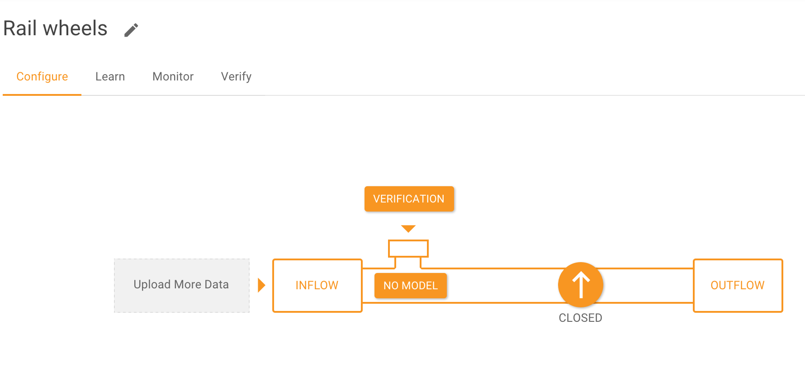

Managing Assessments
====================

The output from a *Pipeline* is a stream of conditions - for every point in time there is
a condition value for each *Assessment* in that Pipeline.  

Adding an assessment
--------------------

When a pipeline gets created, the user specifies an assessment they want it to produce.
However, a user may choose to produce more than one stream of conditions from the same or
a different subset of data in the same pipeline. For example, one assessment focuses on
the reliability of sensors whereas another focuses on operating mode.

It is easy to add multiple assessments and is done from the **Configure** tab of a 
pipeline. Subsequently, all model revisions will compute all the assessments configured
in the pipeline. Different results may be produced for different assessments, as different
verified examples are provided in each assessment.

.. raw:: html

   <iframe src="https://player.vimeo.com/video/168547756" width="500" height="281" frameborder="0" allowfullscreen=""></iframe>

Changing the signals used in an assessment
------------------------------------------

Just as it is possible to add assessments, a user can change the set of signals used in a
pipeline. This is done from the same place in the **Configure** tab where an edit tool is
available for each of the assessments. When an assessment is chosen to be edited, the user
can only change the list of signals used in the assessment. The user can choose any of the
signals defined in the pipeline to be included in the assessment.

Retrieving Assessment Data
--------------------------

Outflow from a Pipeline becomes available after that Pipeline has been put in a Live mode.
Output data can be retrieved from a Pipeline in three ways:

- via the API
- through the Falkonry Service UI
- through a client application like the Splunk App

Retrieving output via the Falkonry Service API
----------------------------------------------

The output retrieved from the API is in CSV form with a header row containing the 
following elements::

  time, ThingFieldName, end, AssessmentName

In the above header line, ``ThingFieldName``, and ``AssessmentName`` are replaced with the 
values configured for the Pipeline.  The subsequent rows then provide corresponding 
Assessment values for a given Thing at a given time.

The figure below shows a sample file from the Sports Activity Pipeline::

  time,value,suggestion,thing
  1447882550000,walking,0.0,p1
  1447882550040,walking,0.0,p1
  1447882550080,walking,0.0,p1
  1447882550120,walking,0.0,p1
  1447882550160,running,0.0,p1
  1447882550200,running,0.0,p1
  1447882550240,running,0.0,p1
  1447882550280,walking,0.0,p1

Retrieving output through the Falkonry Service UI
-------------------------------------------------

The Outflow tab of the Pipeline Details page provides a button to download Assessment 
results.

Retrieving output through a client application
----------------------------------------------

Output can also be retrieved through a client application like the Falkonry Splunk App. 
The Splunk App writes the output of the Pipeline into a Splunk source that the user can 
then search directly in Splunk.  The Splunk App provides convenient links to produce the 
search for a specific Pipeline.
