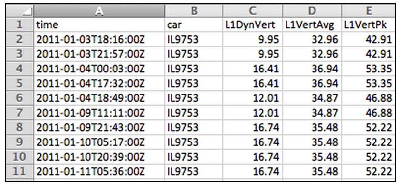
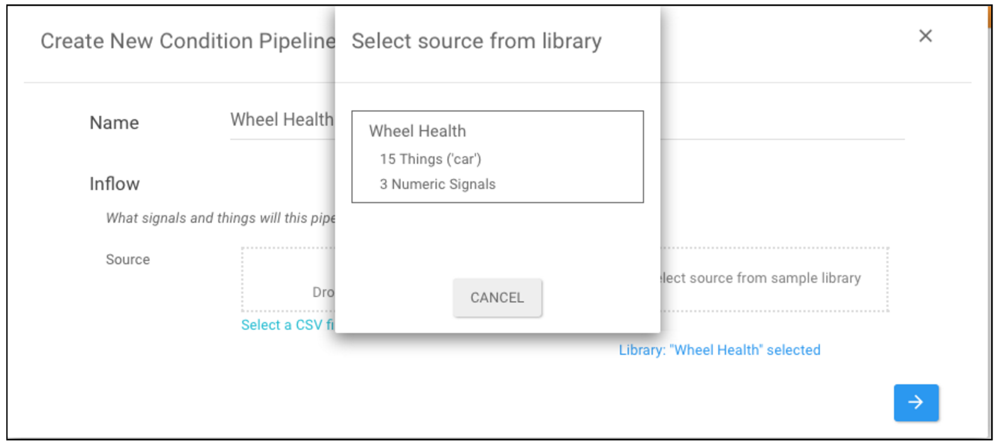
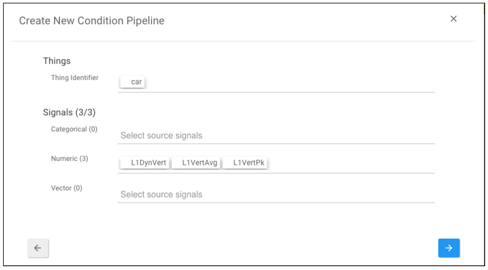
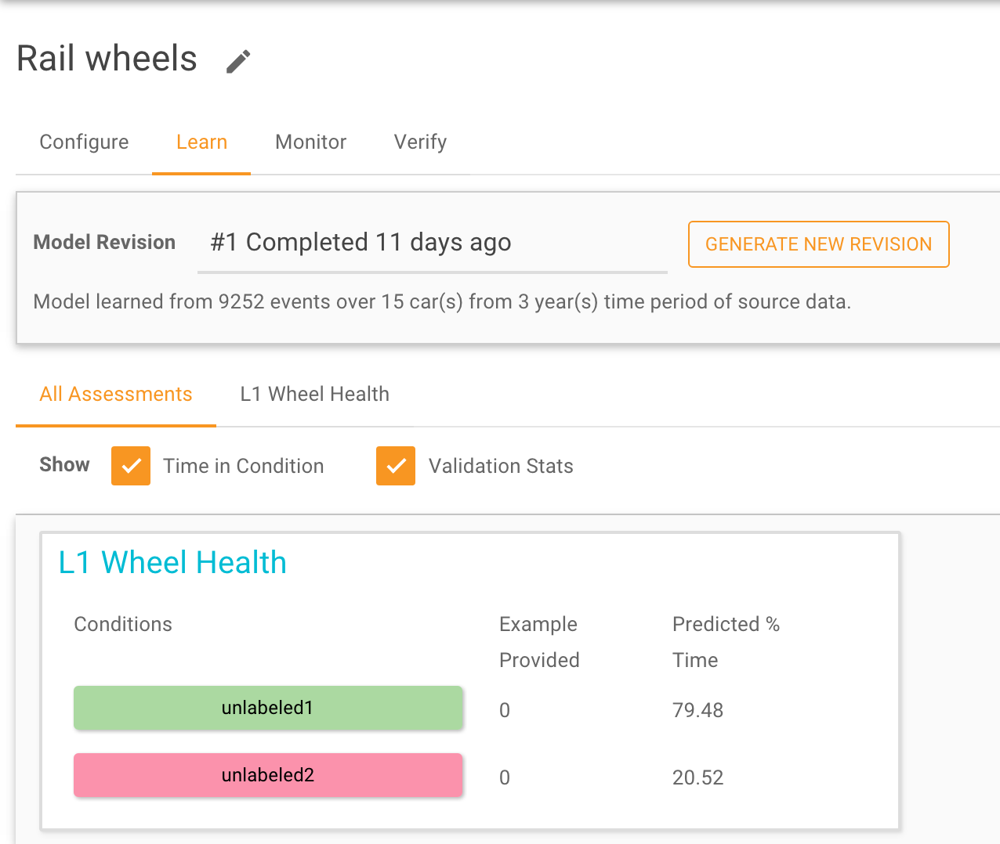
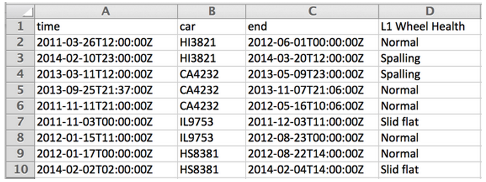
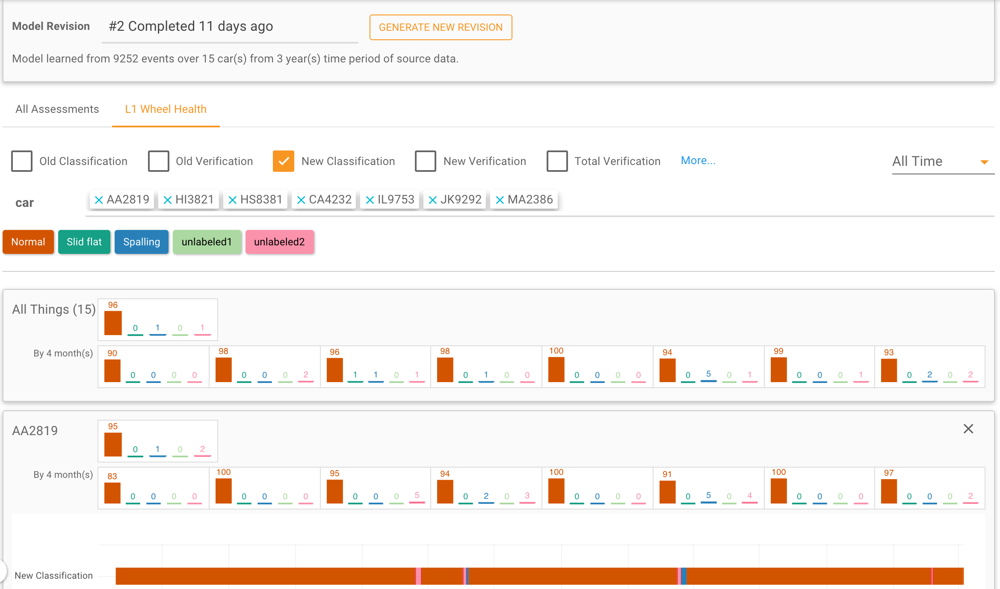

Pipeline Creation and Learning
==============================

In this section, we show how to create a Pipeline and execute the Guided Learning approach
using the Falkonry Service. We start with a source data set that has several months of 
wheel force data for a fleet of locomotives. Here is what the data looks like:

(1) Create a Prediction Pipeline

First, the user creates a Condition Pipeline that consumes the data set to produce a 
condition assessment stream, by specifying a data source and specifying which field in the 
data identifies the Things.

.. image:: ./images/pipeline_step1.png

(2) Start Learning

After creating the pipeline, the user instructs Falkonry to learn a prediction model from 
the data provided, and views the results.

Since no verified condition examples were provided, the pipeline was able to identify three 
different conditions in the data and give them placeholder names - ``unlabeled1`` and
``unlabeled2``.

(3) Add Verified Condition Examples

The user examines the available logs and is able to verify some example conditions for 4 
of the Locomotives.  The user adds these example conditions to the pipeline.

(4) Learn some more

The user initiates a model revision that will incorporate the provided verified conditions.

The new results show how the user provided conditions (Spalling and Slid Flat) are now 
predicted across the whole time window, across the fleet of locomotives.  At this point 
there are still a few conditions that are unrecognized and that maintain computer 
generated condition labels.

(5) Continued Learning and Live Monitoring

From the Configure tab, the user can choose to **Open Outflow**, in which case the most 
recent model revision is used to assess conditions in any existing or newly arriving data.

.. image:: ./images/pipeline_open.png

As soon as the user opens the outflow, live monitoring starts and assessments are produced
at the rate at which data arrives into the pipeline.  At any time, the user can initiate a
model revision and update the model used for live monitoring so that predictions can 
continue to improve.