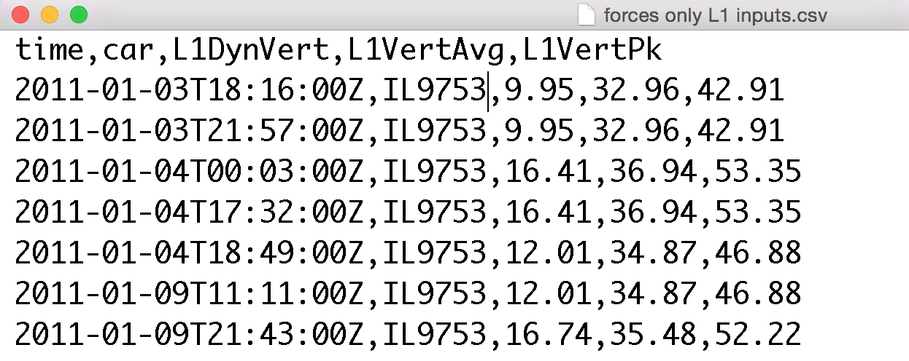

Transferring Data
=================

There are three methods by which Source Signal Data can be provided to a Falkonry Pipeline:

- File upload via `Falkonry Service UI <https://service.falkonry.io>`_ 
- Through a programmatic client using `Falkonry Prediction API <https://service.falkonry.io/api>`_
- Client application - like the `Falkonry Splunk App <http://falkonry.com/splunk>`_

File upload via Falkonry Service UI or API
------------------------------------------
During Pipeline creation, Falkonry will ask the user to upload a CSV file containing 
Source Signal data.  The file can be uploaded by either dropping the file on the UI or by 
navigating to and selecting the file in the file system. Falkonry will use this starting 
source data to begin the model creation.   Additionally, more input data can be added to 
the pipeline using a similar mechanism once the pipeline is live.  The data must be in a 
specific format.

The following figure shows part of a file in the appropriate structure.  The Thing field 
is named ``car``, and we have three signals ``L1DynVert``, ``L1VertAvg``, & ``L1VertPk``.

The three signals above were all of the *numerical* type.  Falkonry supports two types of 
source signals:

- Numerical: scalar value of any type of number
- Categorical: a label that can one of a set of options, represented with a string

More details regarding supported data formats such as CSV files can be found here_.

.. _here: dataformat.html

Sending data via a Client application like the Splunk App 
---------------------------------------------------------

A client application like the Splunk App allows a user to work with data in a familiar 
context and to use the app to send data to the Falkonry Service.   In the case of the 
Splunk App, a user gathers the source signal data they need through a standard Splunk 
search query.  The figure below shows the display of such a search in the Splunk App.

.. image:: ./images/splunk.png

 