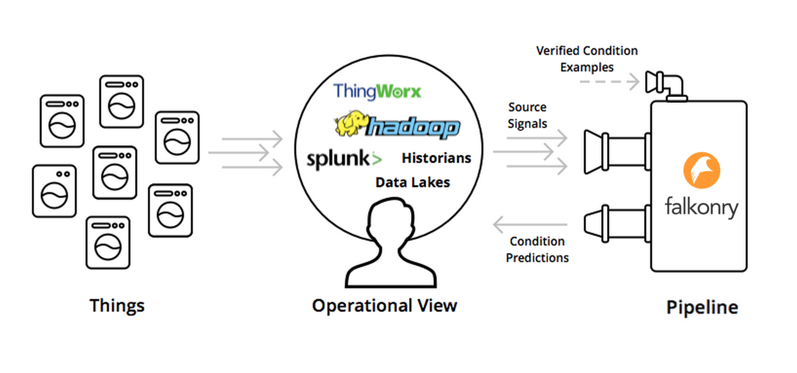

Falkonry Concepts
==============

Here's a quick overview of the basic elements of the Falkonry Service and concepts that
are referenced elsewhere in the documentation.

Things
------

Things are what they sound like - anything (e.g. an appliance, a device, a vehicle, a 
machine) that produce a stream of data through its operation.

Operational View
----------------

In the condition prediction context, there is an Operational View where a locus of 
information about the set of Things is managed.  It is from this view that the state of 
the Things is monitored and in some cases controlled.  

Event Buffer
------------

An *Event Buffer* is a logical or physical holding area in Falkonry for the operational data
being analyzed for patterns. An event buffer can receive data from a variety of sources,
both external and internal. External sources can be Falkonry connectors such as OSISoft PI,
Splunk, Azure IoT Hub, PubNub, and Falkonry client libraries such as for JavaScript, C#,
and Python. The only internal source that brings data into an event buffer is a pipeline,
described below, whose outflow can be dumped into an event buffer.

As operational data arrives in an event buffer, it is saved and available for use in
existing pipelines connected to the event buffer as well as for any future pipelines
created from the event buffer. 

Pipeline
--------

A *Pipeline* is the basic organizing unit in the Falkonry Service.  A pipeline receives
data from  an event buffer and this data flow is referred to as *Inflow*.  The output that 
is produced by the pipeline is referred to as *Outflow*.  In addition to Inflow/Outflow, a 
Pipeline also consumes *Verification* data in form of known condition examples. 

A Pipeline is what a user interacts with when using the Falkonry Service. The Pipeline 
augments the Operational View, by providing a stream of condition predictions in exchange
for a stream of signal data from Things.

.. image:: images/pipeline.png

A pipeline sets up an AI Assistant from accumulated operational data as well as applies an 
AI Assistant to live operational data and performs two basic functions: 
- Set up AI Assistant model from signal and verification data.
- Generate Operational Assessment by applying an AI Assistant model to live operational 
data to produce a stream of assessments.

When a pipeline is first created, it has no AI Assistant model and cannot produce any 
outflow. Once the pipeline is supplied signal data it can learn an AI Assistant with whatever 
verification data is available - even none. The result of the set up process is an AI 
Assistant model. Once this model is available, the pipeline can be Opened and assessments 
will flow out of the pipeline.  Any operational data that flows into the pipeline is 
available for improving the AI Assistant model at any time. Likewise, 
new verification data can be added at any time and is available for future improvements to
the AI Assistant.  A pipeline can carry out a process of continuous improvement by 
generating a sequence of improving AI Assistant and ‘hot-swapping’ those models into the 
real-time assessment flow.
   
Signal Data
-----------

The source signals provide to the Pipeline a stream of values over time, that can be 
indexed by the Thing identity.  At a given time, then, the Pipeline receives a set of 
signals (e.g. representing a set of sensor readings), and it can receive sets of signals 
for many individual Things.  The signals can be of three types:  numerical, categorical, 
and vector (a sequence of numerical values associated with one time point).

Condition Assessments
---------------------

Condition assessments are what the Pipeline produces.  Like the source signals, each 
condition assessment output is a stream of values over time that is indexed by the Thing 
identity.  The value type of an Assessment is categorial, where each potential value is a 
‘Condition’ associated with that Thing.  There can be multiple Assessments associated with
one type of Thing, e.g. a *Health Assessment* and an *Operating Mode Assessment*.

Verification Example Data
-------------------------

A Falkonry Pipeline learns by example, i.e. as verified condition states for Things are 
supplied, the Pipeline’s machine learning capabilities improve its condition predictions.  
These verified condition examples can come from periodic inspection reports, incident 
reports, or other forms of data collection.  The Pipeline can use verified conditions from 
individual Things to improve predictions across the entire set.
