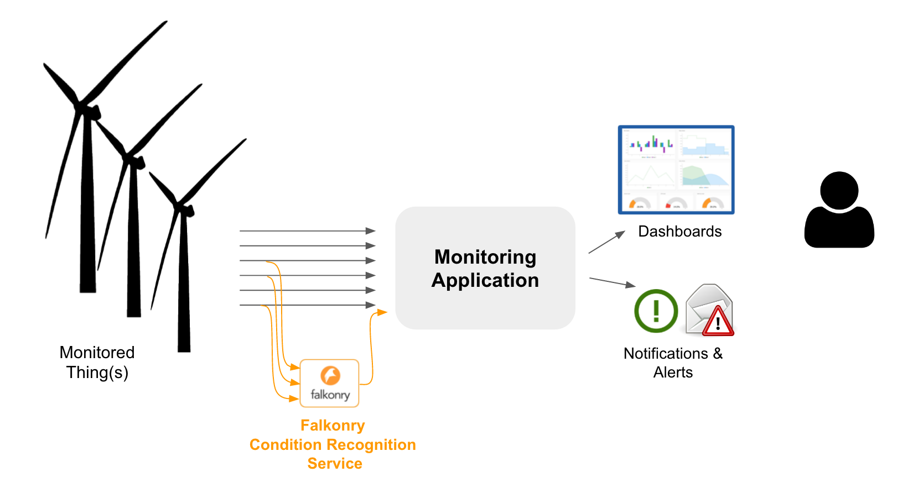
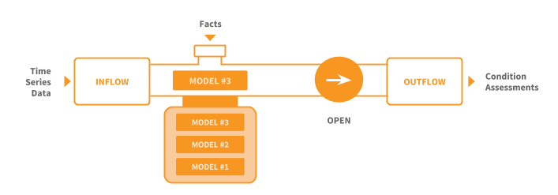

Falkonry Concepts
=================

Here's a quick overview of the basic elements of the Falkonry AI Assistant and concepts that
are referenced elsewhere in the documentation.

The Falkonry AI Assistant is used to extract a real-time understanding of condition from patterns in time series data. The most common use of the Falkonry AI Assistant is to provide intelligence to applications that are monitoring some Thing or set of Things.  
	   
Things
------

Things are what they sound like - anything (e.g. an appliance, a device, a vehicle, a 
machine, a person) that produce a stream of data through its operation.

Signals
-------

Time series data is represented in the Falkonry AI Assistant as a set of Signals. Each Signal represents a sequence of values over time that can be indexed by Thing.  Signals can carry either numerical or categorical values.

Conditions
----------

Conditions are what we are trying to extract from patterns found in time series data. This is typically a measure of the state of some Thing. Conditions could be used to represent health, operating mode, risk or threat level, quality level, or almost any form of condition classification.

Examples (Verification)
-----------------------

An example is a verified or known condition for a particular episode of time.  Examples can come from external sources, inspection reports, or investigations.  Example data typically becomes available after events have passed.

Learning
--------

The Falkonry AI Assistant is able to *Learn* a condition model from signal data and any examples of verified conditions.  The Falkonry AI Assistant is able to perform unsupervised, semi-supervised, and supervised learning on the supplied data to create a condition model.  When no examples are present, the model will recognize conditions and assign machine generated names. Examples aid learning, but there is no minimum numbers of examples that need to be supplied.  The Falkonry AI Assistant uses a continuous learning approach where models are revised over time as more signal data and examples are received.

Recognition
-----------

The application of a model to signal data to produce a condition assessment is called *Recognition*. The Falkonry AI Assistant supports real-time condition recognition on signal data.

Event Buffers and Pipelines
---------------------------

The Falkonry AI Assistant uses two primary building blocks - *Event Buffers* and *Pipelines*.

**Event Buffer**

An *Event Buffer* is a logical or physical holding area in Falkonry for the operational data
being analyzed for patterns. An event buffer can receive data from a variety of sources,
both external and internal. External sources can be Falkonry connectors such as OSISoft PI,
Splunk, Azure IoT Hub, PubNub, and Falkonry client libraries such as for JavaScript, C#,
and Python. The only internal source that brings data into an event buffer is a pipeline,
described below, whose outflow can be dumped into an event buffer.

As operational data arrives in an event buffer, it is saved and available for use in
existing pipelines connected to the event buffer as well as for any future pipelines
created from the event buffer. 

**Pipeline**

A *Pipeline* is the basic organizing unit in the Falkonry AI Assistant.  A pipeline receives
data from an event buffer and this data flow is referred to as *Inflow*.  The output that 
is produced by the pipeline is referred to as *Outflow*.  In addition to Inflow/Outflow, a 
Pipeline also consumes *Verification* data in form of known condition examples. 

A Pipeline is what a user interacts with when using the Falkonry AI Assistant. The Pipeline provides a stream of condition predictions in exchange for a stream of signal data from Things.

When a pipeline is first created, it has no model and cannot produce any outflow. Once the pipeline is supplied signal data it can learn a model with whatever example data is available - even none. Once this model is available, the pipeline can be Opened and condition assessments will flow out of the pipeline. A pipeline can carry out a process of continuous improvement by generating a sequence of improved model and ‘hot-swapping’ those models into the real-time assessment flow.
