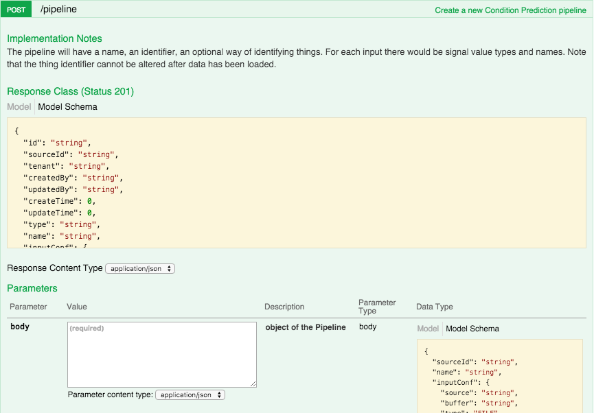
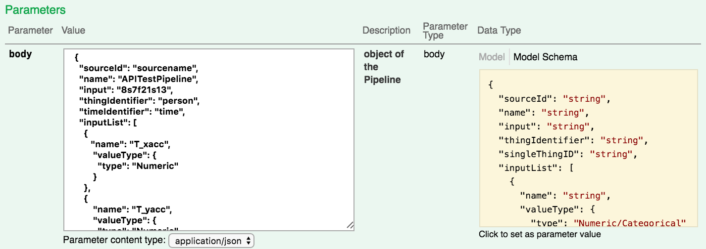

Create a New Pipeline
=====================

Although the pipeline lifecycle begins with the Pipeline creation, for ease of learning 
how to use the API functions we will examine the ``POST /pipeline`` call programmatically at 
the end of this document.  For now, let’s simply use an example pipeline definition in the 
`Interactive API Web page <live.html>`_ to set up the pipeline.  

Step 1. Copy the example pipeline JSON below

.. code-block:: json

    {
      "sourceId": "sourcename",
      "name": "APITestPipeline",
      "inputConf": {
        "type": "FILE"
      },
      "thingIdentifier": "person",
      "timeIdentifier": "time",
      "inputList": [
        {
           "name": "T_xacc",
            "valueType": {
              "type": "Numeric"
            }
        },
        {
            "name": "T_yacc",
            "valueType": {
              "type": "Numeric"
            }
        },
        {
            "name": "T_zacc",
            "valueType": {
              "type": "Numeric"
            }
        },
        {
            "name": "RA_xacc",
            "valueType": {
              "type": "Numeric"
            }
        },
        {
            "name": "RA_yacc",
            "valueType": {
              "type": "Numeric"
            }
        
        },
        {
            "name": "RA_zacc",
            "valueType": {
              "type": "Numeric"
            }
        },
        {
            "name": "LA_xacc",
            "valueType": {
              "type": "Numeric"
            }
        },
        {
            "name": "LA_yacc",
            "valueType": {
              "type": "Numeric"
            }
        },
        {
            "name": "LA_zacc",
            "valueType": {
              "type": "Numeric"
            }
        },
        {
            "name": "RL_xacc",
            "valueType": {
              "type": "Numeric"
            }
        },
        {
            "name": "RL_yacc",
            "valueType": {
              "type": "Numeric"
            }
        },
        {
            "name": "RL_zacc",
            "valueType": {
              "type": "Numeric"
            }
        },
        {
            "name": "LL_xacc",
            "valueType": {
              "type": "Numeric"
            }
        },
        {
            "name": "LL_yacc",
            "valueType": {
              "type": "Numeric"
            }
        },
        {
            "name": "LL_zacc",
            "valueType": {
              "type": "Numeric"
            }
         }
      ],
      "assessmentList": [
        {
          "name": "Activity",
          "inputList": [
             "T_xacc",
              "T_yacc",
              "T_zacc",
              "RA_xacc",
              "RA_yacc",
              "RA_zacc",
              "LA_xacc",
              "LA_yacc",
              "LA_zacc",
              "RL_xacc",
              "RL_yacc",
              "RL_zacc",
              "LL_xacc",
              "LL_yacc",
              "LL_zacc"
          ]
        }
      ],
      "interval": {
      }
    }

Step 2. Click on the function ``POST /pipeline`` to view the details

This API takes an input **body**, which is the JSON definition of the pipeline you are 
creating.  Copy and paste the contents of the JSON above into the box labeled **body**.

Later we will look at this JSON in more detail. For now, click the **Try it out** button 
to create the Pipeline. Go to your Falkonry UI to verify the pipeline was created.  You 
should see *“APITestPipeline”* in your list of pipelines along with whatever other pipelines 
you had created.

.. image:: ./images/pipelines.png

Notice that it has 15 input signals defined and one assessment.  

.. note::

  Unlike creating a pipeline via the Falkonry UI, this pipeline does not yet contain input 
  signal data or verification data.  Let’s next look at how you would add input data to 
  this pipeline.

