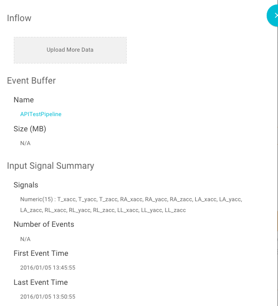
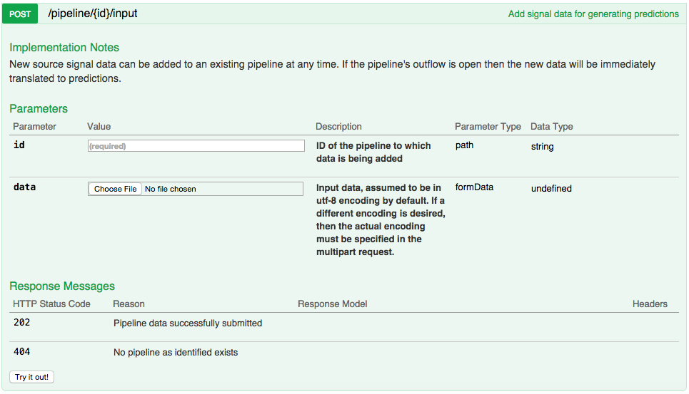
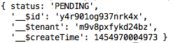
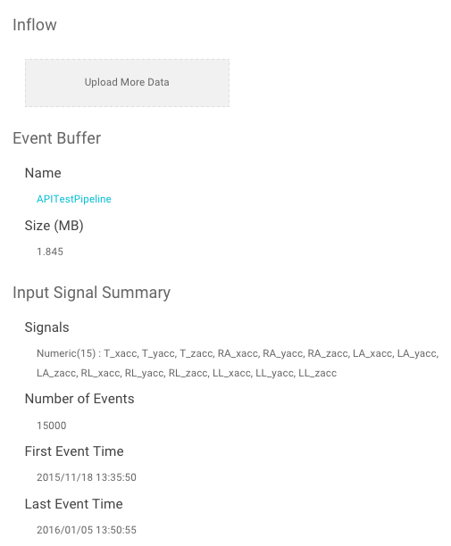

``POST /pipeline/{id}/input``
=============================

This API loads input data from a CSV file into a particular Falkonry pipeline.  The 
data can be the initial input data, or input data that you are adding later, possibly 
after one or more learning sessions.  This example assumes that you have an existing 
pipeline in Falkonry, created either by the UI or by invoking the API. As with adding data 
via the UI, the data must match what the pipeline is expecting.  In other words, the column 
names in the csv file must match the input signal names and thing identifier that you used 
to set up the pipeline.

.. image:: ../images/test-pipeline.png

For this example, a pipeline has been created from the API with no input data.  The 
pipeline creation specifies the names of the input signals, but as you can see by
clicking on the **Inflow** box, notice there are signals defined but no recorded Events.

Let’s take a look at ``POST /pipeline{id}/input`` on the API test webpage to get a 
sense of how it is used.

From this page we can see that the function takes two inputs: ``id`` and ``data``. The 
``id`` input is the pipeline ID which you can find on the pipeline **Configure** tab as 
shown in the previous section.  The ``data`` input is the CSV or JSON file which contains 
your signal data.  Now let’s look at an example in Javascript which creates and sends the 
HTTP POST request.

.. code-block:: javascript

    var unirest = require('unirest');

    var myPipelineId = "517cher3ptu1fm"
    var myToken = "m9v8pxfykd24bz"
    var myFile = "./test_source.csv"
    var url = "https://service.falkonry.io/pipeline/" + myPipelineId + "/input";

    var Request = unirest.post(url)
      .headers({
        'Authorization': 'Token ' + myToken,
        'Accept': 'application/json'
      }).attach("data", myFile) 
      .send()
      .end(function (response) {
        // check response and handle errors here
        console.log(response.body);
    });

The first line imports the ``unirest`` library which is used to facilitate writing HTTP 
requests. Notice the next lines with **myPipelineId** and **myToken**.  The values 
provided here are values that are specific to the pipeline instance used in this document 
and you will need to update these values with your own.  **myPipelineId** is simply the 
**ID** of your pipeline (and the id field referenced above).  **myToken** is an API token 
which is required as an authentication token on all programmatic API requests to Falkonry
Service that is further described at the `beginning of this chapter <../rest.html>`_.  
   
The next line declares the **myFile** variable.  Again, the value of this variable will 
change in your implementation to point to your data file.

The rest of the file uses the ``unirest`` object.  For detailed information on using the 
``unirest`` library please visit http://unirest.io/nodejs.html.  There are two Falkonry 
specific requirements on setting up the ``unirest.post()``.  The first is that the 
*Authorization* header containing the appropriate API token is set.  The second is that 
your file is attached to the post with the name ``data``.  This ``data`` field is the 
second input as outlined above on the Interactive API Web page.

.. note::

   The value of the Content-Type header should match the format of data that is used.
   For example, JSON files should be submitted under ``application/json`` and CSV under
   ``text/csv``.

Once you have your variables set up with the proper values, you can run the Javascript 
program from the ``node`` command line. For detailed information on using and running 
node.js, please visit https://nodejs.org/en/.

The javascript prints out the response to the console.  You should see something like below:

Now let’s look at the pipeline again in the Falkonry UI.  Click on the **Inflow** box in
the **Configure** tab and see that there are new Events

We have now successfully loaded the input signal data. 

