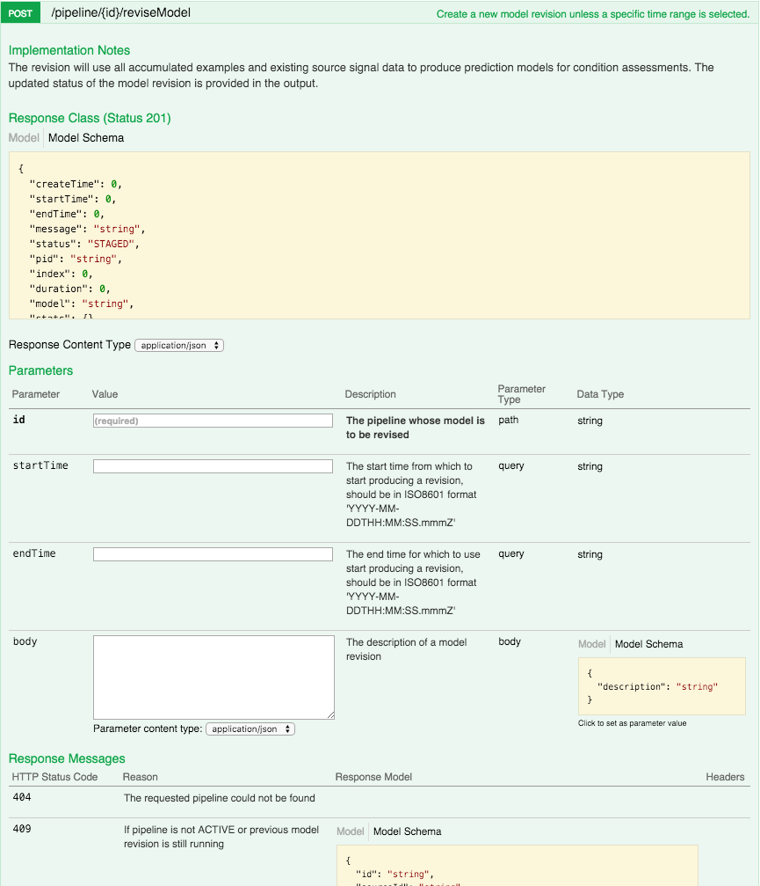

``POST /pipeline/{id}/reviseModel``
===================================

This API is used to initiate a learning cycle in the Falkonry Service.  It can be called 
before or after adding verification examples to a pipeline.  At the completion of a 
learning cycle, a new version of the model will be created.

In our current example, we have just added data to the pipeline but have not completed a 
learning cycle so there is not yet a model in the pipeline.  From the Falkonry Service UI, 
take a look at the **Learn** tab to verify that no model currently exists.

.. image:: ./images/before-revision.png

We are going to create a new revision using the Falkonry Service API. Let's take a look at
the API details for ``reviseMode`` on the Interactive API Web page.

The inputs are ``id``, ``startTime``, and ``endTime``. The ``id`` is the pipeline ID as 
before. The ``startTime`` and ``endTime`` parameters are inputs which specify the time 
segment of input data that you want considered in the learning cycle.  As shown on the 
web page, they should be in ISO8601 format 'YYYY-MM-DDThh:mm:ss.sssZ'. 

Now let’s take a look at some example Javascript code to invoke this API.

.. code-block:: javascript

    var unirest = require('unirest');

    var myPipelineId = "517cher3ptu1fm"
    var myToken = "m9v8pxfykd24bz"
    var myStartTime = "2016-01-05T21:45:55Z"
    var myEndTime = "2016-01-05T21:50:55Z"

    var url = "https://service.falkonry.io/pipeline/" + myPipelineId + "/reviseModel";

    var Request = unirest.post(url)
      .headers({
        'Authorization': 'Token ' + myToken
      }).query('startTime=' + myStartTime)
      .query('endTime=' + myEndTime)
      .send()
      .end(function (response) {
        console.log(response.body);
    });

The code is very similar to the previous example.  Notice the addition of the query 
parameters for ``startTime`` and ``endTime``.  As before, this example prints the response 
to the console.  You should see something like this.

Response:

.. image:: ./images/pending-revision.png

.. note::
   
   Running a learning cycle in Falkonry will take an amount of time that is correlated 
   with the amount and complexity of your data.  Longer time windows, many input signals, 
   and other things will result in longer processing times. Your application should take 
   this into consideration and check back at a later point to ensure the learning cycle 
   has finished and the new model revision is ready for use.
   
Let’s take another look at the Falkonry UI.  We can see now that model revision #1 exists.  
We have not yet added verification examples.  As a result during the learning cycle, 
Falkonry Service identified conditions and applied generated names to label them.
   
.. image:: ./images/revision.png
   
From here, let’s add some verification data to the pipeline.
   