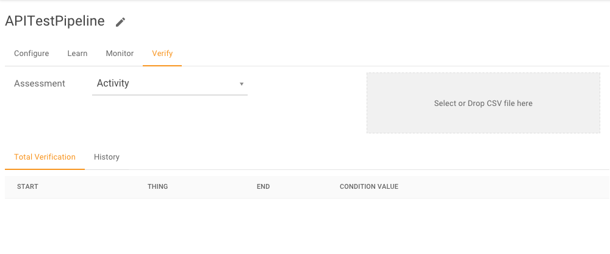
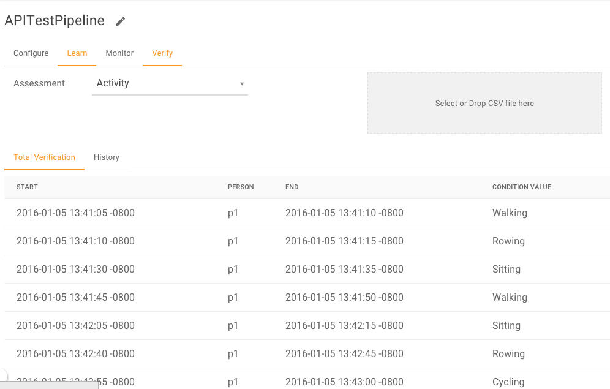

``POST /pipeline/{id}/verification``
====================================

This API loads example data from a csv file into a particular pipeline.  The columns of 
the csv file must match the thing identifier and the assessments which the pipeline is 
expecting.

In our example pipeline, we currently have no verification data loaded.  Click on the 
**Verify** tab in the Falkonry Service UI to confirm.

From the Interactive API Web page we can see that the use of this API is very similar to 
the input data function we used earlier.

.. image:: ./images/verify-pipeline.png

The function takes an input of ``id`` and ``data``. The ``id`` is the pipeline ID and 
``data`` is the location of the CSV or JSON file containing the examples. The Javascript 
code is very similar as well.

.. code-block:: javascript

    var unirest = require('unirest');

    var myPipelineId = "517cher3ptu1fm"
    var myToken = "m9v8pxfykd24bz"
    var myFile = "./test_verification.csv"

    var url = "https://service.falkonry.io/pipeline/" + myPipelineId + "/verification";

    var Request = unirest.post(url)
      .headers({
        'Authorization': 'Token ' + myToken,
        'Accept': 'application/json'
      }).query('startTime=' + myStartTime)
      .attach("data", myFile) 
      .send()
      .end(function (response) {
        // check response and handle errors here
        console.log(response.body);
    });

The values of ``myPipelineID``, ``myToken``, and ``myStartTime`` will vary for your 
implementation.

.. note::

   The value of the Content-Type header should match the format of data that is used.
   For example, JSON files should be submitted under ``application/json`` and CSV under
   ``text/csv``.

Return to the **Verify** tab in the Falkonry Service UI and notice that the verification 
data has been loaded.

From here, you would likely want to run another learning cycle to incorporate the known 
conditions into the model.  Refer to the previous example, ``POST /pipeline{id}/reviseModel``
for details on how to generate the new model revision.

Once we have the latest model, the next step might be to “open” the pipeline.  This puts 
the pipeline into the live state where it generates condition assessment output by 
applying the model to the input signal data.