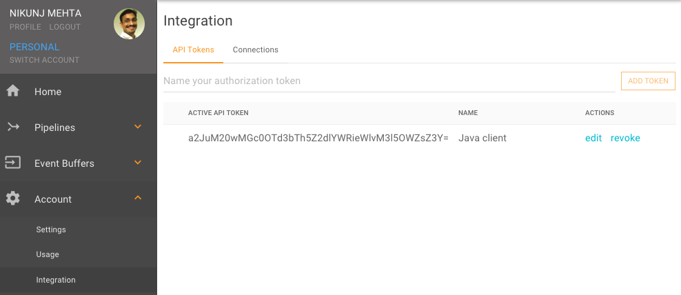

Falkonry REST API
=================

Introduction
------------

This document will focus on using the Falkonry REST API and will explore two different 
ways to access it: 

  - Support API page - This is an interactive web page which allows you to easily examine and test the various UI functions.
  - Programmatic API use - Use of the API programmatically from your application. 

API Authentication
------------------

When using the API programmatically, e.g., from the command line or from a Java 
application, you will need to use an API token obtained from the Falkonry Service UI. 

You can generate an API Token from the Account Settings for Integration. This screen
allows you to generate as many different tokens as you wish. The name of the token
is used to identify the user that performs API actions.

This token will be used in HTTP requests that are sent to Falkonry in the rest of this 
document. 

.. toctree::
   :maxdepth: 1
   
   api/live
   api/index
