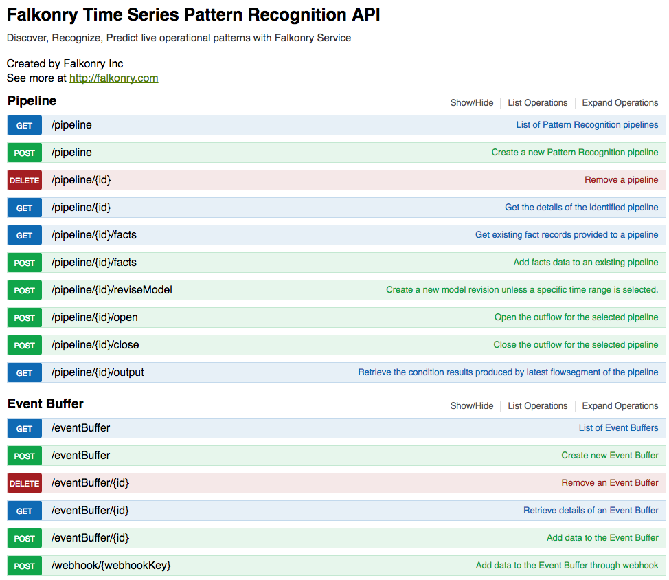
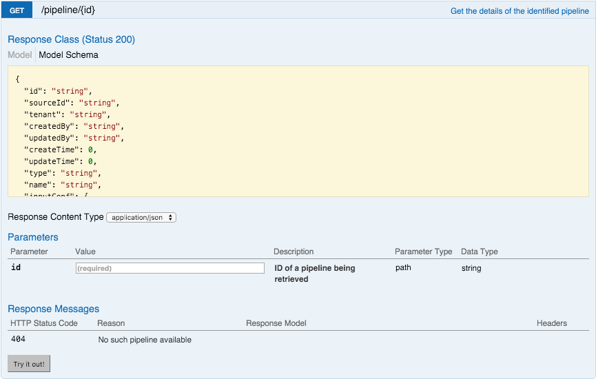
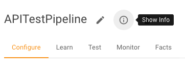
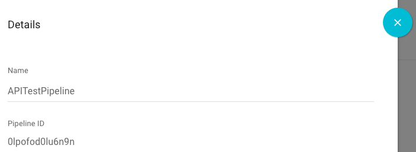
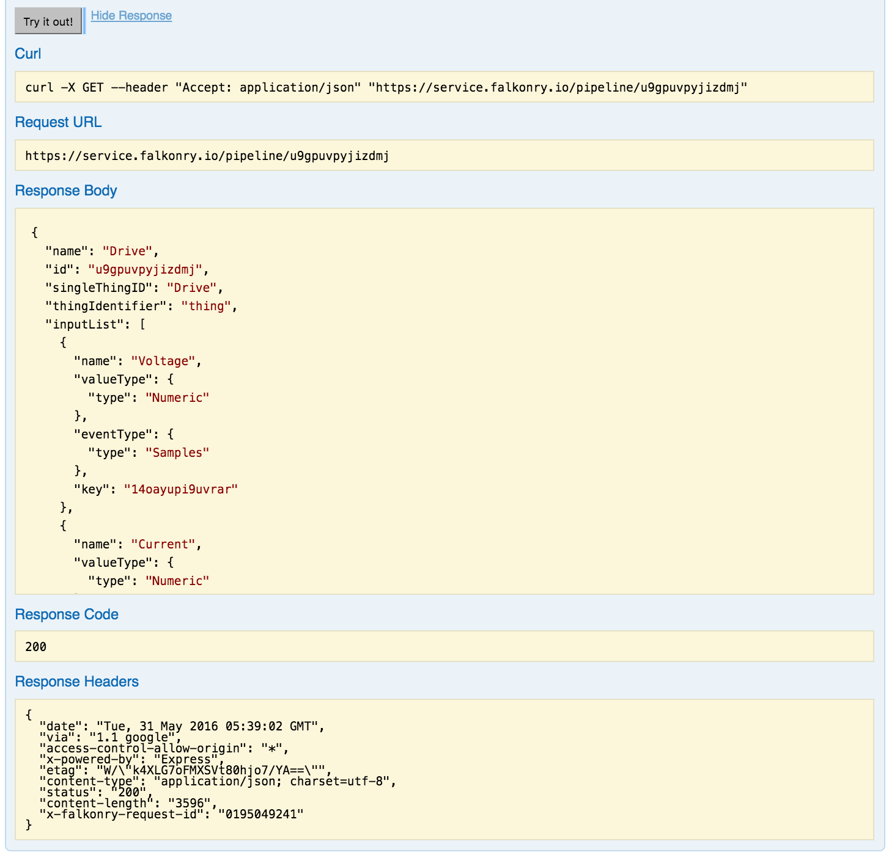

Interactive API page
~~~~~~~~~~~~~~~~~~~~

Let’s first examine the API through the `interactive Falkonry Service API web page 
<https://service.falkonry.io/api>`_.  This Web page lets you view the function inputs and 
outputs, get a sense of how to access these functions, and actually test the functions
interactively.  You will need to log in to the Falkonry Service before using this Web page. 
Once you have logged in you can view the detailed API and use the built-in forms to try 
the various functions.  From the API page click **Pipeline** and **Event Buffer** to expand 
the list of functions.

Notice that the functions support both design-time functions (such as ``POST /pipeline`` 
which creates a pipeline) and run-time functions (such as ``POST /eventBuffer/{id}``, 
which posts input data to an event buffer). 

**Example:** ``GET /pipeline/{id}``

To get a sense of what you can do with this web page, let’s look at one of these functions 
in detail. One of the most basic and easiest functions to understand is the one that 
retrieves all the information for a given pipeline. Click on the ``GET /pipeline/{id}``
function to view the details.  

As you can see from the expanded view, this HTTP GET API takes the pipeline id as an input.  
If the pipeline exists the function returns the JSON output describing the pipeline.  To 
test this function, locate the id of a Falkonry pipeline that you created previously:

 - Go to the Falkonry UI and click on the Pipeline
 - Click the **info** icon to find the Pipeline ID

Once you have the Pipeline ID, enter it into the **ID** value, then click **Try it out** to 
run the function.  This actually creates and sends the HTTP request to the Falkonry service 
using your login credentials and the pipeline id you provided.  If the pipeline is found, 
it displays the response as shown in the Response Body box.  

As you can see, this web page is a convenient way to quickly test API functions and 
familiarize yourself with how they are used. 
