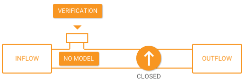
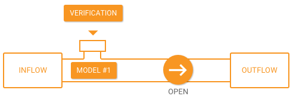

``POST /pipeline/{id}/open``
============================

Use this API to make the pipeline live for monitoring incoming data.  When the pipeline 
is open, it will be monitoring and assessing the incoming data, and producing the outflow 
of assessments. Before you open a pipeline, it must have one or more existing model 
revisions.  Let’s look at the pipeline in the Falkonry Service UI.  Open the **Configure** 
tab and notice the pipeline is in the **Closed** state.

Let’s look at the details of the open API in the Interactive API Web page.

.. image:: ../images/open-pipeline.png

The request requires the pipeline ``id`` and an optional ``modelRevision``. The pipeline 
ID will be used in the request URL and the ``modelRevision`` will be a query parameter.  
If ``modelRevision`` is not provided, Falkonry Service will use the latest completed model 
revision to open the pipeline.

The Javascript code will look something like this:

.. code-block:: javascript

    var unirest = require('unirest');
    var myPipelineId = "517cher3ptu1fm"
    var myToken = "m9v8pxfykd24bz"
    var myModelRevision = "1"

    var url = "https://sandbox.falkonry.ai/pipeline/" + myPipelineId + "/open";

    var Request = unirest.post(url)
      .headers({
        'Authorization': 'Token ' + myToken,
        'Accept': 'application/json'
      }).query('modelRevision=' + myModelRevision)
      .send()
      .end(function (response) {
        console.log(response.code);
        console.log(response.body);
    });

The values of ``myPipelineId``, ``myToken``, and ``myModelRevision`` should be set for 
your implementation.

When you run the above code you should see the ``response.code`` and ``response.body`` 
print to the console:

::

    201
    { createTime: 1455067089778,
      status: 'STAGED',
      index: 2,
      modelRevisionIndex: 1,
      startTime: 1452030055000,
      pid: 'zoy7h5d19kc7bv_omjkxv1gu0t54v' }

Now when we look at the pipeline in the Falkonry Service UI we can see that the pipeline 
is open with the Model revision #1. 

The pipeline is now ready to produce output data.  Your application will want to retrieve 
that data, so let’s take a look at how you would do that.
