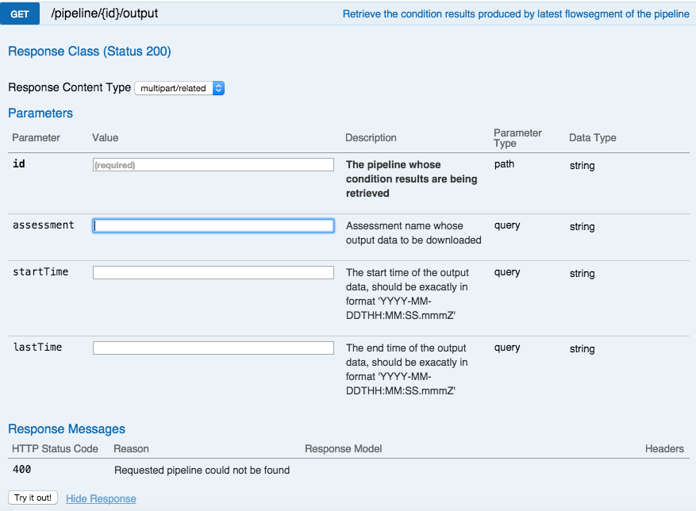
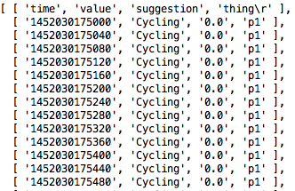

``GET /pipeline/{id}/output``
=============================

Use this function to programmatically examine the Outflow of the pipeline.  In order for a 
pipeline to have outflow for download it must:

 - be live (open) or have been live at some point
 - while live, data was added to the **Inflow**

The pipeline may be open or closed at the time you retrieve output.

Let’s look at this API on the Interactive API Web page.



Notice the inputs it takes: ``id``, ``assessment``, ``startTime``, and ``lastTime``.  As 
before, ``id`` is the pipeline ID. The ``assessment`` is the name of the Assessment in 
the pipeline for which you wish to download values.  It must match what has been set up 
in the pipeline. The ``startTime`` and ``lastTime`` are the start and end of the interval 
for which you wish to retrieve output data.  Note that 

.. note::

  If the time range is not explicitly identified, all the output data for the given 
  assessment will be retrieved.

Now let’s look at the Javascript code to achieve this:

.. code-block:: javascript

    var unirest = require('unirest');
    var parse = require('csv-parse');

    var myPipelineId = "517cher3ptu1fm"
    var myToken = "m9v8pxfykd24bz"
    var myAssessment = "Activity"
    var myStartTime = "2016-01-05T21:44:55Z"
    var myEndTime = "2016-01-05T21:45:00Z"

    var output = [];
    var url = "https://sandbox.falkonry.ai/pipeline/" + myPipelineId + "/output";

    var Request = unirest.get(url)
      .headers({
        'Authorization': 'Token ' + myToken,
        'Accept': 'application/json'
      }).query('startTime=' + myStartTime)
      .query('lastTime=' + myEndTime)
      .send()
      .end(function (response) {
        parse(response.body, {rowDelimiter: '\n'}, function(err, output){
          console.log(output);
       });
    });

The values of ``myPipelineID``, ``myToken``, ``myAssessment``, ``myStartTime``, and 
``myEndTime`` will be set for your own implementation.

The output data is returned in the response.body as JSON data because we specified the
``Accept`` header as ``application/json``. To retrieve the results as CSV, simply use the
value ``text/csv`` for this header. This code relies on the ``csv`` node.js package to 
easily parse data into CSV format.  For more information on the ``csv`` library, please 
visit http://csv.adaltas.com/parse/.  The ``response.body`` is read via the ``csv`` parser 
which creates a two dimensional array of the data..  The code above prints the array to 
the console.  You should see something like this:



After receiving the output data, your code would then inspect the array and act upon 
whatever conditions you are interested in.  Notice the first row of data contains the 
column headers.  To access the first time value *(1452030175000)* in the example above, 
you would use ```output[1][0]``.

Congratulations! you have successfully used the Falkonry API to create, configure, and 
run a Falkonry pipeline!
