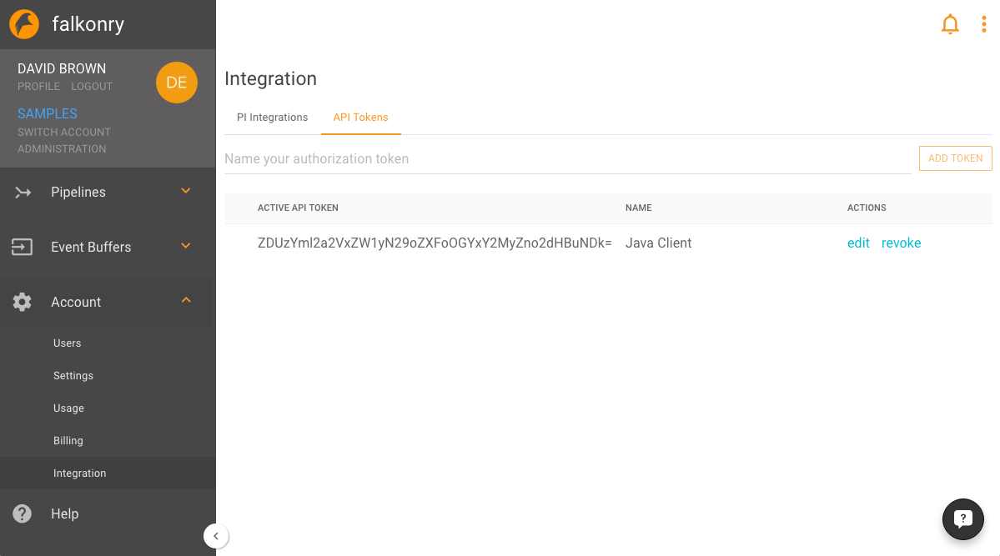

Deployment and Integration
==========================

REST API
--------

This document will focus on using the Falkonry REST API and will explore two different 
ways to access it: 

  - Falkonry Service API page - This is an interactive web page which allows you to easily 
    examine and test the various UI functions.
  - Programmatic API use - Use of the API programmatically from your application. 

When using the API programmatically, e.g., from the command line or from a Java 
application, you will need to use an API token obtained from the Falkonry Service UI. 

You can generate an API Token from the **Account** Settings for **Integration**. This screen
allows you to generate as many different tokens as you wish. The name of the token
is used to identify the user that performs API actions.

This token will be used in HTTP requests that are sent to Falkonry in the rest of this 
document. 

.. toctree::
   :maxdepth: 3
   
   api/live
   api/buffer/index
   api/pipeline/index

Prebuilt Connectors
-------------------

MQTT and AMQP Brokers
~~~~~~~~~~~~~~~~~~~~~

`MQTT <http://mqtt.org/>`_ is a widely-used, machine-to-machine (M2M)/"Internet of Things" connectivity protocol. The `Advanced Message Queuing Protocol (AMQP) <https://www.amqp.org/>`_ is an open standard for passing business messages between applications or organizations.

The Falkonry Service natively supports use of MQTT and AMQP brokers for inbound and outbound data communication. Configuration is straightforward - for inbound communication Event Buffers subscribe to a broker topic, and for outbound communication Pipelines can publish output to a broker topic.  See the following sections in the User Guide:

  - `Event Buffer Subscriptions <../using/eventbuffer.html#event-buffer-subscription-to-mqtt-broker>`_
  - `Publishing Pipeline Output <../using/configure.html#through-a-client-application>`_

Falkonry Splunk App
~~~~~~~~~~~~~~~~~~~

The Falkonry Splunk App allows existing `Splunk <http://www.splunk.com/>`_ customers to connect the Falkonry Service directly to Splunk so that the data in Splunk can be easily used with Falkonry to generate valuable condition assessments. The Splunk App (accessed within the Splunk application environment) will configure flow from Splunk to a Falkonry Event Buffer, and flow of condition assessment results back into Splunk.  The Falkonry Splunk App is available as a free download.

.. toctree::
   :maxdepth: 1
   
   ../splunk_app/setup.rst

Falkonry PI Integrator
~~~~~~~~~~~~~~~~~~~~~~

The `OSISoft PI System <http://www.osisoft.com/pi-system/>`_ is a suite of software products that are used for data collection, historicizing, finding, analyzing, delivering, and visualizing. It is marketed as an enterprise infrastructure for management of real-time data and events.  Falkonry provides a pre-built integrator for the PI System.  

.. toctree::
   :maxdepth: 1
   
   ./pi/example
   ./pi/index
   
Build Your Own Connectors
-------------------------

Who is it for?
~~~~~~~~~~~~~~

If you want to integrate your application directly with Falkonry, then you can use the 
Falkonry API or client libraries. 

.. note::

  Please remember that Falkonry API is a Beta Preview. Things are subject to change, and 
  there might be a few rough edges.

Before you can use the Falkonry API you must have a Falkonry account.  Create an account 
from the `Falkonry Website <http://falkonry.com/start>`_.  Additionally, this document 
assumes knowledge of `Falkonry AI concepts <../concepts.html>`_ and the Falkonry UI.  
   
Connector Technologies
~~~~~~~~~~~~~~~~~~~~~~

There are several ways to interact with the Falkonry service.  Whether you are 
creating a pipeline or uploading source data, you currently have a number of choices besides
the `Falkonry UI <../concepts.html>`_ and `Falkonry Splunk App <../splunk_app/index.html>`_:
      
.. toctree::
   :maxdepth: 3
   
   Falkonry Service Python Client Library <http://github.com/falkonry/falkonry-python-client>
   Falkonry Service JavaScript Client Library <http://github.com/falkonry/falkonry-js-client>
   Falkonry Service Java Client Library <http://github.com/falkonry/falkonry-java-client>
   Falkonry Service Csharp Client Library <http://github.com/falkonry/falkonry-csharp-client>

Data
----

Data Formats
,,,,,,,,,,,,

The currently supported data formats for exchange with Falkonry are CSV (comma separated
values) and line-delimited JSON_. 
Both formats are commonly used general purpose data exchange format allowing numerical, 
categorical, timestamp, and other types of data.  Both formats can be used to supply Input 
data (source signals) as well as facts data to Falkonry.

.. _JSON: http://jsonlines.org/

Falkonry data file requirements
~~~~~~~~~~~~~~~~~~~~~~~~~~~~~~~

CSV and JSON files for use with Falkonry have a few specific requirements.  Every file must have a 
timestamp column. Additionally, all the values used in the data file must have the same 
structure, i.e., the same set of attributes and their data types. Also, the file may 
contain UTF-8 characters, which is the encoding used for supplying data to Falkonry. 

Identifying time
~~~~~~~~~~~~~~~~

In Falkonry, every record is used to convey data for a single instant or interval of time. 
Therefore, timestamps must be present on every record provided to Falkonry, which also 
means that your CSV file must have a column representing the timestamp or a JSON property
containing a timestamp value. Within your data file the naming of the timestamp column is 
flexible; the time column will be identified during pipeline creation.

Your timestamp data can be specified using one of the following formats:

- ISO 8601 format. As you can see in this primer on the time format, you can identify timezones, sub-second precision, as well as the regular components on date and time.
- As a Unix-style long integer encoded as the number of seconds since Jan 1, 1970
- As a Unix-style long integer encoded as the number of milliseconds since Jan 1, 1970.
- 12/19/2014 11:22:00 or ``MM/DD/YYYY HH:mm:ss``
- 2015-02-03 12:55:03 or ``YYYY-MM-DD HH:mm:ss``
- Any timestamp format that can be described using `Java SimpleDateFormat 
  <https://docs.oracle.com/javase/7/docs/api/java/text/SimpleDateFormat.html>`_

When supplying facts data, you must also supply a second time column called end. 
This column is used to mark the end of the interval for which the record provides values.

Identifying entities
~~~~~~~~~~~~~~~~~~

Often your Falkonry data will correspond to more than one "entity", such as a process, a machine,
a device, a computer, or a subject.  You may have several turbofan motors that you are monitoring, 
or you may be collecting activity data from many people. If you have data for multiple entities, 
you must have a column of data which represents your entity identifier, or the entity must be 
part of a tag.  The column that is used to identify entities can be named as appropriate for the 
data set.  During pipeline creation, Falkonry will identify this column and the user will verify 
the selection.

Wide vs. Narrow
~~~~~~~~~~~~~~~

CSV and JSON data can each be formatted in wide or narrow format for the input data. Wide files contain one line for each timestamp that have all of the values whereas narrow files only have a single value per each line. Narrow files concatenate the variables into a single tag.

Input data
~~~~~~~~~~

Input data is used to create a pipeline as well as to add source signal data to an 
existing and live pipeline. The input data must contain the following columns: a single 
time column, an optional entity identifier, followed by one or more source signals. The 
header of the CSV file should reflect the appropriate column names. 

Wide format
...........

**CSV Example**

Data used in the Human Activity example looks like this::

  time, person, T_xacc, T_yacc, T_zacc
  1452030355080, p1, 7.9469, 0.29302, 5.604
  1452030356020, p1, 8.5439, 0.46781, 5.432

**JSON Example**

The same data but formatted in line-delimited JSON would appear like the following::

  {"time": 1452030355080, "person": "p1", "T_xacc": 7.9469, "T_yacc": 0.29302, "T_zacc": 5.604}
  {"time": 1452030356020, "person": "p1", "T_xacc": 8.5439, "T_yacc": 0.46781, "T_zacc": 5.432}
  
where ``1452030355080`` is the time value, ``p1`` is the person identifier, and so on.  
The columns after the person column are the raw source data or signal data which Falkonry 
inspects and monitors to provide meaningful condition assessments. The column names in the 
header can be anything, because the user identifies the time and entity columns for Falkonry when 
creating an event buffer.

Narrow Format
.............

**CSV Example**

In this format the Human Activity data would appear as::

  time, tag, value
  1452030355080, p1:T_xacc, 7.9469
  1452030355080, p1:T_yacc, 0.29302
  1452030355080, p1:T_zacc, 5.604
  1452030356020, p1:T_xacc, 8.5439
  1452030356020, p1:T_yacc, 0.46781
  1452030356020, p1:T_zacc, 5.432

**JSON Example**

Rows of data in a narrow JSON file would look like::

  {"time": 1452030355080, "tag": p1:T_xacc, "value": 7.9469}
  {"time": 1452030355080, "tag": p1:T_yacc, "value": 0.29302}
  {"time": 1452030355080, "tag": p1:T_zacc, "value": 5.604}
  {"time": 1452030356020, "tag": p1:T_xacc, "value": 8.5439}
  {"time": 1452030356020, "tag": p1:T_yacc, "value": 0.46781}
  {"time": 1452030356020, "tag": p1:T_zacc, "value": 5.432}

note that each line only has a single data value. 

The **Tag Field** in this case would be ``tag``, the concatenated variables person and sensor.

The **Signal Delimeter** is a ``:``, or what seperates the concatenated variables in the tag field.

The **Signal Location** is describing where the signal name is in the tag field. In the Human Activity example, the tag field contains the entity first, then the signal name (p1:T_xacc). Therefore the siganl location would be ``suffix`` because the signal name is at the end.

The **Value Field** is ``value`` or the location of the numerical or categorical readings.

Facts data
~~~~~~~~~~~~~~~~~

**CSV**

Facts data is used to provide feedback to the Falkonry learning process in order to 
supply condition names as well as to fine tune its findings. The facts data must 
contain a time column (for the interval start), an end column (which must be called "end"), 
an optional entity identifier, followed by one condition label. The header of the CSV file 
should reflect the appropriate column names. For example, facts data used for the Wheel Health
data contains the following header::

  time, unit, end, L1 Wheel Health

Note that both the entity identifier and the assessment identified in the header must match 
what has previously been set up in the pipeline.  It is possible to provide more than one 
assessment in the facts data set. Moreover, the values for the assessment are the 
names of condition that are desired to be used in the pipeline. For example, the following 
data from another data set conveys four different condition facts::

  time,unit,end,Reliability
  2015-04-22T19:54:02Z,PM-6428,2015-04-22T19:54:04.750Z,Base
  2015-04-22T19:54:05Z,PM-6428,2015-04-22T19:54:06Z,Production
  2015-04-22T19:54:10Z,PM-6428,2015-04-22T19:54:11Z,Production
  2015-04-22T19:54:30Z,PM-6428,2015-04-22T19:54:35Z,Dead Sensor

**JSON**

In line-delimited JSON, this data would appear like the following::

  {"time": "2015-04-22T19:54:02Z", "unit": "PM-6428", "end": "2015-04-22T19:54:04.750Z", "Reliability": "Base"}
  {"time": "2015-04-22T19:54:05Z", "unit": "PM-6428", "end": "2015-04-22T19:54:06Z", "Reliability": "Production"}
  {"time": "2015-04-22T19:54:10Z", "unit": "PM-6428", "end": "2015-04-22T19:54:11Z", "Reliability": "Production"}
  {"time": "2015-04-22T19:54:30Z", "unit": "PM-6428", "end": "2015-04-22T19:54:35Z", "Reliability": "Dead Sensor"}
  
Output data
~~~~~~~~~~~

Output data can be retrieved from a Falkonry pipeline using its API, or exported manually 
through the Falkonry UI, on the Outflow tab. The main purpose of this output data is to be 
able to view all the assessments and estimates for every entity and timestamp. The output 
data contains one time column, zero or one entity identifier, and one condition assessment.  
For example, the output data of the sports activity example contains the following header::

  time, person, Activity

Note that both the entity identifier and the assessment identified in the header will match 
what was previously been set up in the pipeline.  If the pipeline produces more than one 
assessment, then each will be present in this data set. Moreover, the values for the 
assessment are the names of conditions that were produced by the pipeline. For example, 
the following data is a snippet of the output from the sports activity pipeline::

  time, person, Activity
  1474866318337, p1, Sitting
  1474866328417, p1, Sitting
  1474866318217, p1, Walking
  1474866328897, p1, Rowing
  
In line-delimited JSON, this data would appear like the following::  
  
  {"time": "1474866318337", "person": "p1", "Activity": "Sitting"}
  {"time": "1474866328417", "person": "p1", "Activity": "Sitting"}
  {"time": "1474866318217", "person": "p1", "Activity": "Walking"}
  {"time": "1474866328897", "person": "p1", "Activity": "Rowing"}

Transferring Data
,,,,,,,,,,,,,,,,,

There are several methods by which Source Signal Data can be provided to a Falkonry Pipeline:

- File upload via `Falkonry Service UI <./pipeline.html>`_ 
- Through a programmatic client using `Falkonry API <../integration/index.html#rest-api>`_
- Through an MQTT broker using `event buffer subscriptions <../integration/index.html#mqtt-and-amqp-brokers>`_
- Client application - like the `Falkonry Splunk App <../splunk_app/setup.html>`_ and the `Falkonry Integrator for PI System <../integration/index.html#falkonry-pi-integrator>`_
- Through a Webhook integration using REST Gateways such as Kepware Server
- Through Azure IoT Hub
- Through Falkonry PubNub Block

Sending data via a Client application like the Splunk App 
~~~~~~~~~~~~~~~~~~~~~~~~~~~~~~~~~~~~~~~~~~~~~~~~~~~~~~~~~~

A client application like the Splunk App allows a user to work with data in a familiar 
context and to use the app to send data to the Falkonry Service. 

.. image:: ./images/splunk.png

With the Splunk App, a user gathers the source signal data they need through a standard 
search query.  The figure below shows the display of such a search in the Splunk App. Once
the data has been located, the user creates an event buffer in the App and then uses the
event buffer in the Falkonry Service to create pipelines.

.. image:: ./images/splunk_export.png

