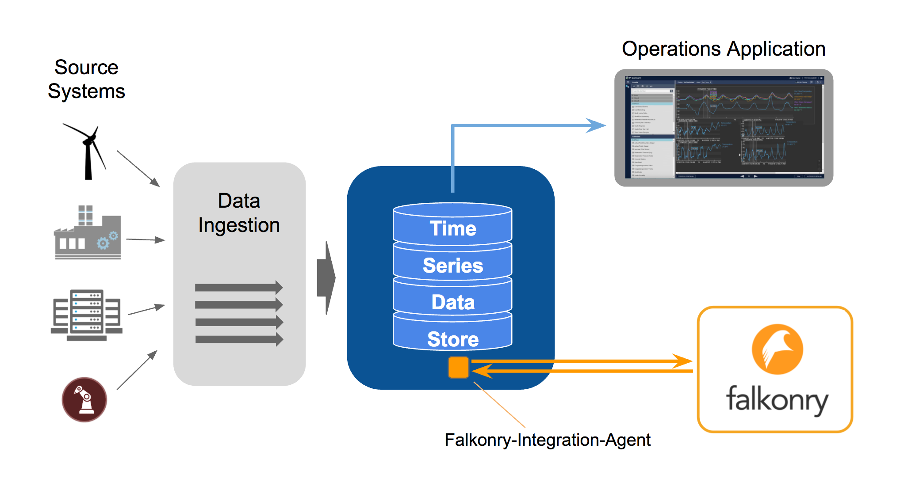
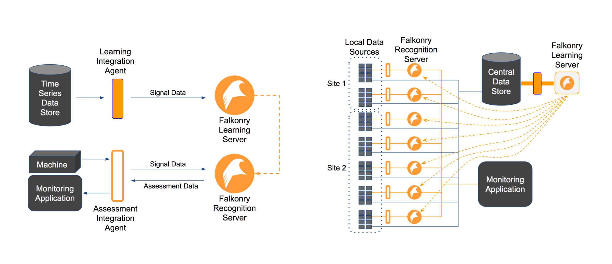

Deployment and Integration
==========================

Solution Architecture
---------------------
The Falkonry Pattern Recognition System is a key component in many different types of operations management and monitoring solutions. The figure below shows the the high-level structure of a typical solution. The Falkonry System can be dropped into an existing operations management solution or it can be designed in at the start. 

An operations management solution contains the following elements:

  - **Data ingestion**: Extraction of data from source systems (PLCs, Servers, Sensors,...)
  - **Data storage/query/search**: After ingestion some portion of the data is stored and made available for application use. The types of data storage components used includes:
    
    - Process historians (e.g. OSISoft PI, Aspentech InfoPlus.21, GE Historian or Wonderware Historian)
    - Time series oriented Data platforms (e.g. Splunk, ELK, Sumo Logic)
    - SQL databases 
    - Other time series or big data oriented DBs (e.g. InfluxDB, Cassandra, HDFS)
  - **Operations application(s)**: Operations management applications can have many purposes, e.g. safety, downtime avoidance, preventative maintenance, yield and efficiency optimization, security management. Applications could involve simple rule-based alerts and dashboards, or they could involve more complicated logic and integration with other enterprise systems.
  - **Falkonry Integration Agent**: This Agent typically is deployed near the data storage component of the solution, and is responsible for controlling interactions with the Falkonry Server. (see Falkonry Integration Agents).
  - **Falkonry Server**: In a typical configuration (see Advanced Falkonry Configurations), a single Falkonry Server is responsible for building pattern recogintion models and applying those models to live streams of data. The Falkonry Server is delivered as self-contained SaaS application that can be easily deployed on premise or in cloud environments from providers like Microsoft Azure, Oracle Cloud, Google Compute Engine, or Amazon Web Services (see Falkonry Server environments).

Falkonry Integration Agents
---------------------------
A Falkonry Integration Agent bridges interactions between the time series data storage component and the Falkonry Server. There are four primary interactions that the agent needs to support:

  - **Create Datastream**: Create a Falkonry Datastream to produce a set of Assessments for a given set of Signals and Entities.
  - **Send History Window**: Data communicated to Falkonry to enable learning of pattern recognition models.
  - **Send Streaming Data**: This amounts to forwarding newly received data to Falkonry for Assessment.
  - **Get Assessment Results for History Window**: In many cases there is a desire to store the Assessment results generated by Falkonry for the provided History Window (this is often referred to as backfill).
  - **Get Live Assessment Results**: Listens for live Assessment results produced by Falkonry.

There is a growing list of pre-built Integration Agents for data storage products like OSISoft PI and Splunk, and there are several downloadable Agent Dev Kits that make construction of Agents for any storage system relatively easy.

Pre-Built Integration Agents
~~~~~~~~~~~~~~~~~~~~~~~~~~~~
Pre-built Agents are currently available for:

  - OSISoft PI
  - Splunk

Agent Dev Kits
~~~~~~~~~~~~~~
Falkonry provides Agent Dev Kits that facilitate rapid construction of Agents for any time series data storage system. These kits are provided as free and open-source software (FOSS) in a variety of programming languages. Currently available Dev Kits include:

  - C# Falkonry Agent Dev Kit
  - Java Falkonry Agent Dev Kit
  - Python Falkonry Agent Dev Kit
  - Javascript Falkonry Agent Dev Kit

Stand-alone Mode for Falkonry Server
------------------------------------
To facilitate exploration of pattern recognition from historical data, the Falkonry Server can be used in 'Stand-alone' mode. In this mode, a user can manually create Datastreams and can upload historical window data via files. The user can execute all functions of the Falkonry Server except for live streaming.

Data Formats for Stand-alone Mode
,,,,,,,,,,,,,,,,,,,,,,,,,,,,,,,,,

Falkonry upload of files in CSV (comma separated values) and line-delimited JSON_ formats. Every file must have a timestamp column. Additionally, all the values used in the data file must have the same structure, i.e., the same set of attributes and their data types. Also, the file may contain UTF-8 characters.

.. _JSON: http://jsonlines.org/

Identifying time
~~~~~~~~~~~~~~~~

In Falkonry, every record is used to convey data for a single instant or interval of time. 
Therefore, timestamps must be present on every record provided to Falkonry, which also 
means that your CSV file must have a column representing the timestamp or a JSON property
containing a timestamp value. Within your data file the naming of the timestamp column is 
flexible; the time column will be identified during pipeline creation.

Your timestamp data can be specified using one of the following formats:

- ISO 8601 format. As you can see in this primer on the time format, you can identify timezones, sub-second precision, as well as the regular components on date and time.
- As a Unix-style long integer encoded as the number of seconds since Jan 1, 1970
- As a Unix-style long integer encoded as the number of milliseconds since Jan 1, 1970.
- 12/19/2014 11:22:00 or ``MM/DD/YYYY HH:mm:ss``
- 2015-02-03 12:55:03 or ``YYYY-MM-DD HH:mm:ss``
- Any timestamp format that can be described using `Java SimpleDateFormat 
  <https://docs.oracle.com/javase/7/docs/api/java/text/SimpleDateFormat.html>`_

When supplying facts data, you must also supply a second time column called end. 
This column is used to mark the end of the interval for which the record provides values.

Identifying entities
~~~~~~~~~~~~~~~~~~

Often your Falkonry data will correspond to more than one "entity", such as a process, a machine,
a device, a computer, or a subject.  You may have several turbofan motors that you are monitoring, 
or you may be collecting activity data from many people. If you have data for multiple entities, 
you must have a column of data which represents your entity identifier, or the entity must be 
part of a tag.  The column that is used to identify entities can be named as appropriate for the 
data set.  During pipeline creation, Falkonry will identify this column and the user will verify 
the selection.

Wide vs. Narrow
~~~~~~~~~~~~~~~

CSV and JSON data can each be formatted in wide or narrow format for the input data. Wide files contain one line for each timestamp that have all of the values whereas narrow files only have a single value per each line. Narrow files concatenate the variables into a single tag.

Wide format
...........

**CSV Example**

Data used in the Human Activity example looks like this::

  time, person, T_xacc, T_yacc, T_zacc
  1452030355080, p1, 7.9469, 0.29302, 5.604
  1452030356020, p1, 8.5439, 0.46781, 5.432

**JSON Example**

The same data but formatted in line-delimited JSON would appear like the following::

  {"time": 1452030355080, "person": "p1", "T_xacc": 7.9469, "T_yacc": 0.29302, "T_zacc": 5.604}
  {"time": 1452030356020, "person": "p1", "T_xacc": 8.5439, "T_yacc": 0.46781, "T_zacc": 5.432}
  
where ``1452030355080`` is the time value, ``p1`` is the person identifier, and so on.  
The columns after the person column are the raw source data or signal data which Falkonry 
inspects and monitors to provide meaningful condition assessments. The column names in the 
header can be anything, because the user identifies the time and entity columns for Falkonry when 
creating an event buffer.

Narrow Format
.............

**CSV Example**

In this format the Human Activity data would appear as::

  time, tag, value
  1452030355080, p1:T_xacc, 7.9469
  1452030355080, p1:T_yacc, 0.29302
  1452030355080, p1:T_zacc, 5.604
  1452030356020, p1:T_xacc, 8.5439
  1452030356020, p1:T_yacc, 0.46781
  1452030356020, p1:T_zacc, 5.432

**JSON Example**

Rows of data in a narrow JSON file would look like::

  {"time": 1452030355080, "tag": p1:T_xacc, "value": 7.9469}
  {"time": 1452030355080, "tag": p1:T_yacc, "value": 0.29302}
  {"time": 1452030355080, "tag": p1:T_zacc, "value": 5.604}
  {"time": 1452030356020, "tag": p1:T_xacc, "value": 8.5439}
  {"time": 1452030356020, "tag": p1:T_yacc, "value": 0.46781}
  {"time": 1452030356020, "tag": p1:T_zacc, "value": 5.432}

note that each line only has a single data value. 

The **Tag Field** in this case would be ``tag``, the concatenated variables person and sensor.

The **Signal Delimeter** is a ``:``, or what seperates the concatenated variables in the tag field.

The **Signal Location** is describing where the signal name is in the tag field. In the Human Activity example, the tag field contains the entity first, then the signal name (p1:T_xacc). Therefore the siganl location would be ``suffix`` because the signal name is at the end.

The **Value Field** is ``value`` or the location of the numerical or categorical readings.

Falkonry Server Environments
----------------------------
A Falkonry Server instance runs in a clustered compute environment. This enviroment can be located on premise or in the cloud. In all cases, Falkonry monitors and maintains the health of the instance and manages software upgrades. The Falkonry Server instance only requires outbound internet connectivity. There are two types of compute environments preferred for deployment:

  - VPC deployment in supported cloud vendor environments (in customer managed account): Oracle Bare Metal Cloud, Microsoft Azure, Google Compute Engine
  - Pre-configured appliance delivered to customer site: Falkonry is partnered with hardware vendors to provide Falkonry-in-box. Customer provides power & network connectivity.

A Falkonry Server instance can be installed on customer provided hardware or virtualized environments in certain circumstance. Please contact us if you believe you will need to deploy in this manner <info@falkonry.com>.

Advanced Falkonry System Configurations
--------------------------------
As mentioned previously, the Falkonry System is typically deployed via a single Falkonry Server that is responsible for learning models and applying those models to recognize patterns in live streaming data. There are some circumstances where it is advantageous to divide learning and live recognition responsibilities across a set of Falkonry Server instances. In such a configuration, models can be learned in one server and then be delivered to other servers for purposes of live recognition.

Drivers for a distributed configuration include:

  - Optimization of resource usage: Learning activities are infrequent but consume large amounts of CPU and RAM. Live recognition requires a steady but smaller allocation of resources.
  - Performance enhancement: Separating responsibilties allows the real-time recognition capabilities to be moved out to the edge to reduce latency.
  - Isolation and control: In some enviroments, real-time flow components are highly isolated from user interaction and more strictly controlled in their behavior. Use of a Recognize-only Falkonry Server near the data source makes it easy to support these types of requirements.
