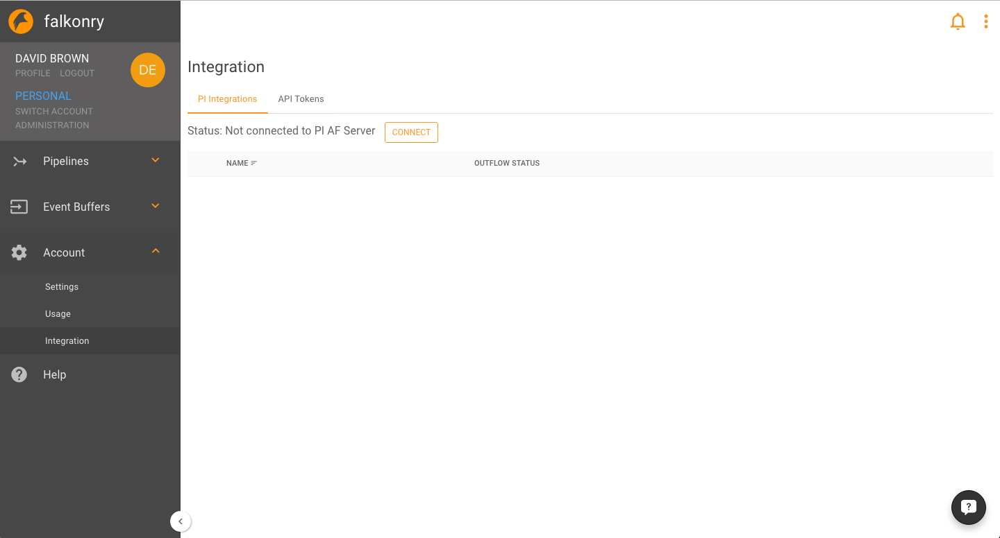
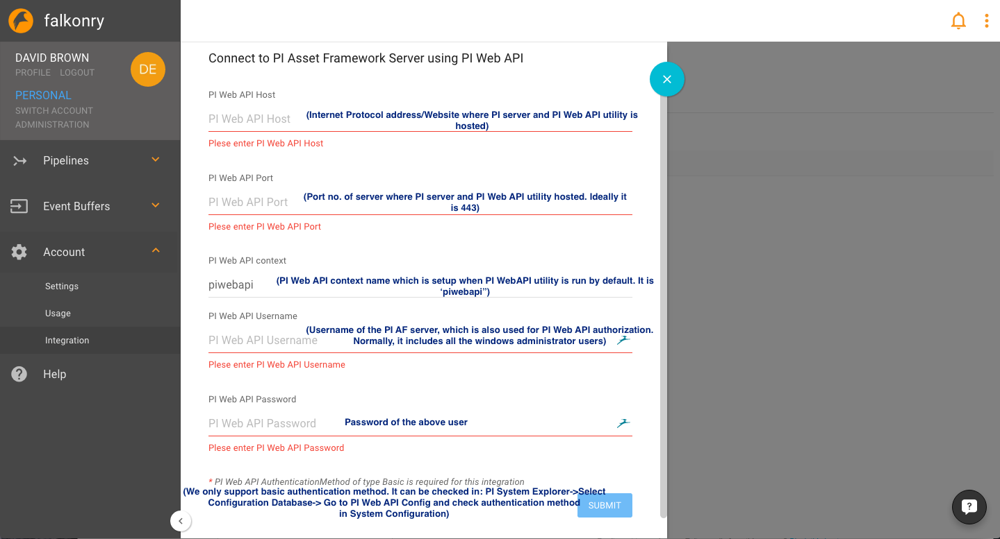
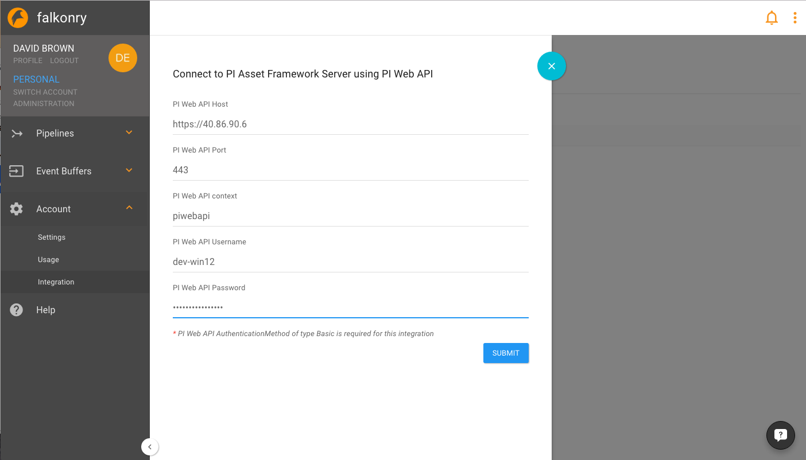
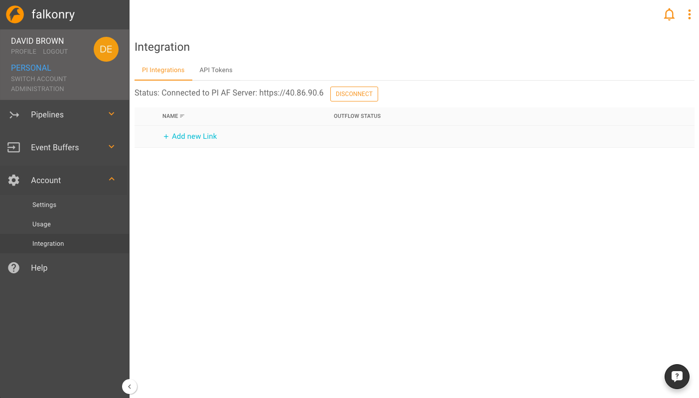
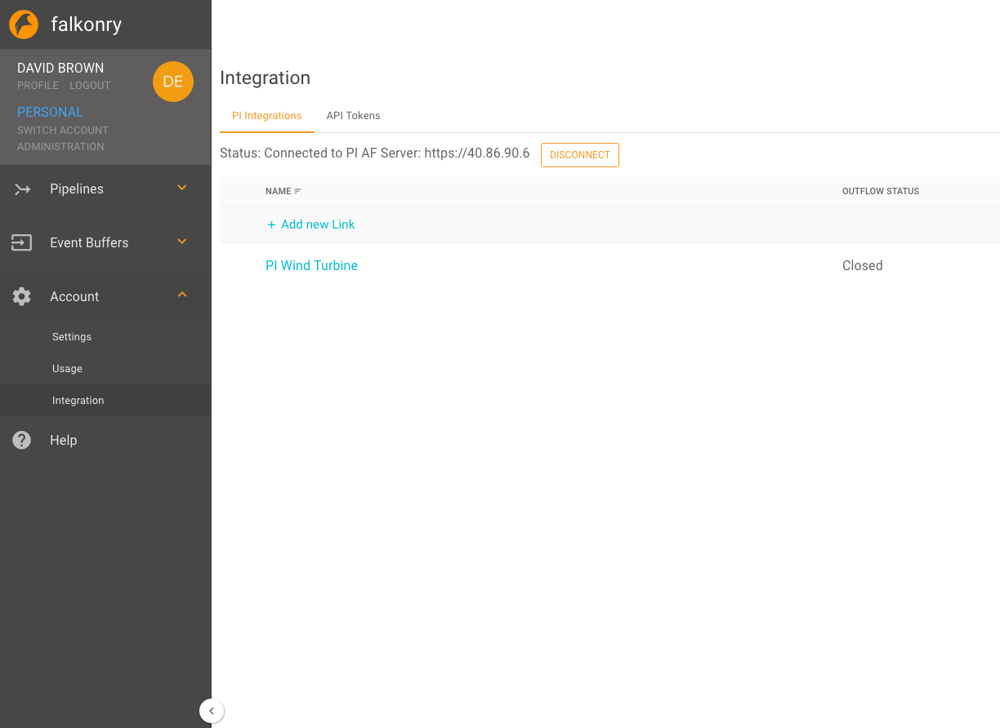
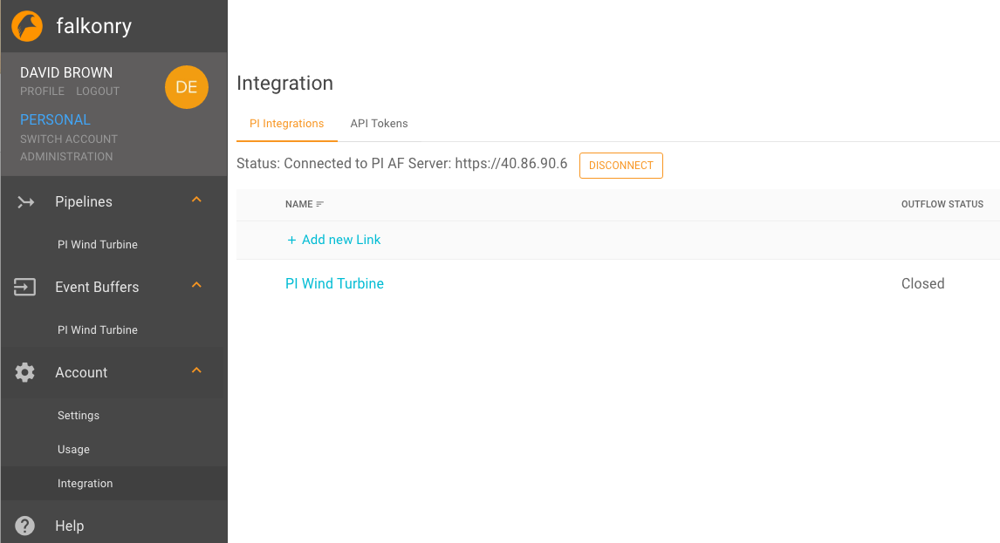
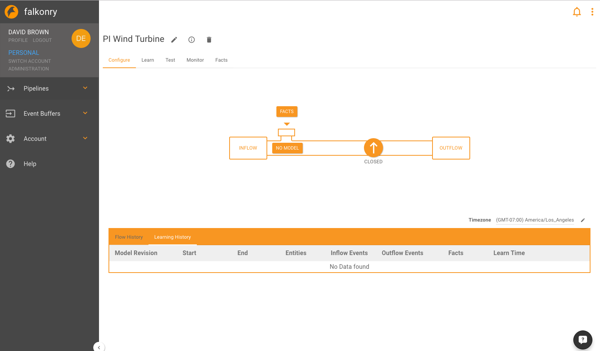

Setting Up The Falkonry PI Integration
======================================

Prerequisites for using PI with Falkonry
----------------------------------------

Here are the required setup of the PI System:

- PI Web API configured with the expected AF server.
- Port 443 should be accessible from the Falkonry Service on the host where PI Web API is running.
- Basic authorization method should be configured for PI Web API.
- AF Databases should be crawled and indexed for search in PI system.

Falkonry PI Integration
~~~~~~~~~~~~~~~~~~~~~~~

After login to your Falkonry Service account, click on **Account** in the side drawer and then go to **Integration** 

In order to connect to the PI AF server, click on Connect and a panel will appear.

Following are the details which will need to be filled

Once connection to PI server is validated, Falkonry Service can now  connect to the PI AF server

Now to bring data in Falkonry you can create a new link to the PI AF server

1. Click on the Add new link

.. image:: images/AddNewLinkPanel.png

2. Name: Choose a name for this integration 
3. Assessment Name: Add an assessment name for the pipeline created from this data
4. Asset server: Choose a data server you are going to get data from
5. Connect to a database of your interest
6. Choose an element template that is available in the above chosen database
7. As a results, all the attributes related to this template will be brought in to falkonry automatically. You can remove/add these       attributes here by simply crossing them or selecting them from the drop down list
8. To bring data of all child entity/elements of the selected element template, select first radio button (Use all Elements based on template) OR if you want to process only selected entity/element then select second radio button (Select Elements From Element Tree) and select the appropriate elements from the tree view
9. Next, choose a time range
10. Select a timezone of your data
11. Click Save and your link is created

12. You should see event buffer and pipeline with name same as the created link name in the corresponding list.

13. Click on the just created PI Wind Turbine link and it takes you to the event buffer detail page where all the details for this event buffer is available

.. image:: images/EBDetails.png

14. Clicking on the pipeline with the same name in the event buffer details, will take you to the pipeline detail view 

15. In background falkonry will pull data continuously from PI server and will store in the event buffer which will internally flow to pipeline. You can verify the availability of the data by clicking on inflow button on pipeline details page. Once you have the data you can go the **Learn Tab** and create a model revision for pattern analysis. 
