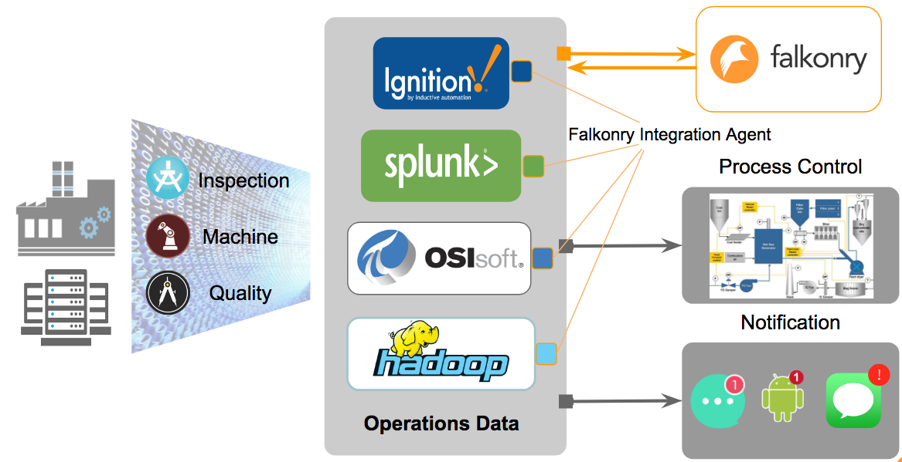
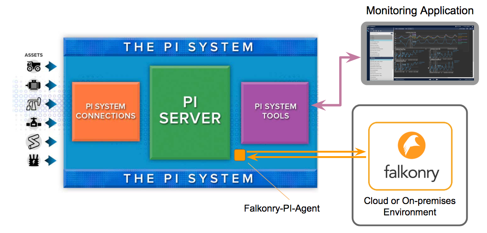

.. _pi_agent:

PI Integration Agent
=====================

Falkonry supports different integration agents that help tap into the time series data store so as to enable communication of historical data betwwen the data store and Falkonry Services.
This agent is responsible for sending data to the Falkonry Service which could running on-prem on in a cloud environment. It also enriches the historian or data store by feeding back the condition information or assessments generated by Falkonry as attributes of tags for monitoring applications.

Following is an example of OSIsoft's PI system that comprises of Connections, System Tools and the PI Server.
The Falkonry PI agent is a small footprint integration agent that sits close to the PI Server to help facilitate communication with the Falkonry Service.

           
Getting Started
-----------------
To receive a download link for the Falkonry PI Integration agent go to `Pi Jumpstart <www.falkonry.com/pijumpstart/>`_

Trial Structure
^^^^^^^^^^^^^^^^
A trial will typically involve the following steps:
     * Provision of historical data to Falkonry
     * Use of Falkonry to create a model that successfully finds patterns or conditions of interest in the historical data
     * Connection of a live data stream to Falkonry and demonstrate real-time condition recognition

Trial Preparation
^^^^^^^^^^^^^^^^^^
To execute a successful Falkonry trial, you need time series data that you believe could reveal insight into the condition of some entity or set of entities of the same type (e.g. a manufacturing tool or a set of compressors). Some knowledge of previously confirmed conditions in historical data is very helpful.

Data can be provided to Falkonry in two ways:
     1. Directly from the OSIsoft PI system: To use this approach you will need to install the Falkonry-PI Integration agent on a Windows machine that has access to the PI System and outbound connectivity to the Internet. The Falkonry-PI Agent will allow you to identify an Element Template and an associated set of Attributes/Tags and Elements to use with Falkonry.
     2. Via upload of CSV or JSON files to the Falkonry Interface: This approach will enable all use of Falkonry except for demonstration of real-time recognition on live streams.

Falkonry will provide you the following:
     * Use of Falkonry via account on sandbox.falkonry.ai: This is a multiple user account that allows you to invite members of your team.
     * A download link for the Falkonry-PI Integration Agent
     * Support and guidance
     * Online support in the application
     * Online support documentation
     * Interactive web conferences as required

You will need to provide the following:
     * Data
     * A subject matter expert (SME) who understands the operation of the entity or entities in question, and who can evaluate the results produced by Falkonry.

User Guide
^^^^^^^^^^^
   
Refer to the **User Guide** on the **PI Integration Agent** to get started (see :doc:`using/using_pi_agent`)

