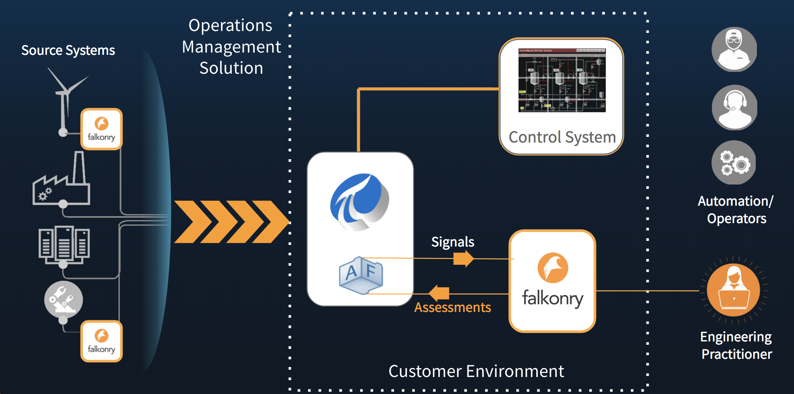
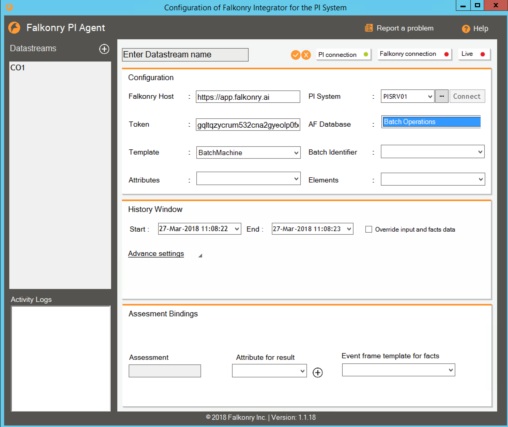
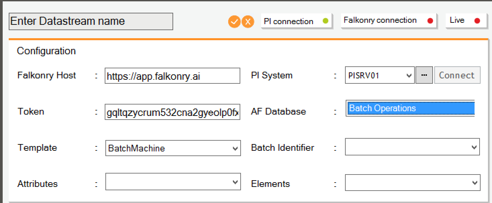
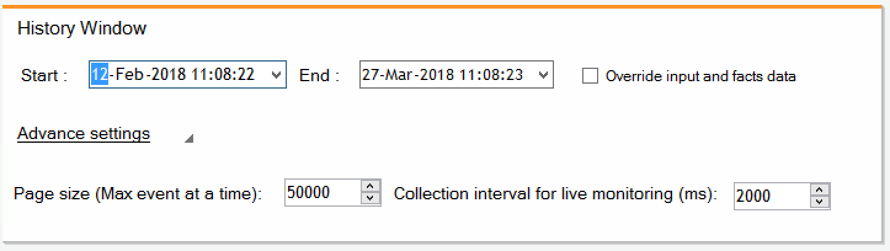
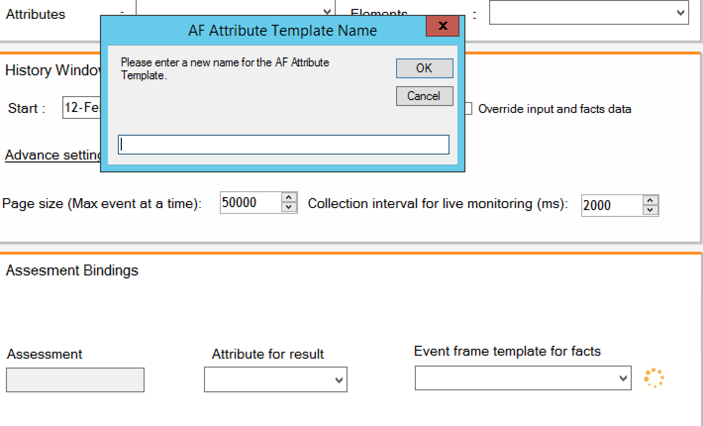
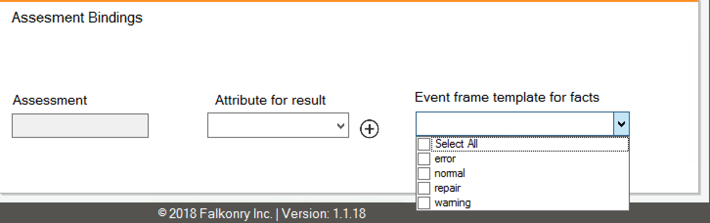
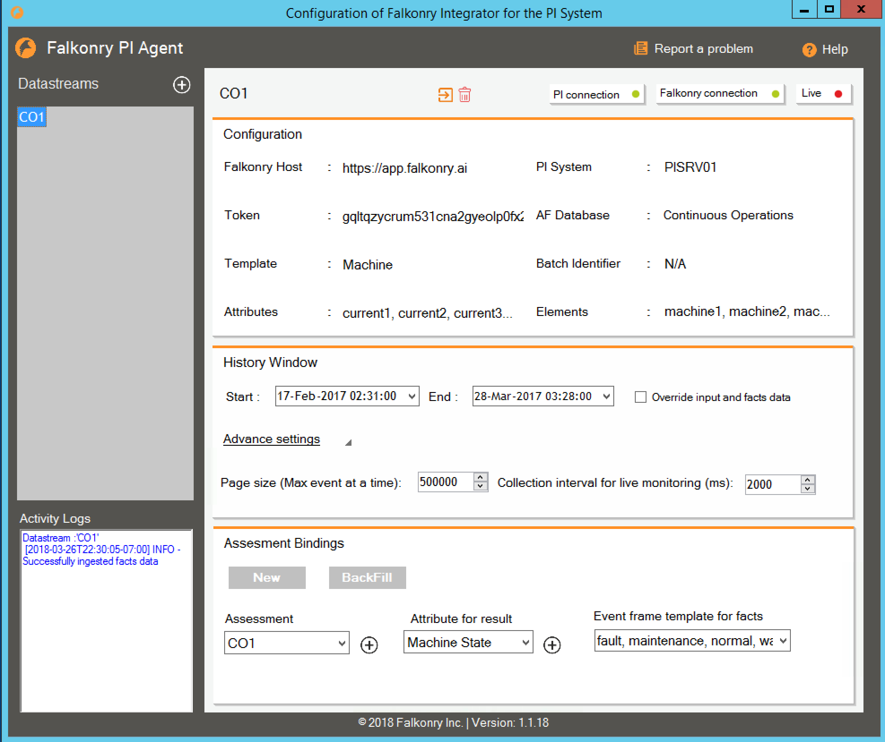

.. _pi_agent:

PI Integration Agent
=====================

Falkonry supports integration agents that help tap into the time series data store so as to enable communication of historical data between the data store and Falkonry Services. This agent is responsible for sending data to the Falkonry Service running on-prem or in a cloud environment. A feedback loop is completed by writing back the condition information or assessments generated by Falkonry as attributes of tags for monitoring applications into the historian/ data stores.

Following is an example of how Falkonry LRS integrates into a customer’s environment that uses OSIsoft’s PI System. This demonstrates the tight integration and the simultaneous distributed approach with real-time Falkonry assessments. Historical operational data from time series data sources captured within PI System is used by Engineering Practitioners to train Falkonry models. This data can then be extracted into Falkonry LRS using the Falkonry PI Agent connector. 

Falkonry PI agent is a small footprint integration agent that sits close to the PI Server to help facilitate communication with the Falkonry Service. The same Falkonry connector can be used to stream real-time data generated at the Edge into Falkonry to make real-time assessments.

Assessments generated by Falkonry LRS can be transcribed back into the PI System using PI AF as attributes associated with the entities being monitored. 

           
Getting Started
-----------------
To receive a download link for the Falkonry PI Integration agent go to `Pi Jumpstart <https://www.falkonry.com/pijumpstart/>`_

Trial Structure
^^^^^^^^^^^^^^^^
A trial will typically involve the following steps:
     * Provision of historical data to Falkonry
     * Use of Falkonry to create a model that successfully finds patterns or conditions of interest in the historical data
     * Connection of a live data stream to Falkonry and demonstrate real-time condition recognition

Trial Preparation
^^^^^^^^^^^^^^^^^^
To execute a successful Falkonry trial, you need time series data that you believe could reveal insight into the condition of some entity or set of entities of the same type (e.g. a manufacturing tool or a set of compressors). Some knowledge of previously confirmed conditions in historical data is very helpful.

Data can be provided to Falkonry in two ways:
     1. Directly from the OSIsoft PI system: To use this approach you will need to install the Falkonry-PI Integration agent on a Windows machine that has access to the PI System and outbound connectivity to the Internet. The Falkonry-PI Agent will allow you to identify an Element Template and an associated set of Attributes/Tags and Elements to use with Falkonry.
     2. Via upload of CSV or JSON files to the Falkonry Interface: This approach will enable all use of Falkonry except for demonstration of real-time recognition on live streams.

Falkonry will provide you the following:
     * Use of Falkonry via account on sandbox.falkonry.ai: This is a multiple user account that allows you to invite members of your team.
     * A download link for the Falkonry-PI Integration Agent
     * Support and guidance
     * Online support in the application
     * Online support documentation
     * Interactive web conferences as required

You will need to provide the following:
     * Data
     * A subject matter expert (SME) who understands the operation of the entity or entities in question, and who can evaluate the results produced by Falkonry.

AF Version Support
^^^^^^^^^^^^^^^^^^
Falkonry supports AF Server 2016 R2 (SDK version: 1.4.6.494) and beyond

Note: AF Server 2012 (SDK version: 1.4.2.445) and AF Server 2014 (SDK version: 1.4.4.484) are not supported.

Using Falkonry PI agent
------------------------

Connecting to the Falkonry Service starts with the creation of a new datastream.

A datastream in Falkonry parlance is the basic building block for pattern recognition. A Datastream is associated with a set of Signals (that it consumes as input), a set of Entities, and a set of Assessments that convey the output of the Datastream.

For the definition and details on **Datastreams**, see :ref:`datastreams`

Creating a new datastream
--------------------------
To create a new datastream, a user clicks on the **" + "** button next to the word **Datastreams**.

Configuration
^^^^^^^^^^^^^^
Here new users can be invited into the account and access can be controlled.

**Falkonry Host** - is the Falkonry service where an account has been provisioned for the user

**Authentication Token** - this token is the means for the PI agent to be able to authenticate itself to the Falkonry service. After logging into the Falkonry service the user should navigate to "Account" in the left panel and then select "Integration" from the list of Account activities. Add a string that is a good identifier for your authorization token and click on "Add Token". Copy and paste the token generated by using the copy button and add it to the "Token" field in the PI agent. 

**PI System** - Next, in order to have a connection to Asset Framework the user needs to specify a local PI system

**AF Database** - Put in the PI Asset Framework database and chose any existing **Template** associated with the your AF database. 

**Attributes** are keyed off from the template. In a future release of the Falkonry PI agent, there will an option to not have to select a Template and instead select **Attributes** specific to **Entities** which could be specific extensions to a given Entity.

Finally, select a list of **Attributes** and **Entities** from the pulldown lists.

For the definition and details on **Entities**, see :ref:`entities`

History backfill
^^^^^^^^^^^^^^^^^
The history window allows the user to suggest the window of historical data/ events to extract into the Falkonry system to help build the model.
The window size is defined by the **Earliest** and **Latest** date/time stamps.

The **Override Input and Facts Data** allows the user to override existing data in the Falkonry datastream with the data currently residing in Asset Framework. By default, this box is left unchecked.

Within **Automated Update Settings** a user can define variables that define the streaming performance of the data. It's best to leave these settings as default. Feel free to reach out to Falkonry at support[at]falkonry[dot]com for help with changing these settings.

Assessment to Attribute Bindings
^^^^^^^^^^^^^^^^^^^^^^^^^^^^^^^^^
Finally, before the user is ready to create the new datastream, we need to close the loop of the datastream by providing a way to bind **Assessments** (output from Falkonry) with Tags or **Attributes** in the Asset Framework. This section allows you to select one or more **Assessments** and bind them to existing **Attributes** with the AF database or help create new **Attributes** that can be injected into AF from within the PI agent. To add a new Assessment or Attribute that does not exist in the AF database, a user can click on the **" + "** button next to either **Assessment** or **Attribute for Result**.

Multiple **Assessments** can be created and bound to existing of new **Attributes**. To do this, the user should click on the **New** button in the **Assessment to Attribute Bindings** section to add additional rows for such bindings. A Delete (trashcan) icon should help delete these assessment bindings. Note, upon deletion only the binding is removed, the attribute with historical assessment values persists in Asset Framework.

A user can also provide an **Event Frame** from the existing AF database from where he/she may be able to extract specific **Facts** that can serve as ground truths or **Conditions** when developing the model. Use the pulldown utility to select an **Event Frame** if one exists.

For the definition and details on **Facts**, see :ref:`facts`

Injecting facts using Event Frame Templates
^^^^^^^^^^^^^^^^^^^^^^^^^^^^^^^^^^^^^^^^^^^^^

At any point of the datastream creation, a user can also choose to introduce facts using PI Event Frame Templates.

In this example, known states of different entities or facts have been captured in different Event Frame Templates, for example, "normal" or "warning".
These could be sourced based on tags associated with certain events within PI or inspection logs that have been captured in Event Frames.

These Event Frames will be imported into Falkonry and should be available upon creation of the datastream. 

Connection
^^^^^^^^^^^^^
When the user clicks **Save**, a datastream is created. Within a few seconds the user should be able to see a datastream created within the Falkonry service. A hyperlink is provided at the top right of the Falkonry PI agent that opens up the Datastream in Falkonry Service from within a browser.

Notice that the connection status is reflected at the bottom. At this point, the **PI connection** and the **Falkonry connection** should turn green suggesting a successful 2-way connection between Asset Framework and the Falkonry Service via the Falkonry Integration Agent.

Deleting a datastream
---------------------

Deleting a datastream is fairly straightforward. A user can select a datastream from the list on the left panel and then click on **Delete**.
Click **Yes** on the dialog box that appears.

Updating a datastream
---------------------

Once configured a datastream can be updated only to change the **History Window** or modify/ create **Assessment-Attribute** bindings.

After edits have been made to the history window or the bindings, change is committed to the Asset Framework by clicking on the **Update** button at the bottom.
Once the datastream has been updated, a **Backfill History** button is activated that then allows the user to initiate a backfill into Asset Framework based on the changes recently committed.

Live Monitoring 
----------------

Once a datastream has been created and a connection to the Asset Framework initiated, a user can select to go **Live** by turning on **Live Monitoring** at the bottom of the page.
A dialog box should confirm the user's decision to go Live. At this point, live data from Asset Framework is streamed to the Falkonry Service to generate live assessments based on a model revision that has been activated from with Falkonry.

A green indicator next to "Live Monitoring" at the bottom should suggest that the datastream is in a "Live Monitoring" state.

Note, Live Monitoring can be activated from the Falkonry Service as well. In either case, turning on Live Monitoring should reflect in the other application. For example, if the user turns on Live Monitoring from within the PI agent, it should show the active "Live Monitoring" status in the Falkonry Service.

For the definition and details on **Live Monitoring**, see :ref:`live_monitoring`

   
  
