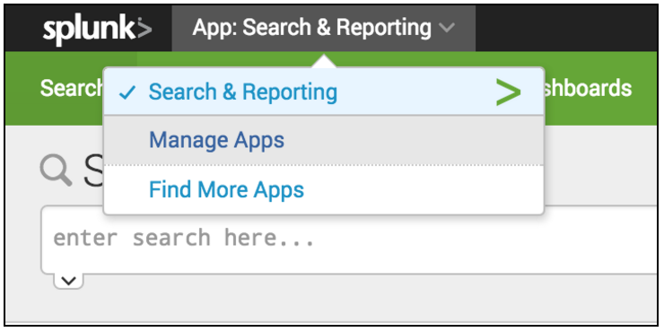
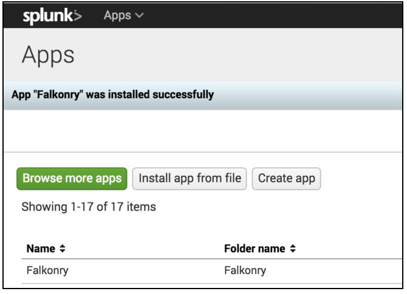
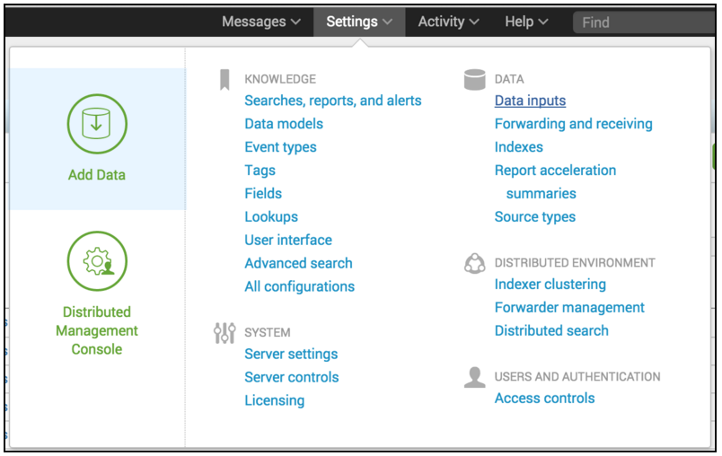
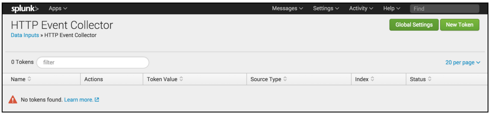
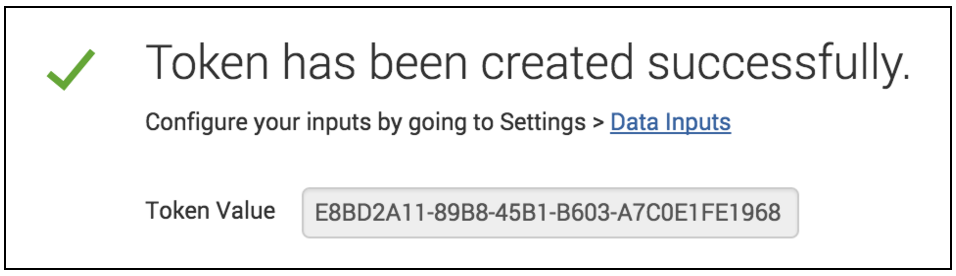
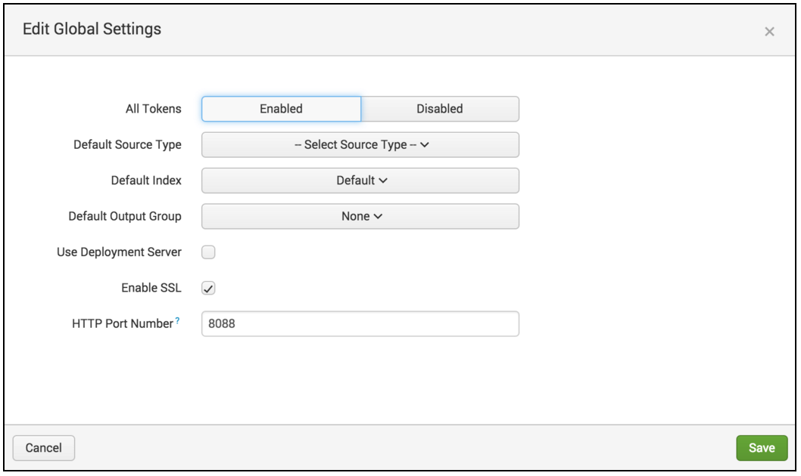
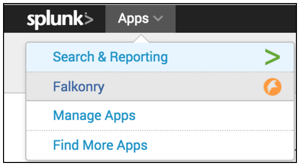

Setting Up The Falkonry Splunk App
==================================

Objectives
----------

This section describes how to:

- Download and install the Falkonry Splunk App
- Set up an HTTP event collector in Splunk for the Falkonry Splunk App
- Connect the Falkonry Splunk App to your Falkonry account

Prepare to use the Falkonry Splunk App
--------------------------------------

Install the Falkonry Splunk App
~~~~~~~~~~~~~~~~~~~~~~~~~~~~~~~

1. Open the `Falkonry Splunk Download page <http://falkonry.com/splunk>`_ and click the 
   DOWNLOAD FALKONRY APP button to start downloading the installation file. Note the location
   where you chose to save the file ``Falkonry.tar.gz``.

2. As an administrator, login to your Splunk UI and from the system bar, select 
   **Apps > Manage Apps**.

3. From the Apps page, click **Install app from file**.

.. image:: images/select.png

4. When prompted, go ahead and **Restart Splunk**. When restart is complete, log back into 
   Splunk. You should see the Falkonry App successfully installed at the top of the list on 
   the Apps page.

Set up the HTTP Event Collector and token
~~~~~~~~~~~~~~~~~~~~~~~~~~~~~~~~~~~~~~~~~

Detailed information about Splunk HTTP Event Collectors is available in 
`Splunk documentation <http://docs.splunk.com/Documentation/Splunk/latest/Data/UsetheHTTPEventCollector>`_.
 

1. From the Splunk system bar, click **Settings > Data Inputs**.

2. On the left side of the page, click **HTTP Event Collector**.

.. image:: images/collector.png

3. From the Event Collector management page, click **New Token**.

4. In the Add Data wizard, enter a name for your Falkonry token and click **Next**.

In the **Index** section of the **Input Settings** step, click **main** from the 
**Available Item(s)** list and make sure it moves to the **Selected item(s)** list and is 
set as the **Default Index** before clicking **Review**.

.. image:: images/add_data.png

5. From the **Review** step, review the final detail and click **Submit**.

.. image:: images/token_review.png

6. Upon completion you will see a success message indicating that the token was created 
   successfully and providing you with the token value. Save this value for later as you will 
   need it to complete the Falkonry setup.

Check that HTTP Event Collector is enabled
~~~~~~~~~~~~~~~~~~~~~~~~~~~~~~~~~~~~~~~~~~

If you haven’t created any tokens and this is your first time using the Event Collector 
you have to ensure that the HTTP Event Collector is enabled before continuing.

1. Use the link provided in the success message to go directly to the **Data Inputs** page.

2. Click on HTTP Event Collector again.

3. Check the status (far right column) of the token you just created in the previous 
   section. If it is “enabled” then you are ready for the next step. If not, click the 
   **Global Settings** button.

4. In the dialog, click **Enabled** then click **Save**. You should now be ready to 
proceed to the next section.
 

Connect the Falkonry Splunk App with your Falkonry Service
----------------------------------------------------------

1. From Splunk system bar, click **App > Falkonry**.

2. On the Falkonry connection screen, the status will show as Not Connected. The default settings should show:

  - Service URL: *https://service.falkonry.io*
  - Connection Mode: *Default*
  - Management Port: *8089*
  - Event Collector Port: *8088*
  
3. In addition to these settings, you must enter:

  - The **Event Collector Token ID** you set up earlier (to find this again, you can go to 
    **Settings > Data Inputs > HTTP Event Collector** and check the token value for the 
    Falkonry Event Collector)
  - Splunk credentials (username and password) for a Splunk user that has ``edit_tcp``, 
    ``edit_udp``, ``rtsearch``, ``schedule_rtsearch`` and ``search`` capabilities.
    
4. Once you have entered values for all the required fields, click **Connect**.

5. If you are not logged in to your Falkonry service account, you will be directed to the 
   Login page where you can either log in directly or create a new Falkonry Personal account 
   to connect to Splunk.

6. Once you have logged in, the connected Falkonry Splunk App will open to the Manage tab 
   and display the sample pipeline included with all Personal accounts so you can start 
   experimenting with the Falkonry App by completing a tutorial.
