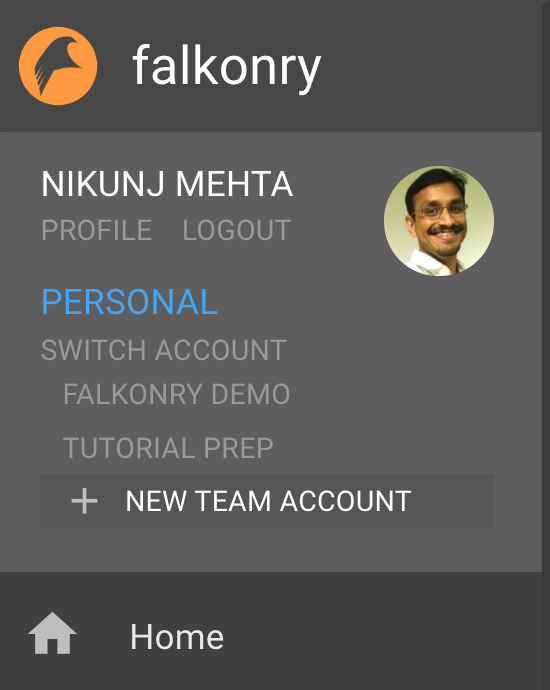
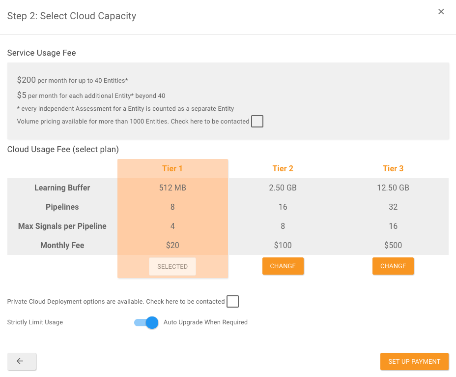
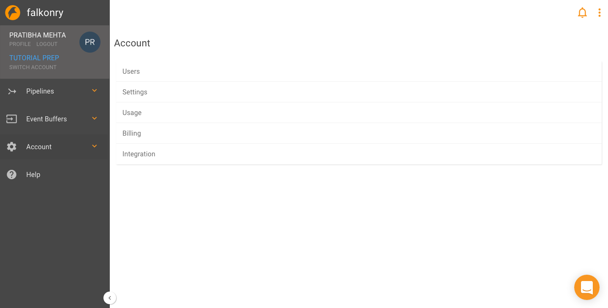

Account Management
===================
Falkonry provides isolated personal use as well as collaboration workspaces through its
feature called Service Accounts.

Whenever a user visits the Falkonry Service URL, they are presented a login dialog. For a
private deployment, this is a simple login dialog to accept the user's email address. 
Through configuration performed by Falkonry, it is possible instead to set up the Service
to perform authentication using a email/password dialog to validate that the user is 
indeed the owner of that email address.

When a user completes sign up for the Falkonry Service, a Personal account is created for 
them automatically, provided their email address ends with the domain configured in the 
deployment. Using this account, the user can start using the Falkonry Service to learn how 
to create and use event buffers and pipelines.

Personal Account
----------------

A Personal account is intended to enable experimentation, before creating a 
pre-production system. Every Personal account has the following limitations:

- Maximum of 4 pipelines 
- Maximum of 16 signals
- Limit of 20MB of data
- Single user only

Other than these limitations, a Personal accounts is fully-functional, including all 
the features available in a Team account. Once you are ready to hook up the Falkonry 
Service to your own data sources and use it to generate real condition predictions without 
limitation, you should create a Team account.

Team Accounts
-------------

With a Team account you can create many more prediction pipelines and can share your 
account with other users. You can create a Team account after signing into your Personal 
account.

After clicking **New Team Account** you will be given a list of options of usage plans.

Managing additional Users
-------------------------

As the owner of your Team account, you have full control over other users' access to the 
account, its pipelines and data. 

Account owners can:

- Invite new users to the account
- Remove users from the account
- Grant and Remove ownership privileges for other users
- Track invitation status

Additionally, users with ownership privileges have the ability to:

- Close the account
