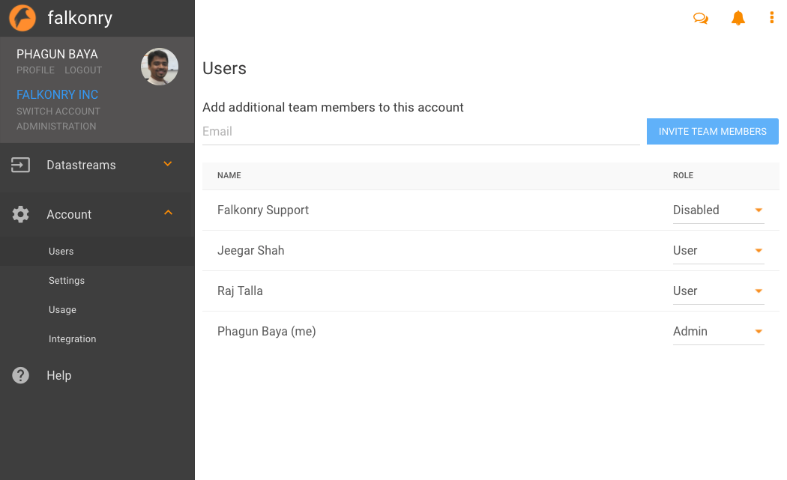
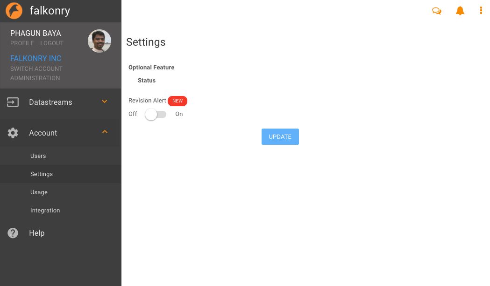
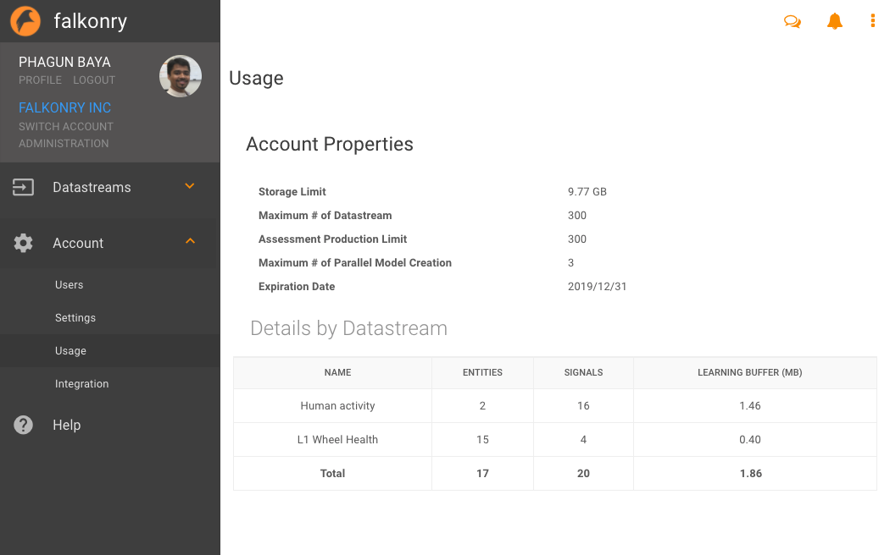
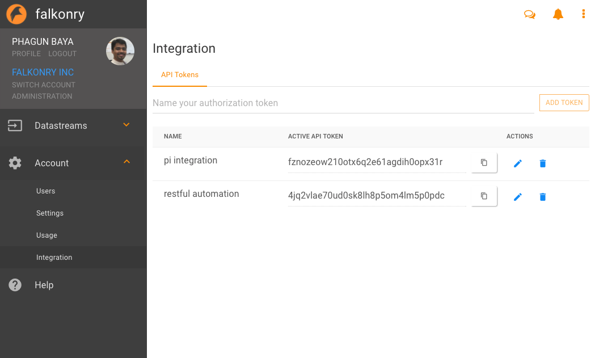

Account Management
===================
Falkonry usage is organized by Accounts that can support multiple users. The 'Account' section found on the left hand panel supports a variety of Account Management actions including:

  - *User* management
  - *Settings* management
  - *Usage* monitoring
  - *Integration* token management

User
----
Here new users can be invited into the account and access can be controlled.

Settings
--------
This allows advanced users control over certain featues or behaviors.

Usage
-----
Account usage metrics are shown here.

Integration
-----------
The Integration section allows users to generate security tokens that can be used by Falkonry Integration Agents to access the Account.

.. image:: images/integration2.png

