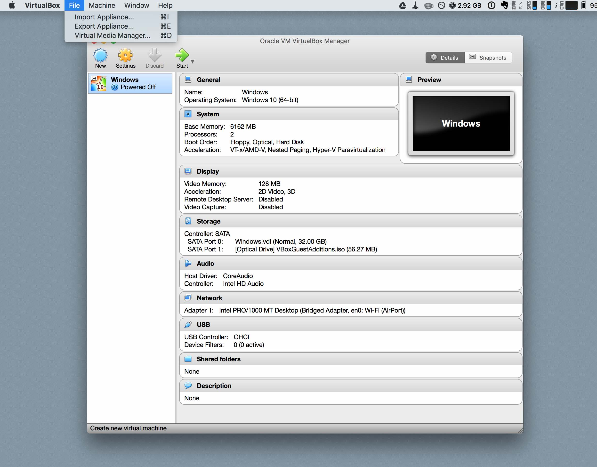
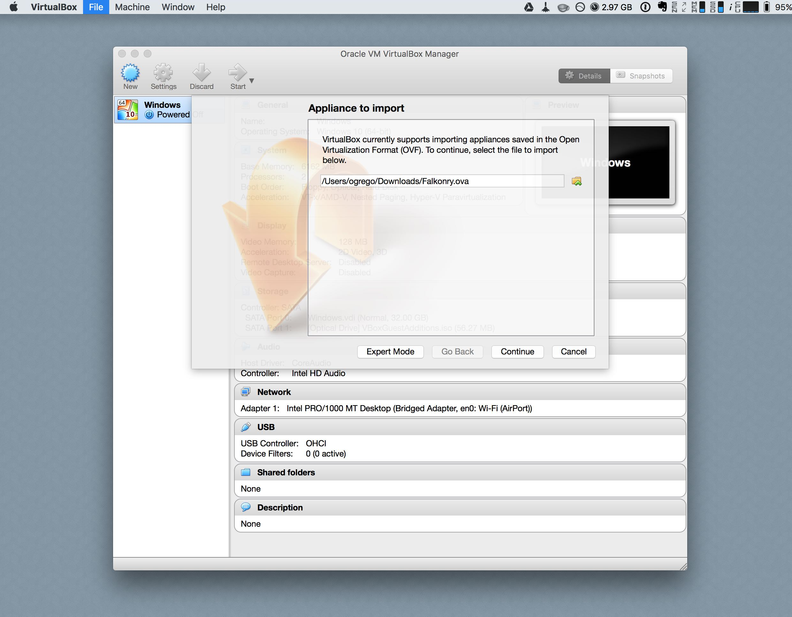
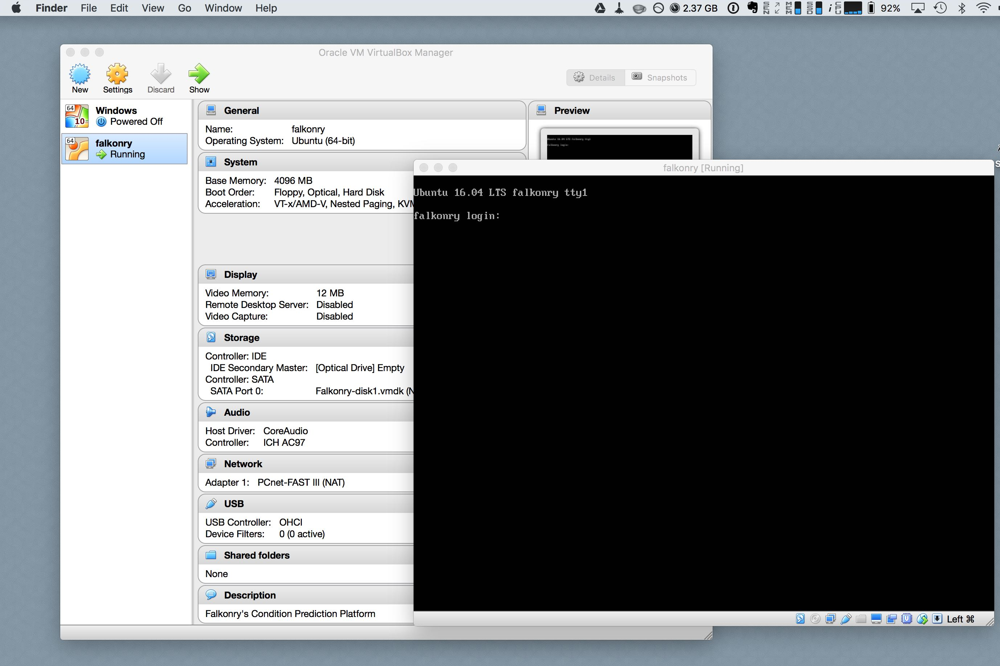
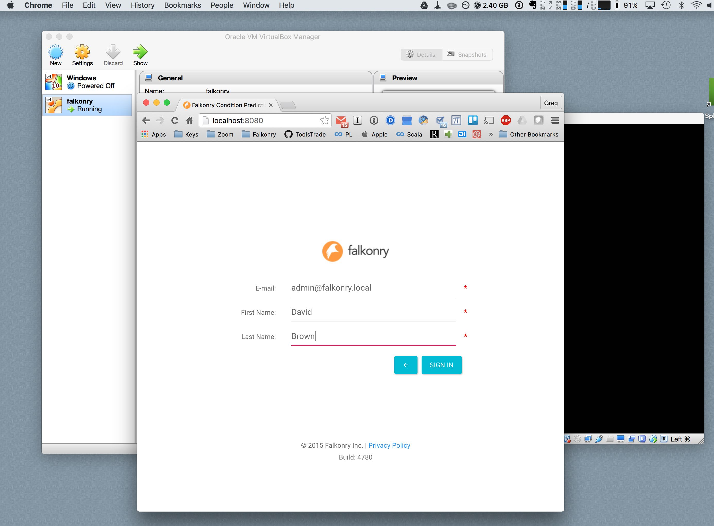

Virtual Appliance
=================

A Falkonry Virtual Appliance can be installed on any Virtual Machine environment such as
Virtual Box or VMWare. The goal of the Falkonry Virtual Appliance is to provide a quick
installation process using widely deployed virtualization technologies.

.. note::

 To obtain the Falkonry Virtual Appliance, please contact us at `sales@falkonry.com`.

System requirements
-------------------

Any deployment of Falkonry should be sized appropriate to the data rate, maximum number
of signals per pipeline, and the number of pipelines. The minimum suggested hardware for
use with Falkonry is the following:

- Hardware 

  - A minimum of

   - 4 full cores and 16 GB RAM
   - 128 GB attached SATA for root volumes
   - 256 GB SSD for internal database volumes

- Software 

  - Oracle Virtual Box or
  - VMWare

Installation via Virtual Box
----------------------------

Once you've downloaded your Falkonry.ova file you can import it into Virtual Box.

Once the appliance is imported, the virtual machine can be started. The following screen appears
that shows the Falkonry Service as running. 

.. note::
  There is no need to log into the window shown in the image below.
  

Falkonry Service is now accessible via a web browser at http://localhost:8080 as seen in the following
screen. 

Please read about `Service Administration <./administration.html>`_ before continuing to the next step.
You will need to install a license first.

.. note::
  You can log in using any email address and name. The information you enter here is used solely
  for identifying your account. 
