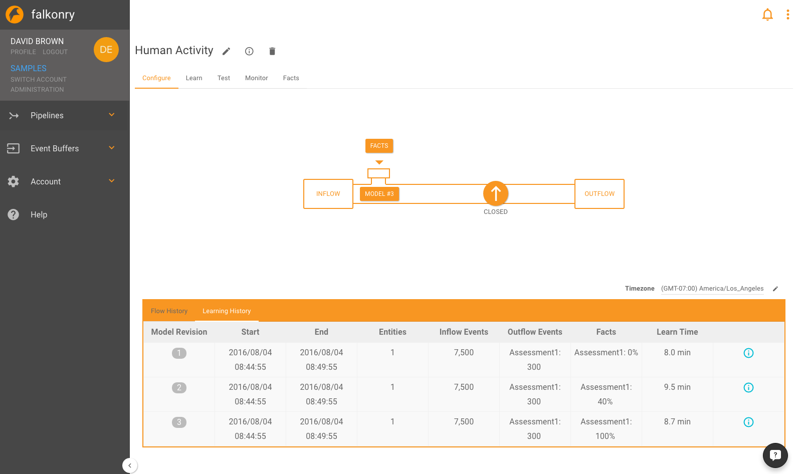
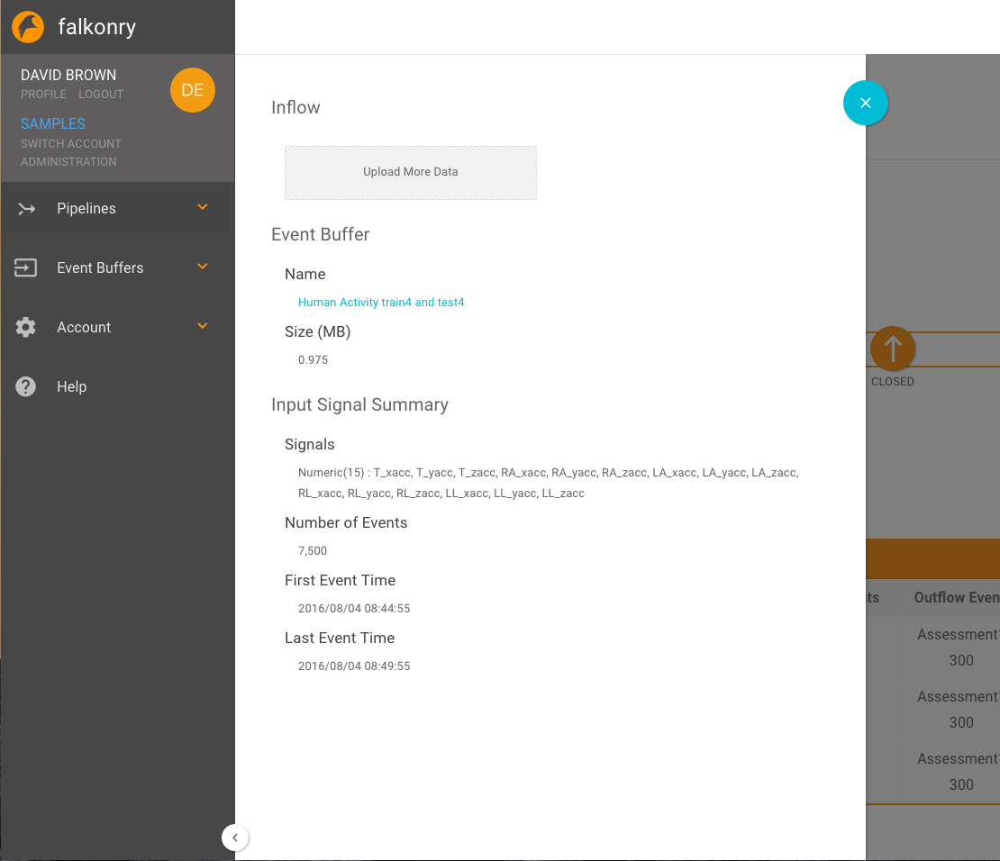
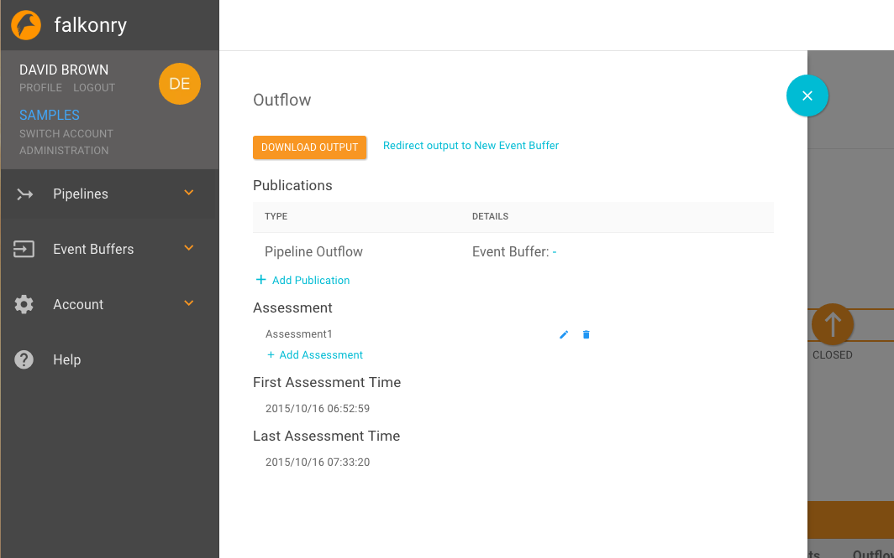
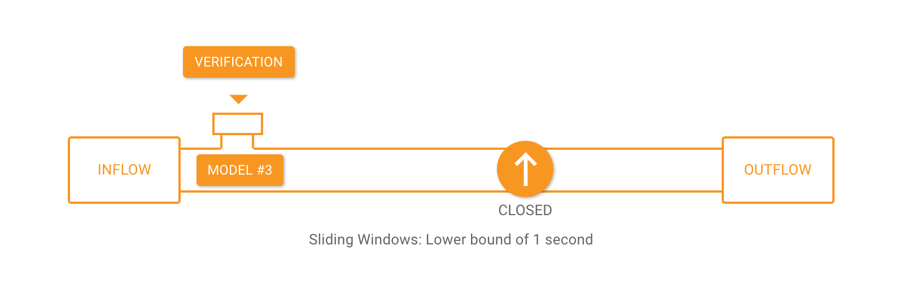
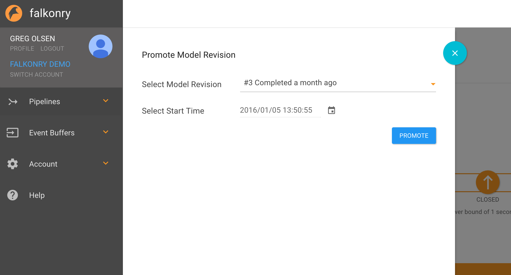

Configure
=========

The configure tab allows you to examine an overview of all your revisions and your flow history. After you create an initial model in the `learn <./learn.html>`_ tab, you can open the pipeline by clicking on the arrow and begin to `monitor <./monitor.html>`_  data.

INFLOW
------

Clicking on the ``INFLOW`` box, displays a panel that lets you see inflow related properties and to perform functions related to the `Event Buffer <./eventbuffer.html>`_ that feeds the Pipeline including:

  - Adding more data: While data often flows into the Event Buffer via the REST APIs, it is sometimes convenient to upload addition files via this panel.
  - Navigate to the Event Buffer to see details or to configure new subscriptions.

To better understand how to configure API-based inflow of data see `Integration <../integration>`_.

OUTFLOW
-------

Clicking on the ``OUTFLOW`` box, displays a panel that lets you see outflow related properties and to perform functions related to the assessments produced by the Pipeline including:

  - Download output data: You can use the button to download a file containing pipeline output.
  - Add Publications of output data: You can publish pipeline output to an external service.
  - Edit Assessment properties: You can use the edit capability to change which signals are used in the assessement.
  - Add Assessments: You can create additional assessments for the Pipeline. This is useful when the Pipeline is used to recognize separate groups of conditions simultaneously, e.g. Health and Operating Mode conditions.

.. raw:: html

   <iframe src="https://player.vimeo.com/video/178232693" width="500" height="281" frameborder="0" allowfullscreen=""></iframe>

To better understand how to configure API-based outflow of data see `Integration <../integration>`_.

OPEN and CLOSING the Pipeline
-----------------------------

	   
Opening a Pipeline puts it into a live monitoring state.  When opened, the arrival of new inflow data will result in outflow of assessments.  When a Pipeline is opened a panel is presented where you can select the Model that will be used for condition recognition, and the time at which you want monitoring to start.  Inflow data will be stored in the Event Buffer so that it can be used in future Learning revisions.

Closing a Pipeline shuts down any outflow.  Inflow into the Pipeline continues where it is stored for Learning or Monitoring in the future.

	   
Model Swapping
--------------
Clicking on the Model button allows the user to 'hot swap' the model revision being applied during monitoring.

