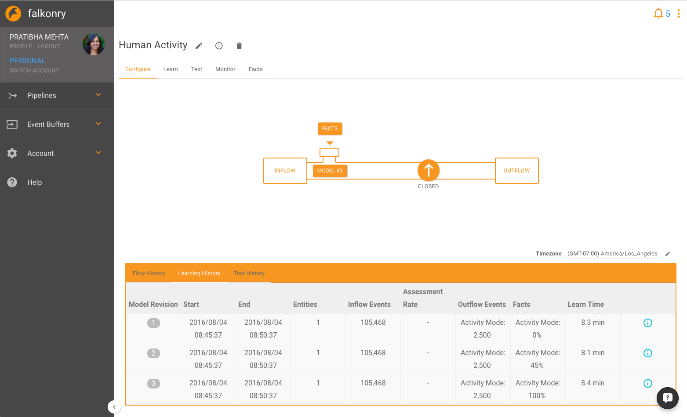

Configure
=========

The configure tab allows you to examine an overview of all your revisions and your flow history. After you create an initial model in the `learn <./learn.html>`_ tab, you can open the pipeline and begin to `monitor <./monitor.html>`_  data.

Add more data
-------------

Once a good model revision is created as verified from the results of the revision, the 
pipeline can be used for continuous monitoring, in which case more data can be added to 
the pipeline. From the UI, this can be done either from an event buffer or from a pipeline
as shown in the video below.

.. raw:: html

   <iframe src="https://player.vimeo.com/video/168813480" width="500" height="281" frameborder="0" allowfullscreen=""></iframe>
