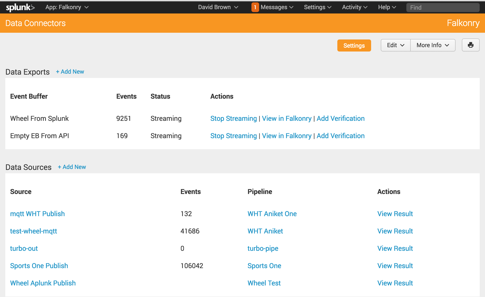
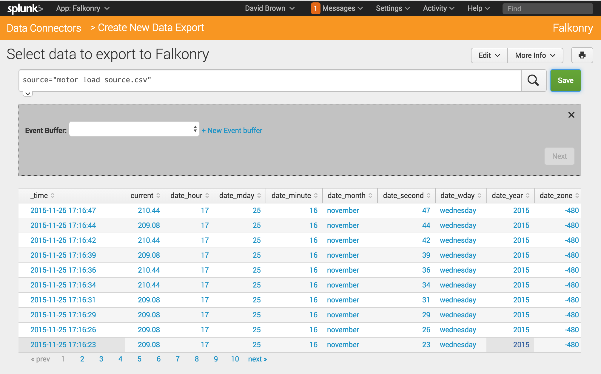

Data
====

Formatting data
---------------

The currently supported data formats for exchange with Falkonry are CSV (comma separated
values) and line-delimited JSON_. 
Both formats are commonly used general purpose data exchange format allowing numerical, 
categorical, timestamp, and other types of data.  Both formats can be used to supply Input 
data (source signals) as well as verification data to Falkonry.

.. _JSON: http://jsonlines.org/

Falkonry data file requirements
~~~~~~~~~~~~~~~~~~~~~~~~~~~~~~~

CSV and JSON files for use with Falkonry have a few specific requirements.  Every file must have a 
timestamp column. Additionally, all the values used in the data file must have the same 
structure, i.e., the same set of attributes and their data types. Also, the file may 
contain UTF-8 characters, which is the encoding used for supplying data to Falkonry. 

Identifying time
~~~~~~~~~~~~~~~~

In Falkonry, every record is used to convey data for a single instant or interval of time. 
Therefore, timestamps must be present on every record provided to Falkonry, which also 
means that your CSV file must have a column representing the timestamp or a JSON property
containing a timestamp value. Within your data file the naming of the timestamp column is 
flexible; the time column will be identified during pipeline creation.

Your timestamp data can be specified using one of the following formats:

- ISO 8601 format. As you can see in this primer on the time format, you can identify timezones, sub-second precision, as well as the regular components on date and time.
- As a Unix-style long integer encoded as the number of seconds since Jan 1, 1970
- As a Unix-style long integer encoded as the number of milliseconds since Jan 1, 1970.
- 12/19/2014 11:22:00 or ``MM/DD/YYYY HH:mm:ss``
- 2015-02-03 12:55:03 or ``YYYY-MM-DD HH:mm:ss``
- Any timestamp format that can be described using `Java SimpleDateFormat 
  <https://docs.oracle.com/javase/7/docs/api/java/text/SimpleDateFormat.html>`_

When supplying verification data, you must also supply a second time column called end. 
This column is used to mark the end of the interval for which the record provides values.

Identifying things
~~~~~~~~~~~~~~~~~~

Often your Falkonry data will correspond to more than one "thing".  You may have several 
turbofan motors that you are monitoring, or you may be collecting activity data from many 
people. If you have data for multiple things, you must have a column of data which represents 
your thing identifier.  The column that is used to identify things can be named as 
appropriate for the data set.  During pipeline creation, Falkonry will identify this 
column and the user will verify the selection.

Example data
~~~~~~~~~~~~

CSV data files are used for source signals (Input data) as well as for verification data. 
Let's look at some examples in detail.

Input data
__________

Input data is used to create a pipeline as well as to add source signal data to an 
existing and live pipeline. The input data must contain the following columns: a single 
time column, an optional thing identifier, followed by one or more source signals. The 
header of the CSV file should reflect the appropriate column names. 

For example, data used in the Sports Activity example contains the following header::

  time, person, T_xacc, T_yacc, T_zacc, RA_xacc, RA_yacc, RA_zacc, ...

A row of data in that CSV file might look like this::

  1452030355080, p1, 7.9469, 0.29302, 5.604, 1.0998, 0.57985, 6.8342, ...

In line-delimited JSON, this data would appear like the following::

  {"time": 1452030355080, "person": "p1", "T_xacc": 7.9469, "T_yacc": 0.29302, "T_zacc": 5.604, ...}
  
where ``1452030355080`` is the time value, ``p1`` is the person identifier, and so on.  
The columns after the person column are the raw source data or signal data which Falkonry 
inspects and monitors to provide meaningful condition assessments.

In another example, you can see how UTF-8 characters can be used in the header with a 
different thing identifer::

  time, turbine, LuftTemp Austritt Kühlturm 1, LuftTemp Austritt Kühlturm 2, Drehzahl Lüfter, Temp Auslf WB Scheibe

Verification data
_________________

Verification data is used to provide feedback to the Falkonry learning process in order to 
supply condition names as well as to fine tune its findings. The verification data must 
contain a time column (for the interval start), an end column (which must be called "end"), 
an optional thing identifier, followed by one condition label. The header of the CSV file 
should reflect the appropriate column names. For example, data used for verification of 
the Wheel Health data contains the following header::

  time, unit, end, L1 Wheel Health

Note that both the thing identifier and the assessment identified in the header must match 
what has previously been set up in the pipeline.  It is possible to provide more than one 
assessment in the verification data set. Moreover, the values for the assessment are the 
names of condition that are desired to be used in the pipeline. For example, the following 
data from another data set conveys four different episodes being verified::

  time,unit,end,Reliability
  2015-04-22T19:54:02Z,PM-6428,2015-04-22T19:54:04.750Z,Base
  2015-04-22T19:54:05Z,PM-6428,2015-04-22T19:54:06Z,Production
  2015-04-22T19:54:10Z,PM-6428,2015-04-22T19:54:11Z,Production
  2015-04-22T19:54:30Z,PM-6428,2015-04-22T19:54:35Z,Dead Sensor

In line-delimited JSON, this data would appear like the following::

  {"time": "2015-04-22T19:54:02Z", "unit": "PM-6428", "end": "2015-04-22T19:54:04.750Z", "Reliability": "Base"}
  {"time": "2015-04-22T19:54:05Z", "unit": "PM-6428", "end": "2015-04-22T19:54:06Z", "Reliability": "Production"}
  {"time": "2015-04-22T19:54:10Z", "unit": "PM-6428", "end": "2015-04-22T19:54:11Z", "Reliability": "Production"}
  {"time": "2015-04-22T19:54:30Z", "unit": "PM-6428", "end": "2015-04-22T19:54:35Z", "Reliability": "Dead Sensor"}
  
Output data
___________

Output data can be retrieved from a Falkonry pipeline using its API, or exported manually 
through the Falkonry UI, on the Outflow tab. The main purpose of this output data is to be 
able to view all the assessments and estimates for every thing and timestamp. The output 
data contains one time column, zero or one thing identifier, and one condition assessment.  
For example, the output data of the sports activity example contains the following header::

  time, person, ActivityClassification

Note that both the thing identifier and the assessment identified in the header will match 
what was previously been set up in the pipeline.  If the pipeline produces more than one 
assessment, then each will be present in this data set. Moreover, the values for the 
assessment are the names of conditions that were produced by the pipeline. For example, 
the following data is a snippet of the output from the sports activity pipeline::

  time, person, ActivityClassification
  2016-01-05T21:42:50.000Z, p1, Sitting
  2016-01-05T21:44:48.000Z, p1, Sitting
  2016-01-05T21:45:32.000Z, p1, Walking
  2016-01-05T21:42:24.000Z, p1, Rowing
  
In line-delimited JSON, this data would appear like the following::  
  
  {"time": "2016-01-05T21:42:50.000Z", "person": "p1", "ActivityClassification": "Sitting"}
  {"time": "2016-01-05T21:44:48.000Z", "person": "p1", "ActivityClassification": "Sitting"}
  {"time": "2016-01-05T21:45:32.000Z", "person": "p1", "ActivityClassification": "Walking"}
  {"time": "2016-01-05T21:42:24.000Z", "person": "p1", "ActivityClassification": "Rowing"}

Transferring Data
-----------------

There are three methods by which Source Signal Data can be provided to a Falkonry Pipeline:

- File upload via `Falkonry Service UI <./pipeline.html>`_ 
- Through a programmatic client using `Falkonry API <../connector/index.html>`_
- Through an MQTT broker using `event buffer subscriptions <../connector/index.html>`_
- Client application - like the `Falkonry Splunk App <../splunk_app/index.html>`_

Sending data via a Client application like the Splunk App 
~~~~~~~~~~~~~~~~~~~~~~~~~~~~~~~~~~~~~~~~~~~~~~~~~~~~~~~~~~

A client application like the Splunk App allows a user to work with data in a familiar 
context and to use the app to send data to the Falkonry Service. 

With the Splunk App, a user gathers the source signal data they need through a standard 
search query.  The figure below shows the display of such a search in the Splunk App. Once
the data has been located, the user creates an event buffer in the App and then uses the
event buffer in the Falkonry Service to create pipelines.

