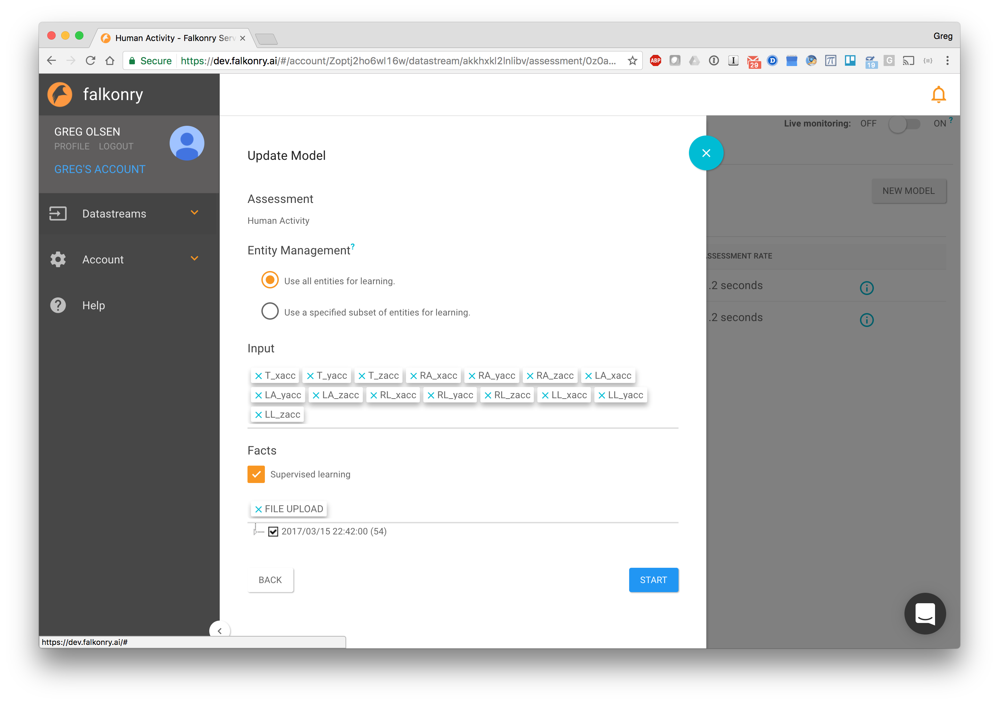
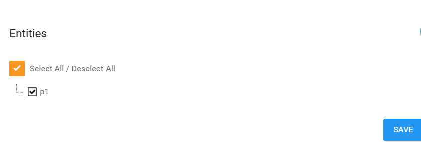
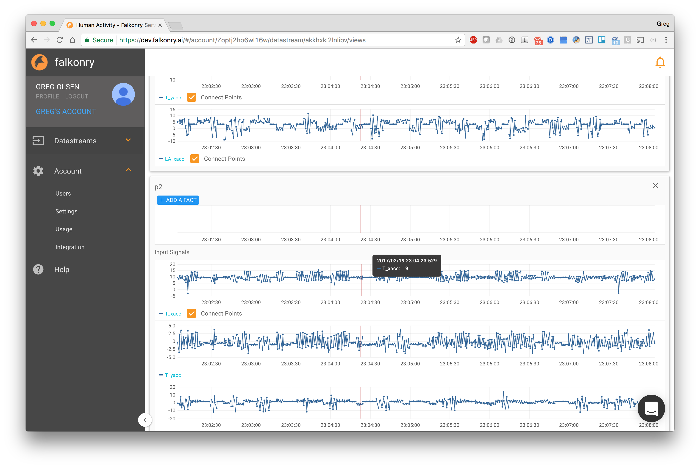
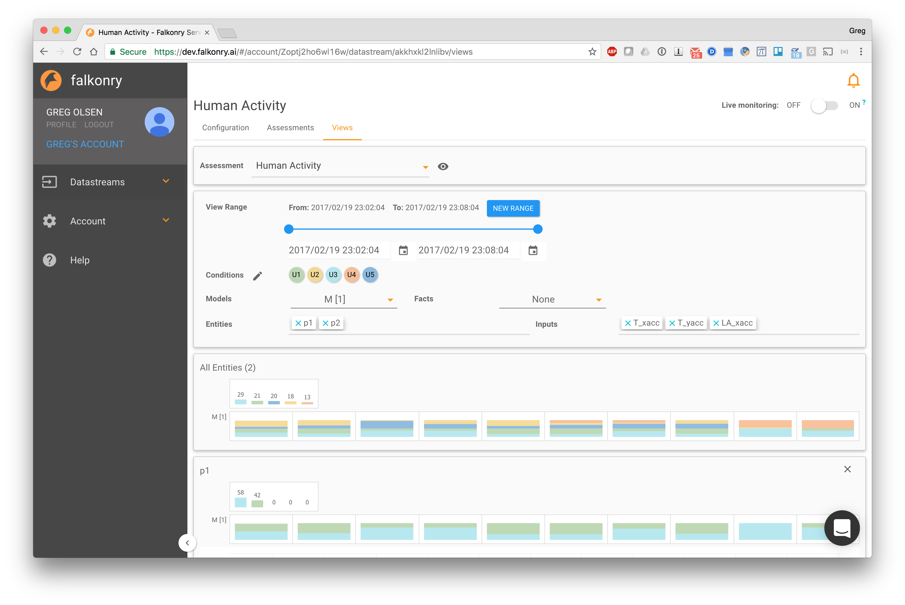
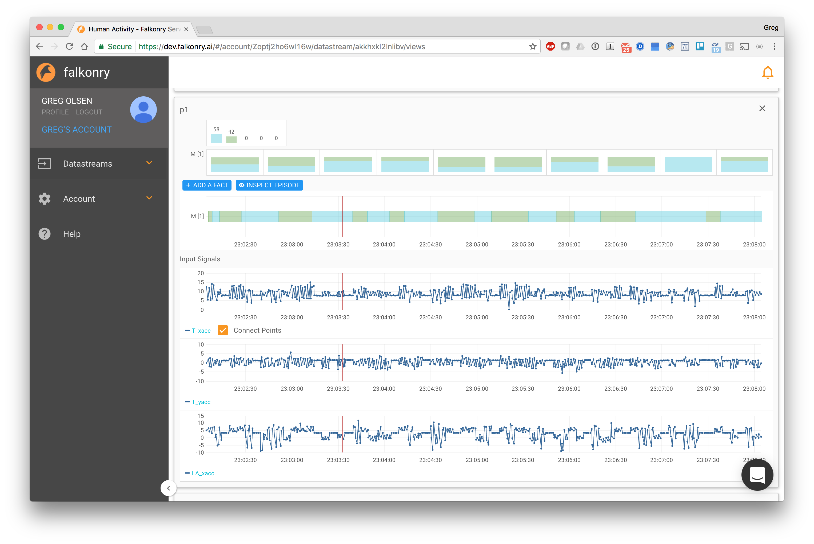
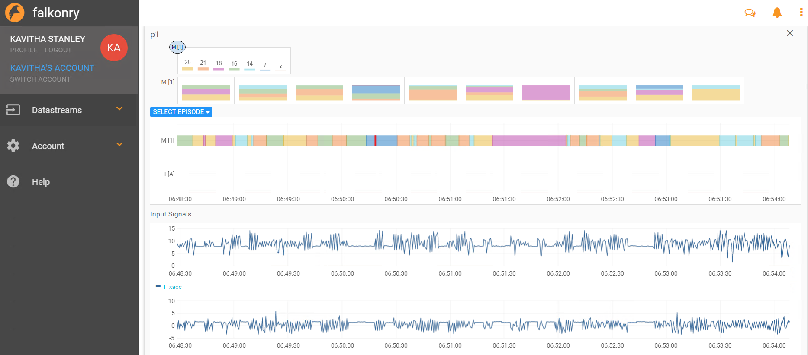
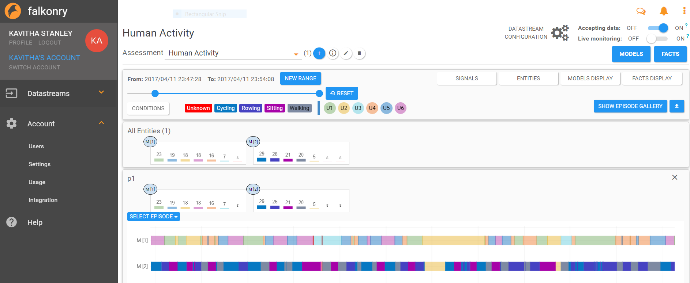
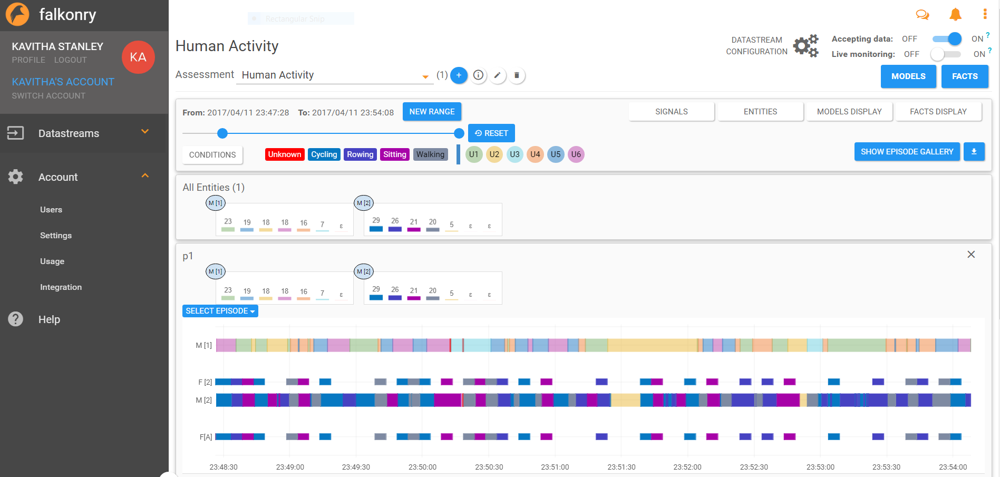
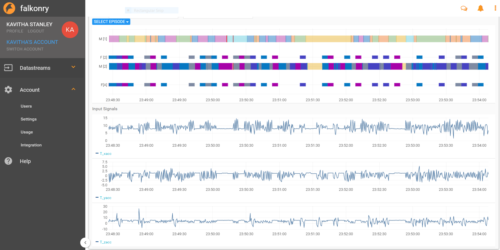
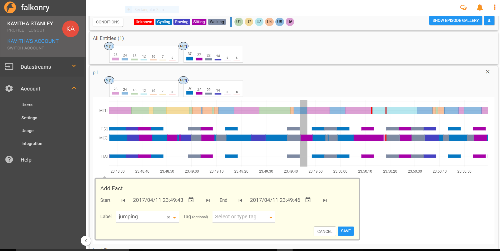

Datastreams
===========
A *Datastream* is the basic building block for pattern recognition used in Falkonry. A Datastream is associated with a set of *Signals* (that it consumes as input), a set of *Entities*, and a set of *Assessments* that convey the output of the Datastream.

A Datastream can consume a *History Window* of signal data and *Facts* that lie within the window to facilitate the learning of *Models*.

At any time one model can be designated as "Active". If the Datastream is turned on with an active model, signal data streamed into the Datastreams will produce a live output stream of assessment results.

Creating Datastreams
--------------------

Creating via a Falkonry Integration Agent
~~~~~~~~~~~~~~~~~~~~~~~~~~~~~~~~~~~~~~~~~
Typically, a Datastream is created by a Falkonry Integration Agent that sits next to a time-series data store that holds the signal data. For example, the Falkonry-PI-Agent allows a user to select a set of Signals & Entities based on familiar structures in the OSISoft PI process historian and to create a Datastream based on those selections. Integration Agents can be used with any system (see :doc:`../../integration/index`).

Creating via file upload in Stand-alone Mode
~~~~~~~~~~~~~~~~~~~~~~~~~~~~~~~~~~~~~~~~~~~~
The Falkonry Server also supports 'Stand-alone Mode' to facilitate easy exploration of pattern recognition from file-based historical data. In this mode, a user manually creates Datastreams and uploads historical window data files. The user can execute all functions of the Falkonry Server except for live streaming (see :doc:`standalone`).

Datastream Configuration
------------------------
Once a Datastream has been created, basic information about it can be found on its Configuration tab. This includes time range of History Window, Signals, Entities.

.. image:: images/configuration.png

Assessments
-----------
The goal of a Datastream is to produce Assessments of condition for Entities in the Datastream. An initial Assessment is automatically created with the creation of the Datastream. You can rename this Assessment and add more as needed.

.. image:: images/datastream_after.png

If you click on an Assessment, you will navigate to the detail view for that Assessment. Initially, you will not have any Models for the Assessment.

.. image:: images/assessmentdetail.png

From here you can click the 'New Model' button to start Model creation.

Learning a Model
~~~~~~~~~~~~~~~~
The user has control over the model that is created from the available History Window and supplied Facts. We will start with a case where no Facts are loaded.

The first thing the user does is identify from which segments of time within the History Window that the model is to be learned. The user can select the entire History or 1 or more segments from the Window. Segments do not have to be contiguous in time.

.. image:: images/createmodel1.png

There are other settings which the user can control to improve the models that are created. These include:

  - Cluster Guidance: Upper and lower bound on the number of Clusters that are found. This gives some control of granularity of the Assessment results.
  - Time Window Guidance: Here the user chooses between sliding and fixed windows, and upper and lower bounds for the case of sliding windows.
  - Assessment Rate: The user can control how frequently Assessment results are produced.

.. image:: images/createmodel2.png

Finally the user can control which Entities, Signals, and Facts are to be used in learning the Model. Failure to check the Facts box, results in unsupervised learning.

.. image:: images/createmodel3.png

Adding Facts & Using Facts When Learning a Model
~~~~~~~~~~~~~~~~~~~~~~~~~~~~~~~~~~~~~~~~~~~~~~~~
A Fact is a known condition for a particular episode of time for a particular Assessment for a particular Entity. Facts can come from external sources, inspection reports, or investigations. Fact data typically becomes available after events have passed.

Facts are means by which Falkonry can learn to recognize semantically meaningful names for conditions that have previously occurred.

Facts can be entered into Falkonry in the following ways:
  - Integration Agents can insert them
  - A user can upload a Fact file via the Falkonry UI (see :doc:`facts`)
  - A user can directly add Facts on the timeline in the Datastream Views tab

The figures below show upload of a Fact file from the Assessment tab.

.. image:: images/facts1.png
.. image:: images/facts2.png

To use Facts in learning check the Supervised Learning box in the New Model dialog. Selective use of Facts is supported.

Views
-----
The Views tab provides a flexible way for the user to view:

  - Signal data
  - Assessment results (across different models)
  - Fact data
  - Variations across Entities

.. image:: images/views1.png

.. image:: images/M2zoom.png

    

