Datastreams
===========
A *Datastream* is the basic building block for pattern recognition used in Falkonry. A Datastream is associated with a set of *Signals* (that it consumes as input), a set of *Entities*, and a set of *Assessments* that convey the output of the Datastream.

A Datastream can consume a *History Window* of signal data and *Facts* that lie within the window to facilitate the learning of *Models*.

At any time one model can be designated as "Active". If the Datastream is turned on with an active model, signal data streamed into the Datastreams will produce a live output stream of assessment results.

Creating Datastreams
--------------------

Creating via a Falkonry Integration Agent
~~~~~~~~~~~~~~~~~~~~~~~~~~~~~~~~~~~~~~~~~
Typically, a Datastream is created by a Falkonry Integration Agent that sits next to a time-series data store that holds the signal data. For example, the Falkonry-PI-Agent allows a user to select a set of Signals & Entities based on familiar structures in the OSISoft PI process historian and to create a Datastream based on those selections. Integration Agents can be used with any system (see :doc:`../../integration/index`).

Creating via file upload in Stand-alone Mode
~~~~~~~~~~~~~~~~~~~~~~~~~~~~~~~~~~~~~~~~~~~~
The Falkonry Server also supports 'Stand-alone Mode' to facilitate easy exploration of pattern recognition from file-based historical data. In this mode, a user manually creates Datastreams and uploads historical window data files. The user can execute all functions of the Falkonry Server except for live streaming (see :doc:`standalone`).

Datastream Configuration
------------------------
Once a Datastream has been created, basic information about it can be found on its Configuration tab. This includes time range of History Window, Signals, Entities.

.. image:: images/configuration.png

Assessments
============
The goal of a Datastream is to produce Assessments of condition for Entities in the Datastream. An initial Assessment is automatically created with the creation of the Datastream. You can rename this Assessment and add more as needed.

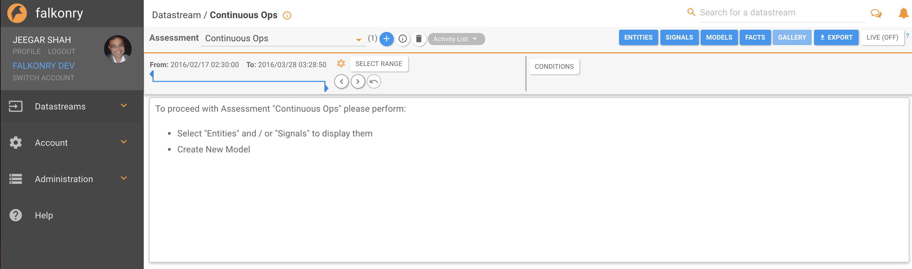

Selecting the **Model** button opens the Model drawer. Models can be created and selected for display on this drawer. For any new assessment with no existing models the drawer looks as follows:

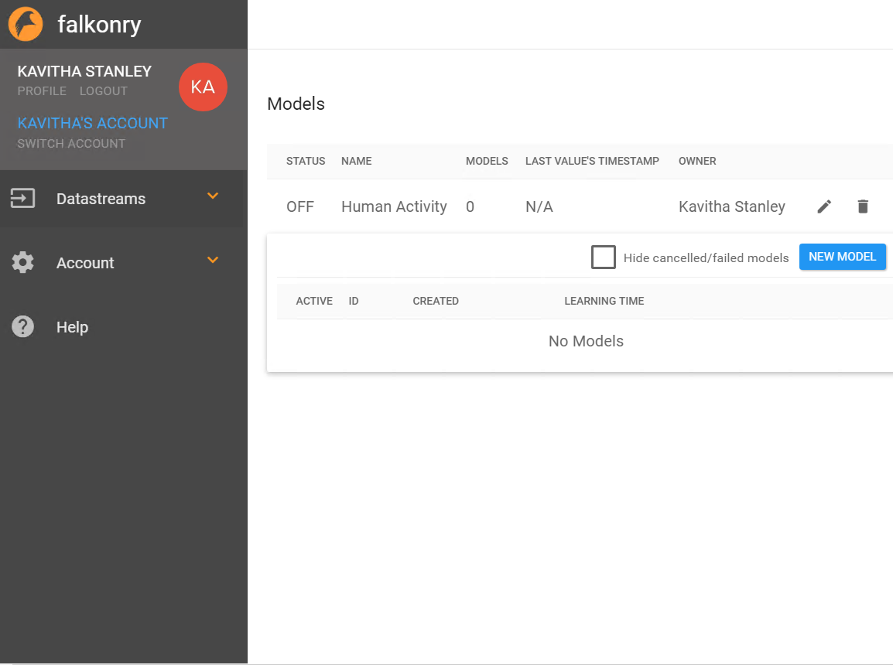

From here you can click the 'New Model' button to start Model creation.

.. _modellearning:

Model Learning
---------------

The user has control over the model that is created from the available History Window and supplied Facts. We will start with a case where no Facts are loaded.

The first thing the user does is identify from which segments of time within the History Window that the model is to be learned. The user can select the entire History or one or more segments from the Window. Segments do not have to be contiguous in time.
At this stage, the user can decide which entities to select to be part of the model creation process.

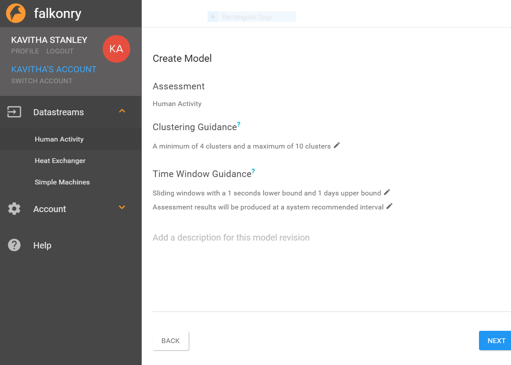

Next, signals are selected.

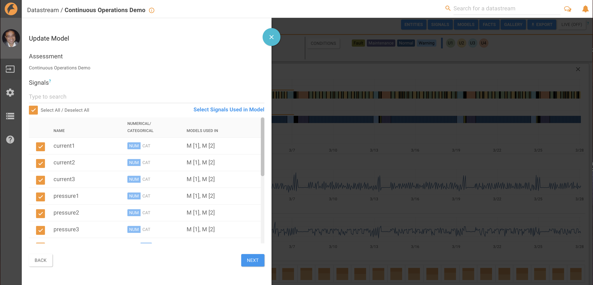

Additional settings need to be configured to fine tune the model. These include:

Cluster Guidance
++++++++++++++++
Upper and lower bound on the number of Clusters that are found. This gives some control of granularity of the Assessment results. 

Falkonry will try to maximize the number of clusters and hence patterns that be identified based on the signal features. The user can change the bounds of the number of clusters (default being set between 4 and 10) and thus control the impact of the signal feature sets on the number of patterns identified in unsupervised learning.

Time Window Guidance
++++++++++++++++++++
Here the user chooses between sliding and batch windows, and upper and lower bounds for the case of sliding windows. A user can either provide explicit grouping guidance (Batch window) or provide bounds on a minimum window width (Sliding window) of the incoming signals to achieve the desired time granularity by changing the size of the windows based on signal variability. 

In Batch window, signal are sampled by splitting them into batch window sizes. This helps improve runtime in scenarios where there is repetition of temporal patterns. In Sliding windows, incoming signals may not be be very well characterized and temporal proximity can be exploited to enable opportunistic loss-limited sampling by changing the size of the windows (within a suggested range) to better identify characteristic signal features.

Assessment Rate
+++++++++++++++
The user can control how frequently Assessment results are produced. These can be:

      1. Configured by the system
      2. Made as frequent as possible to exploit rate of change in incoming signals
      3. Be user defined: default set at 1s

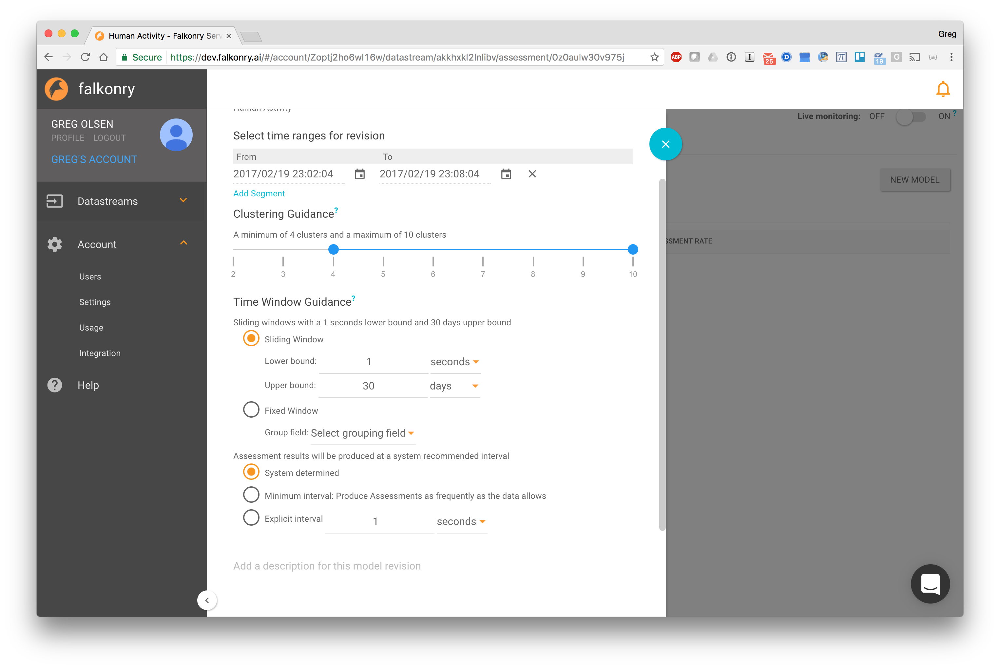

The next figure shows detailed configurations for each of the above. 

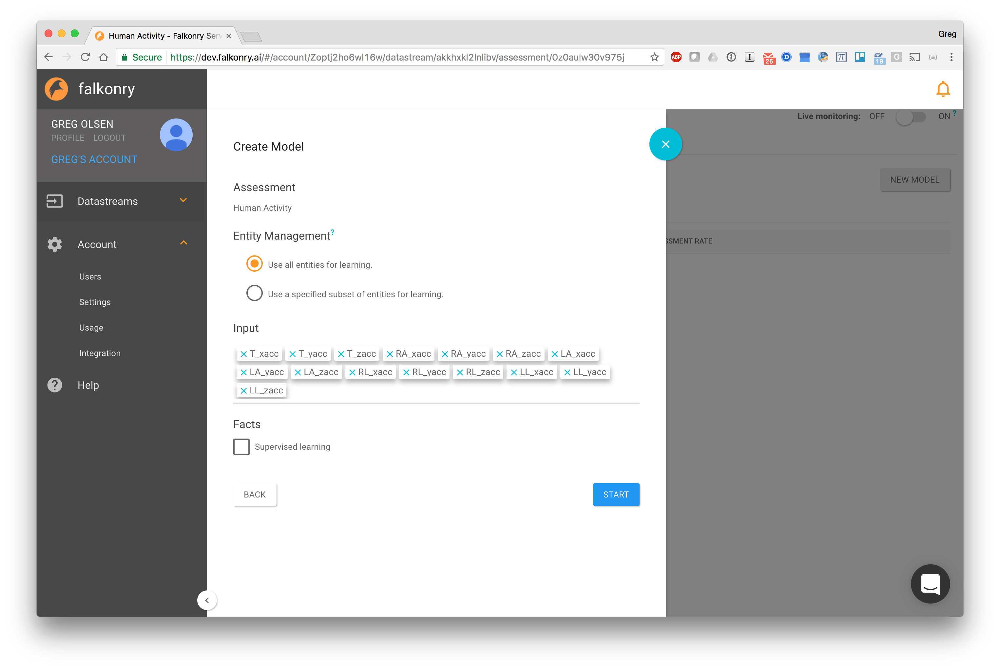

Pattern Generalization
++++++++++++++++++++++
The featurization aims to find temporal patterns in the time series data. The featurization learns these patterns based on the training set and then looks for “similar” shapes in live mode. The following parameter defines the generalization power (also known as sensitivity) of both classifier and featurization. 

When set to **Minimum Generalization** the engine is restricted to what it sees in training dataset. Patterns that are slightly different from learned patterns are classified as unknown. This usually gives us better FPR rate. The TPR rate also might be low.

When set to **Maximum Generalization** the engine only looks at the general shape of the time series. It is less sensitive to temporal shift or even small number of peaks and troughs in the general pattern. With this approach, one can achieve higher TPR. However, the FPR might be high as well.

As the final step, the user may decide to create an **Unsupervised**, **Semi-supervised**, or **Fully-supervised** model. This can be achieved by adding **Facts**. Facts uploaded can be filtered based on *Entities*, prior *Models*, *Keywords* associated with facts, *Conditions* and *Time range*.
gallery

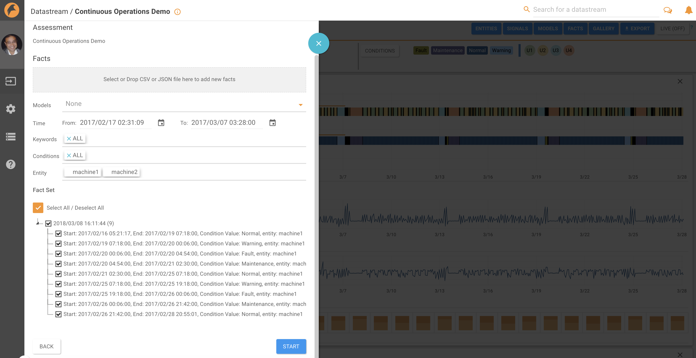

Upon completion of facts selection, clicking the *NEXT* button should bring the user to the final step of the model creation which is selecting entities and time range on which to apply the model. 
This allows a user to have the model applied to a user specified range (may include validation range outside of model learning range) immediately after model creation. A user can always go back and trigger model apply on a different time range at a later point in time. 

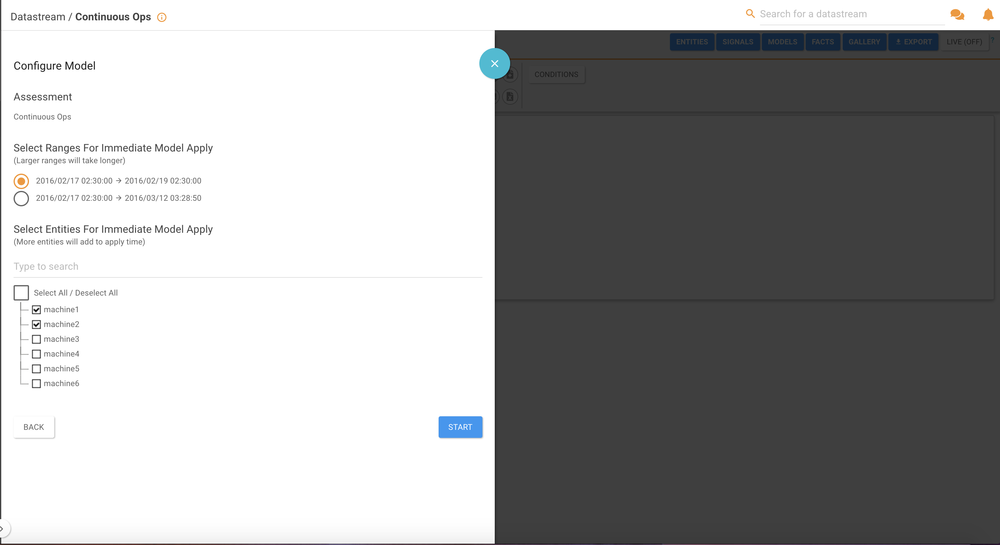

At this point Falkonry has received the following guidance to start building the model:

  - Learning Time Range
  - List of Entities for Learning
  - List of Signals for Learning
  - List of Facts for Learning
  - Model Configuration Settings
  - Model Apply Time Range and Entities

To start the model creation process, hit **START**.

.. _factfilters:

Adding Facts & Using Facts When Learning a Model
~~~~~~~~~~~~~~~~~~~~~~~~~~~~~~~~~~~~~~~~~~~~~~~~
A Fact is a known condition for a particular episode of time for a particular Assessment for a particular Entity. Facts can come from external sources, inspection reports, or investigations. Fact data typically becomes available after events have passed.

Facts are means by which Falkonry can learn to recognize semantically meaningful names for conditions that have previously occurred.

Facts can be entered into Falkonry in any one of the following ways:

  - Integration agents/ connectors for TSDB historians
  - Manually by selecting segments from the Falkonry LRS
  - Any of the Falkonry ADKs (C#, Java, Python)

The figures below show upload of a Fact file from the Assessment tab.

Opening the facts drawer for a new Assessment should present a drawer with no available facts.

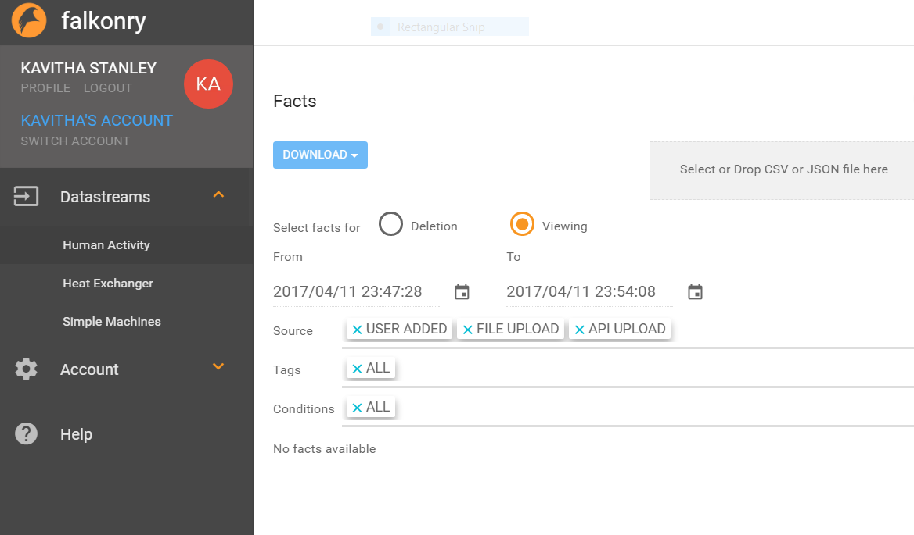

A CSV/JSON file (see :doc:`facts`) can either be selected from or simply dropped into the "Select or Drop CSV or JSON file ...". A window asking the user to select specific identifiers for Start time, End time, Batch Identifier (for Batch datastreams only), Entity, Value and Keywords (optional) should present itself before the facts can be populated within Falkonry LRS.

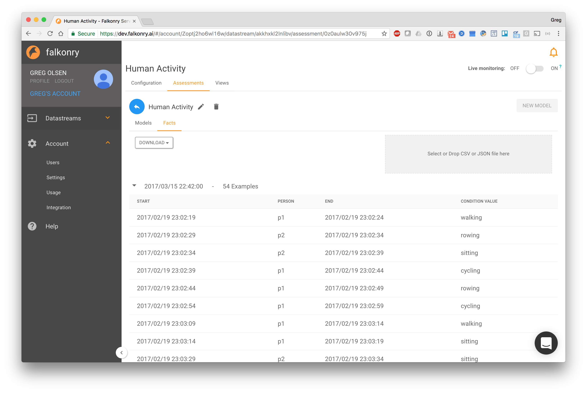

Once facts are available in this drawer, specific filters can be applied to narrow down the set of facts of interest. These settings can be saved as a **Filter View** by clicking on **Add new fact filter** in the **Filters** dropdown.
Instead a user may select to use an existing filter view. The filter views are meant to be used as a means of remembering specific filter settings. 

.. image:: images/facts3.png

These specific filter settings may be used to display a certain subset or combination of facts on the Timeline view. This can be achieved by clicking on the **Add/ Remove Filters To Timeline** button. A pulldown selector should help to present/display one or more such combinations of facts on the timeline view.
In this particular case we would like to display "Reference" facts based on the prior filter settings. These filer timelines can prove instrumental in determining what combinations of facts should be used for subsequent model creation. These can also be used for *Verification* purposes to analyze and compare the actual conditions based on these facts with the assessment output results.

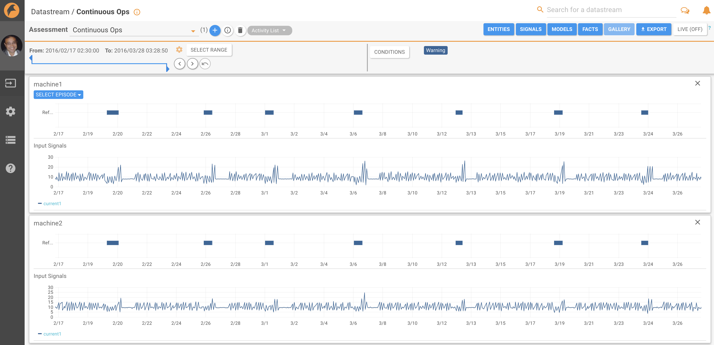

Sharing Facts with colleagues on the same account
++++++++++++++++++++++++++++++++++++++++++++++++++

As may have been noticed above, a set of facts belong to a particular *Assessment*. However, facts introduced by other users within the same Assessment may be shared across users. For example, user "Sally's" facts may be visible to user "John". This encourages collaboration and sharing of ideas for model creation.  

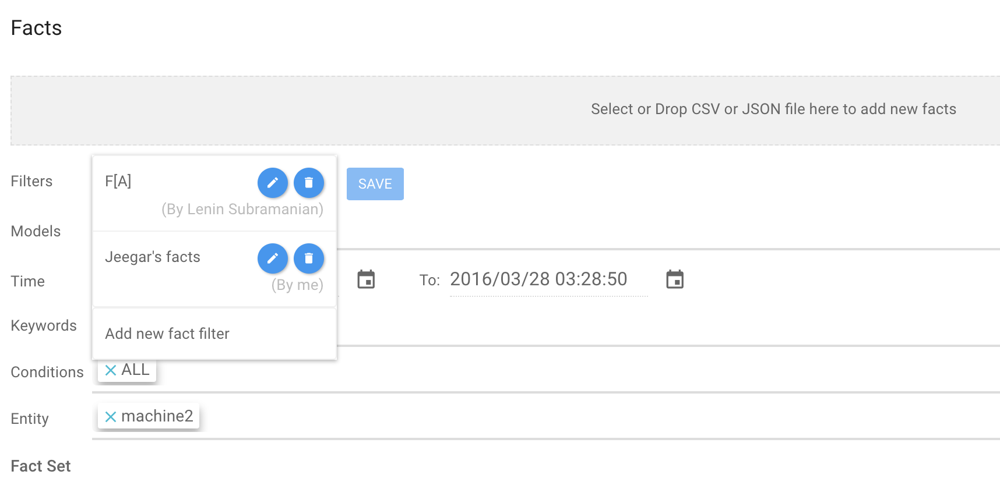

Deprecated Models
~~~~~~~~~~~~~~~~~~~~

As Falkonry technology evolves existing models created may need to be deprecated.
At times a user may notice that certain models have the following icon 
   
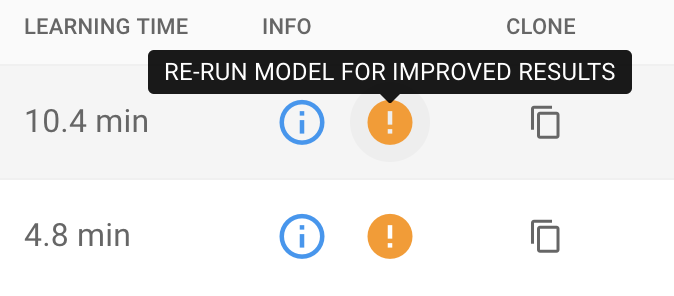

This only suggests that Falkonry updates have happened since the time of this model creation and re-running the model would possibly yield improved results. In such cases, Falkonry strongly suggests rerunning the model. A quick way to re-run a model is by using the *cloning* functionality mentioned below.

A model is classified as deprecated when Falkonry technology has evolved since the original model was created such that it is likely that the original model may not deliver the same results. At Falkonry, the effort is constantly towards improving our condition classification capabilities. This would suggest that recreating the model could potentially result in improved classifications. 

A deprecated model essentially suggests that a user cannot perform the following:
 - Apply the model on more/ new data using the old model
 - Live streaming 

Existing results persist on the Falkonry UI and you can see your original results anytime.

To be able to apply the model to additional data, the user should recreate the model. A quick way to regenerate this model is by using the “clone” button (next to the Deprecation symbol) that helps with model creation process by remembering the model selections made in the deprecated model.

Assessment Timeline View
==========================

Selecting Signals for display
-----------------------------

Signal drawer allows the user to select a list of signals to display. The signals can be viewed either in their original *Raw* form or in an *Interpolated* format post Falkonry sampling and processing of the signals. 
Users can see the signals in discrete points or as connected signals. 

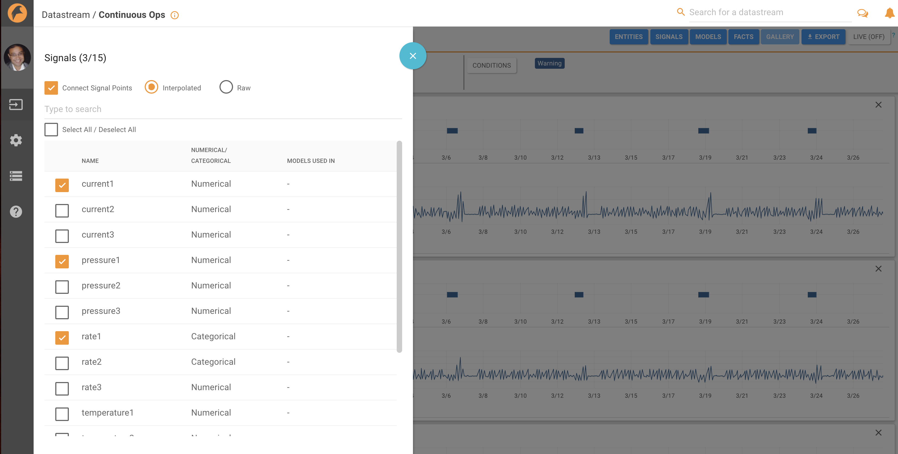

Selecting Entities for display
-------------------------------

Entities may be selected for display in this drawer. Similar to the Signals drawer, a search utility can help search through and shortlist a longer list of entities. Each entity selection will enable the display of selected signals, assessment output and facts associated with that entity.

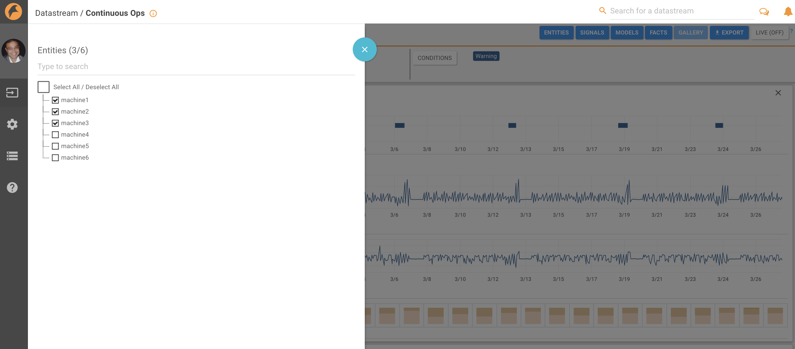

Note: clicking on the **X** closes the drawer but also retains the state of entity/ signal selections. These selection persist when the user opens the drawer again.

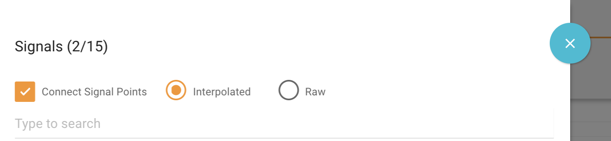

Viewing Assessment results and facts on the timeline view
-----------------------------------------------------------

The timeline view consists of several cards, each associated with a particular **Entity** selected for display from the **Model drawer**.

- M[n] displays the assessment output based on Model "n"
- F[n] displays the facts used for creation of model M[n]
- Each signal (selected for display from Signals panel) associated with the Entity
- Fact snapshots created using **Fact Filters**, see :ref:`factfilters`
- Model training ranges (displayed as a red line between M[n] and F[n])

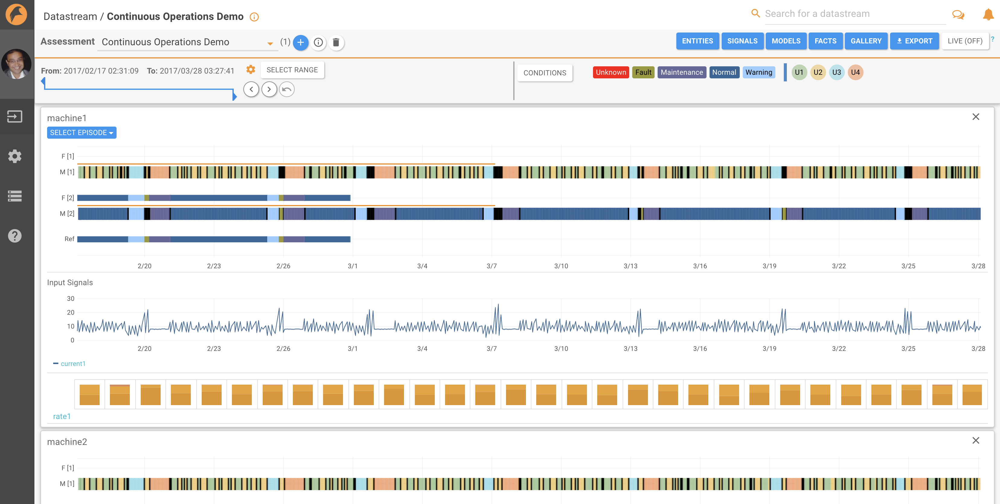

Assessment summary statistics that provide a percentage distribution of the different assessment conditions can be turned on from the Models drawer

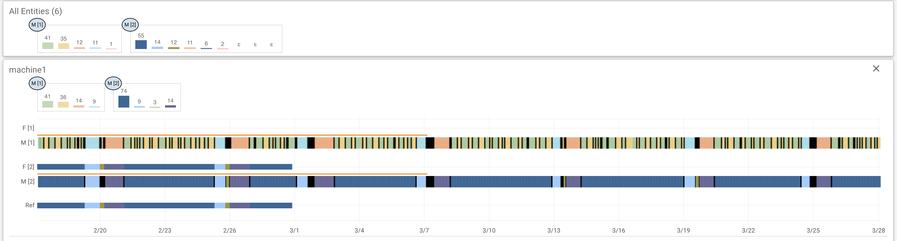

Certain segments of the assessment timeline are colored "black". This simply indicates a higher density of conditions with a small time range given the the entire width of the range selected for display. For example, in the image below one can see "Fault" and "Normal" conditions in the tooltip annotation for the black segment.
    
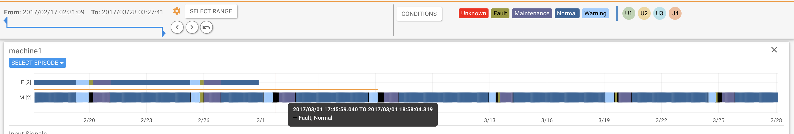

Zooming in into this segment will resolve the clustered display of conditions as shown. To zoom in, simply click the left mouse button and drag across the range that you would like to zoom into. 

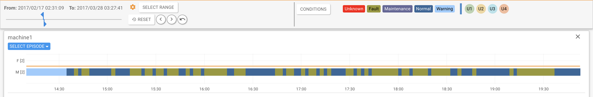

Selecting Episodes
-------------------

Once assessment results are available on the timeline view, a user may want to select specific episodes/ segments by clicking and dragging the mouse over of the assessment output:
  1. Zooming in to evaluate and observe specific events with more granularity
  2. Adding facts over specifc time ranges
  3. Deleting facts over specific time ranges
  4. Adding episodes to the Episode Gallery for further inspection and analysis of assessment results (more on this :ref:`explanations`)

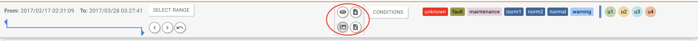

A user can select to be in one of 4 modes to be able to select segments for performing the above tasks. The default selection is for being able to view, pan and zoom into the assessment output.

An example of adding episodes to the Episode Gallery is discussed (:ref:`explanations`)

To walk through an example of adding Facts on the timeline view, simply select the button "Add a fact" to choose to be in Fact addition mode.

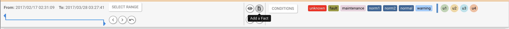

Next, click and drag the mouse pointer over the time range segment of interest on the assessment output to highligh the segment. A dialog box presents itself. Add the condition wanrning and give it a Keyword (optional) to help you tag or identify this fact.
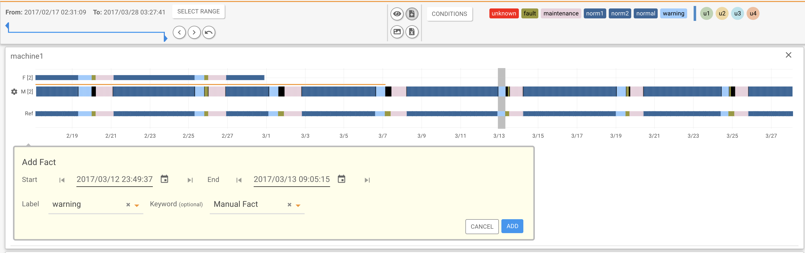

Here, we are trying to confirm a segment to be of condition type "warning". When you create a new fact view/ snapshot with the Keyword specified when creating the fact, the manually added fact is presented as shown.

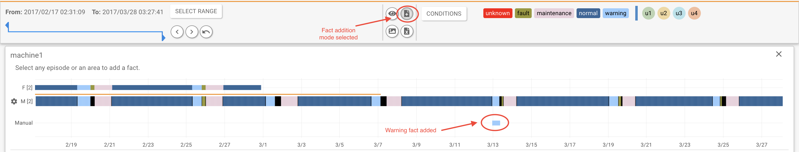

.. _selectingtimerange:

Selecting time ranges on timeline view 
-----------------------------------------

The **Time Range** button can help a user easily navigate to a specific start and end time in the timeline view. Time ranges are saved so that they may be easily accessed at a later point in time. 

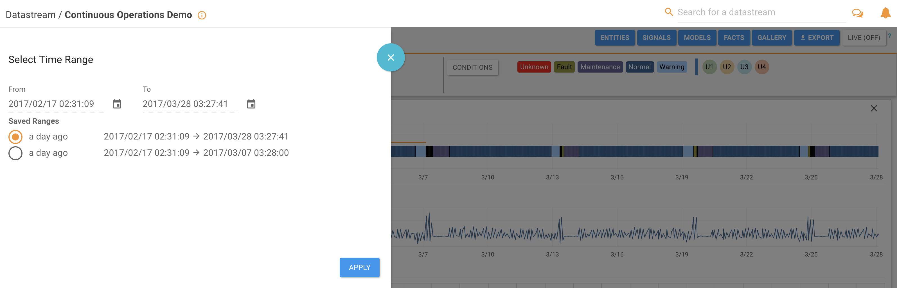
*Start and End time selectors* can be used to change the time range by sliding the mouse pointer. Once zoomed in, the entire time range can be *panned* left or right. Often times a user may find it useful to be able to revert to the previous zoom level or time range selection. The *Revert time range* icon serves this functionality.

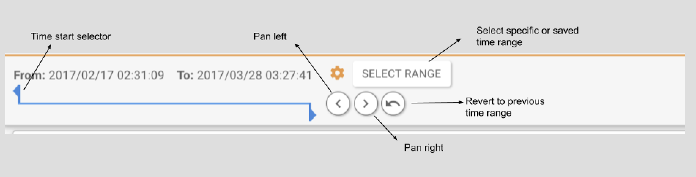

Once a smaller time range is selected, the user needs to *confirm or reject* the new time range to mark completion of time range selection. This will initiate rendering the new time range on the timeline view.

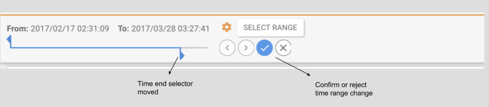

Upon confirming the new time range, the user now also have the option to reset to the full extent of the previous time range by clicking on *Reset button*.

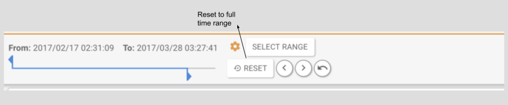

Selecting time ranges and entities for model apply
----------------------------------------------------

Section (:ref:`modellearning`) discusses how the model can be applied for a specific set of entities across a given time range during model creation time.

Any model can be applied across a previously selected time range (:ref:`selectingtimerange`) on any set of entities post model creation.

In the image below, a gear icon in "orange" color |orange_gear| suggests that the assessment output for model M[8] does not exist while the "dark gray" gear icon |gray_gear| suggests that the assessment output for model M[3] exists as displayed in the corresponding swim lane.
To generate assessment output for M[8] or to apply the model for the given time range for entity *machine 1* the user can click on the orange gear **Apply model** icon. 

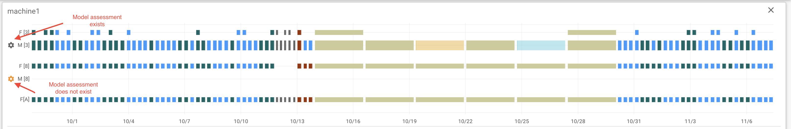

On clicking the gear icon a form (as shown below) the user is asked to confirm if he / she would like to apply model **M[8]** for given time range (range selected on timeline view) on **machine 1** for 
Clicking on **Apply** initiates the model apply process.

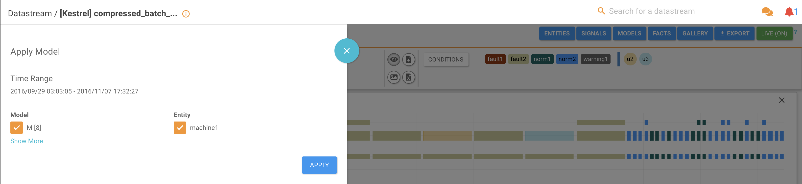

If the user would rather initiate model apply on some combinations of models and entities, selecting the *Show More* option should reveal a list of models and entities. Checking the boxes for some selection of models and entities allows the user to quickly apply these models on the selected entities for the time range displayed on the window.
Note: This selection is a cross-product of models and entities each producing an assessment output on the timeline view.

.. image:: images/model_apply3.png

Once the model apply completes, the corresponding assessment output is displayed on the timeline view and the gear icon changes to dark gray.

Initiating model apply from a dark gray gear icon (model apply exists) simply checks to see if new data exists for the given time range and accordingly recomputes the assessment output. Else it simply retains the current assessment.  

Inspecting and analyzing assessment episodes
=============================================

Post model creation users are often interested in analyzing the assessment output in greater detail. Falkonry enables the user to do this within the **Episode Gallery**.

Specific episodes or segments of the assessment may be selected to be posted into a **Gallery** for further investigation. Here, the user has the ability to view and inspect the following:

- Assessment episode with specific assessment points determined/ spread by the Assessment Rate
- Fact line for the same time range as the episode selected
- Signals associated with the assessment
- Signal window sizes overlaid on top of the signal plot (in case of Sliding windows)
- In case of Batch windows, the entire batch segment is selected for display determined by the size of the fixed/ batch window
- Batch identifier of the selected batch for Batch datastreams
- Understanding correlations between assessment outcome and the input signals (more on this :ref:`explanations`)

.. _explanations:

Episode Gallery
----------------

An assessment episode can be selected from the timeline view by selecting to be in the **Select Episode** mode by clicking on the "Save to Gallery" button as shown on the timeline view

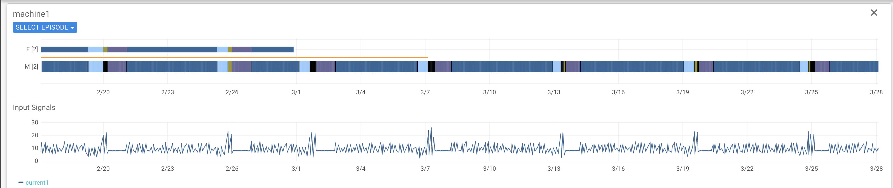

Select a segment from the timeline view by dragging the mouse over the timeline

In the dialog box that opens up, add a description (optional) and select an **Episode View** to save the segment into. An Episode View is a gallery of selected episodes that a user may have collected for simultaneous investigation.
Multiple episode views can be created by each user.

.. image:: images/gallery3.png

Notice that the **Gallery** button has an updated count of *unviewed* episodes suggesting that an episode was added to the gallery.

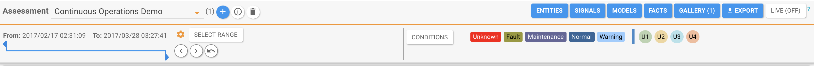

Within the Gallery, a card shows the recently added episode. The user can switch between different views of the gallery. Signals can be added in the gallery and corresponding signal plots present themselves for the selected episode.
Note, the shaded windows overlaid on the signal plots. These depict the historical window sizes determined by Falkonry for model creation and inference. Each vertical line is illustrative of an assessment point. Click on any of these assessment points will present the corresponding historical window size for each of the signal plots.
Assessment points can be panned left/ right and the episodes can be zoomed in/ out by using the *Viewer Width*.

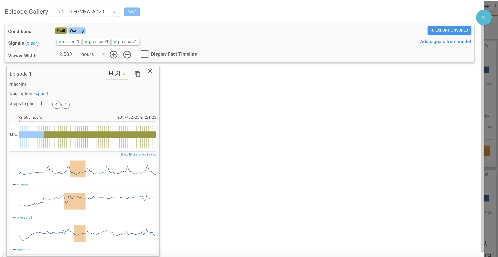

Multiple episode can be added to a gallery view. This is a useful when comparing multiple episodes. An episode card can be *cloned* and the model assessment can be changed by selecting a different model as shown below. 

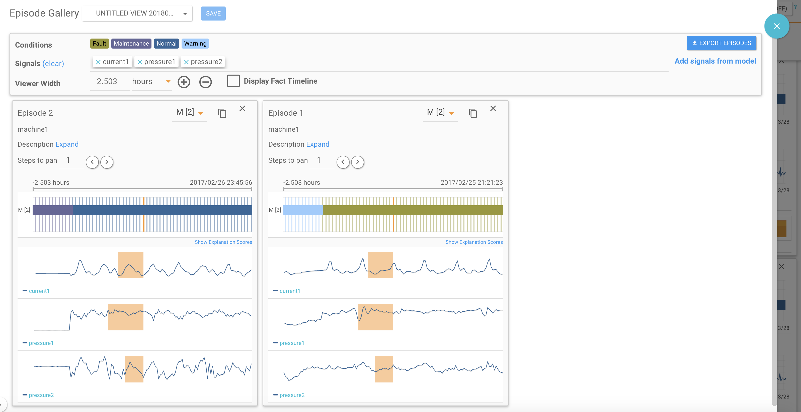

In case of *Batch* datastreams, the episode selector will automatically zoom into the exact size of the batch/ fixed window size. Since each batch can only have one assessment outcome, only one batch with one condition will be displayed as shown.
A batch identifier annotated into the tooltip help identify the batch being investigated.

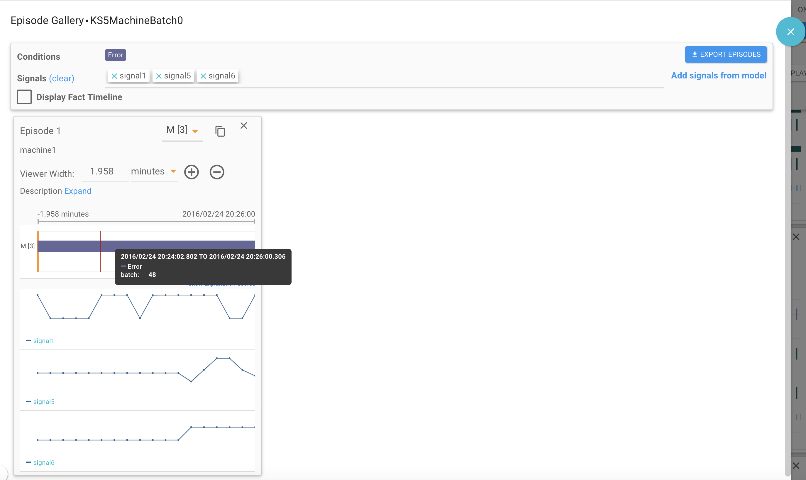

Sharing Episodes with colleagues on the same account
+++++++++++++++++++++++++++++++++++++++++++++++++++++++

Similar to *sharing facts* with colleagues on the same Falkonry account, Episode gallery views may also be shared and accessed across other users. An *Episode View* selector allows a user to select from a list of episode views that may have been created by other users. The list of gallery views also lists the name of the user that created this episode gallery view. Users *may edit* each others views. To *view a user's updates* the *Gallery* browser needs to be closed and opened again.
This encourages collaboration across users especially when sharing certain episodes of interest. Episode views names can be updated to provide better context. 

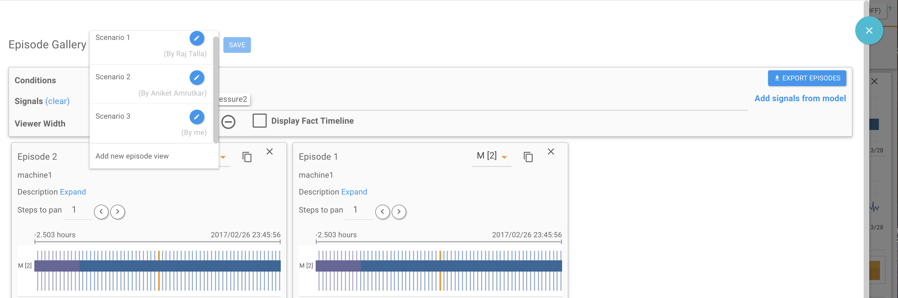

Explanations
--------------

| *Formulation*: Explain which signals are most/least associated with a given prediction / outcome
|
| *Motivation*: Once a condition is known, there is often a desire to understand what may be causing this condition. Explaining the relative contribution of different signals provides a useful tool to that end
|

Clicking on the **Show Explanation Scores** flips the episode card to replace the signal plots with the Explanation scores. Scores range from +1 to -1.

| A **higher score (+1)** suggests a **higher correlation** of the particular signal with the assessment outcome associated with the assessment point currently selected. In other words, the signal had a higher impact on determining the classification of the episode at the current assessment point.
| 
| A **lower score (closer to 0)** suggests a **lower correlation** of the particular signal with the assessment outcome associated with the assessment point currently selected.
|
| A **high negative score (-1)** suggests a **high correlation** of the particular signal with a **classification other than** the classification associated with the assessment point currently selected.

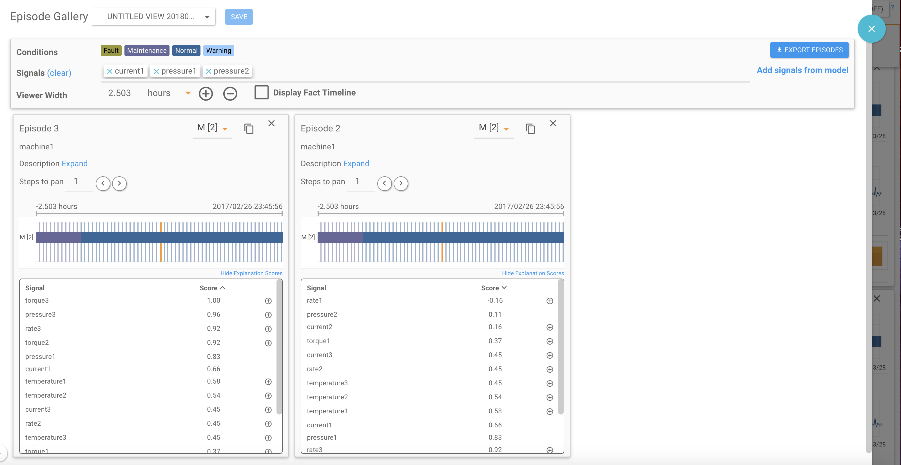

This signal list can be ordered in ascending or descending order. This list is comprehensive of all the signals in the datastream, however only 10 signals can be plotted on the episode card. To add a signal plot (not originally selected from the *Signals* selector), a user can click on the **+** sign next to the signal name on the Explanation score list to have it appended to the Signal list.
Flipping the card by clicking on *Hide Explanation Scores* should now show the signal plot of the newly added signal.

Exporting datastream, assessments and facts
=============================================

All timeline related export/ download functions can be managed from the **Exports** button. Specific filters allow the user to narrow down the context or extent of the datastream.
A user can select between JSON and CSV formats for each of the following

Exporting Datastream
-----------------------

All the input signals may be exported in CSV or JSON format filtered on time range, list of entities and signals.

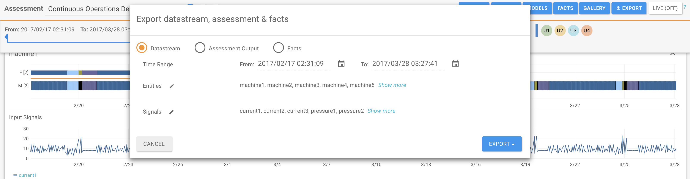

Exporting Assessment
-----------------------

The *current* assessment output be exported in CSV or JSON format filtered on time range, model and list of entities. The output would constitute of an assessment time, entity and assessment result. In case of a *Batch* datastream, a batch identifier will also be identified.

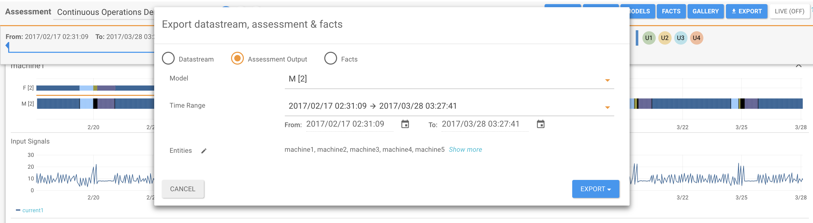

Exporting Facts
-----------------------

Facts can be exported as *Raw* or *Effective* in JSON/CSV format. Raw facts as the name implies are "raw" or as ingested. Effective facts on the other hand are facts "visualized/ seen" by a model and resolve overlaps in time.
In case of facts, several filters may be applied such as Model, Time range, Keywords, Conditions, Entity. Batches of facts (based on upload time) or individual facts may be selected or deselected after application of the filters.
A saved fact filter may also be applied which has specific filters already applied to determine the fact set.

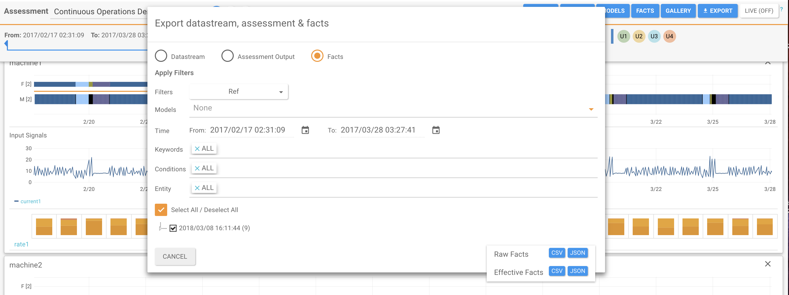

