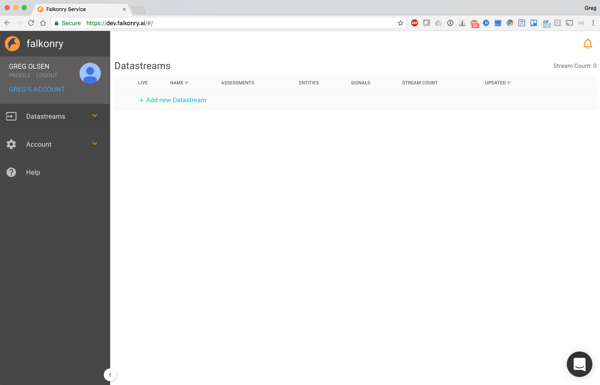
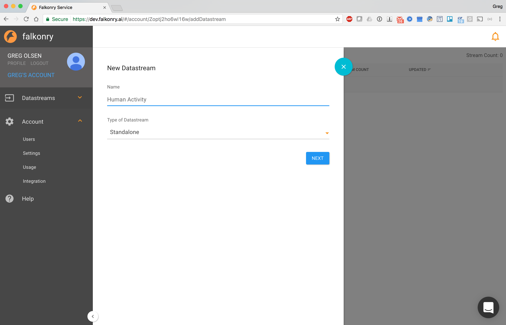
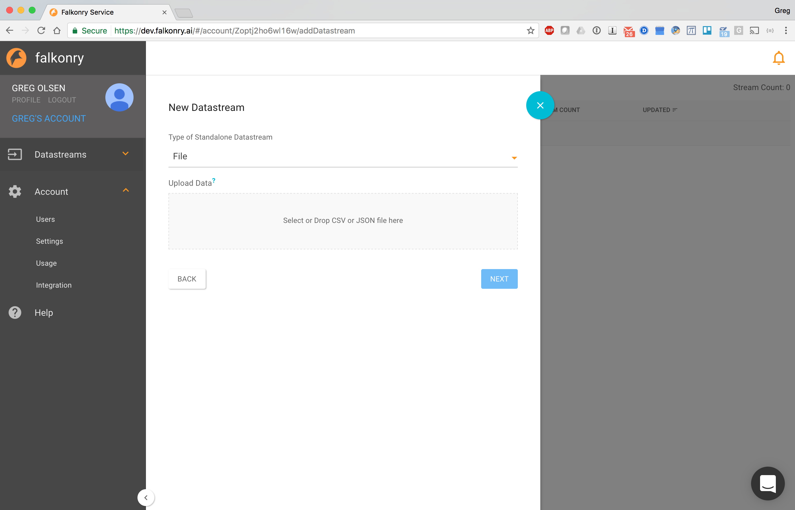
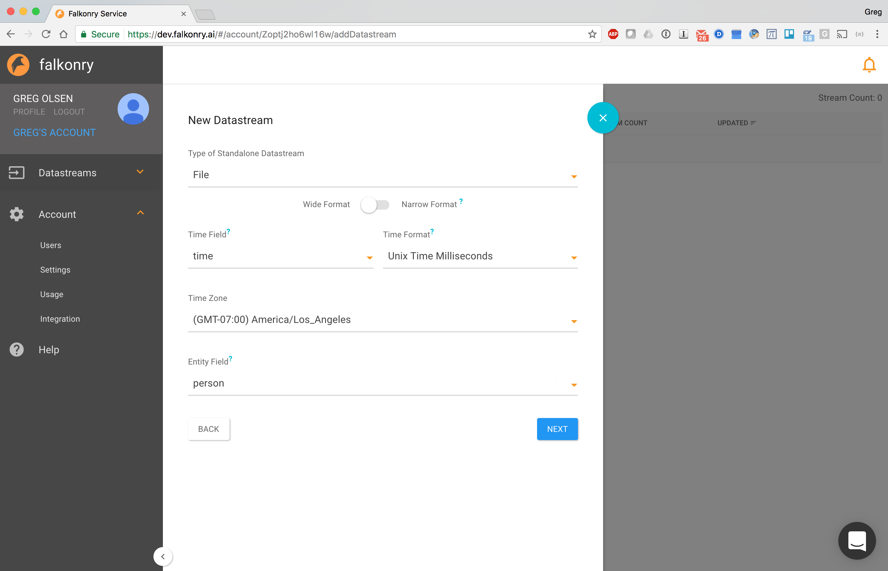

Stand-alone Mode for Falkonry Server
====================================
The Falkonry Server supports a 'Stand-alone Mode' to facilitate easy exploration of pattern recognition from file-based historical data. In this mode, a user manually creates Datastreams and uploads historical window data files. The user can execute all functions of the Falkonry Server except for live streaming. A new stand-alone datastream is created by clicking on the '+ Add new Datastream' link.

A dialog will allow the user to choose a name, select a file, disambiguate file structure, and clarify signal and entity interpretations.

Data Format Requirements for Stand-alone Mode
---------------------------------------------

Falkonry upload of files in CSV (comma separated values) and line-delimited JSON_ formats. Every file must have a timestamp column. Additionally, all the values used in the data file must have the same structure, i.e., the same set of attributes and their data types. Also, the file may contain UTF-8 characters.

.. _JSON: http://jsonlines.org/

Identifying time
~~~~~~~~~~~~~~~~

In Falkonry, every record is used to convey data for a single instant or interval of time. 
Therefore, timestamps must be present on every record provided to Falkonry, which also 
means that your CSV file must have a column representing the timestamp or a JSON property
containing a timestamp value. Within your data file the naming of the timestamp column is 
flexible; the time column will be identified during pipeline creation.

Your timestamp data can be specified using one of the following formats:

- ISO 8601 format. As you can see in this primer on the time format, you can identify timezones, sub-second precision, as well as the regular components on date and time.
- As a Unix-style long integer encoded as the number of seconds since Jan 1, 1970
- As a Unix-style long integer encoded as the number of milliseconds since Jan 1, 1970.
- 12/19/2014 11:22:00 or ``MM/DD/YYYY HH:mm:ss``
- 2015-02-03 12:55:03 or ``YYYY-MM-DD HH:mm:ss``
- Any timestamp format that can be described using `Java SimpleDateFormat 
  <https://docs.oracle.com/javase/7/docs/api/java/text/SimpleDateFormat.html>`_

When supplying facts data, you must also supply a second time column called end. 
This column is used to mark the end of the interval for which the record provides values.

Identifying entities
~~~~~~~~~~~~~~~~~~~~~

Often your Falkonry data will correspond to more than one "entity", such as a process, a machine,
a device, a computer, or a subject.  You may have several turbofan motors that you are monitoring, 
or you may be collecting activity data from many people. If you have data for multiple entities, 
you must have a column of data which represents your entity identifier, or the entity must be 
part of a tag.  The column that is used to identify entities can be named as appropriate for the 
data set.  During pipeline creation, Falkonry will identify this column and the user will verify 
the selection.

Wide vs. Narrow
~~~~~~~~~~~~~~~

CSV and JSON data can each be formatted in wide or narrow format for the input data. Wide files contain one line for each timestamp that have all of the values whereas narrow files only have a single value per each line. Narrow files concatenate the variables into a single tag.

Wide format
...........

**CSV Example**

Data used in the Human Activity example looks like this::

  time, person, T_xacc, T_yacc, T_zacc
  1452030355080, p1, 7.9469, 0.29302, 5.604
  1452030356020, p1, 8.5439, 0.46781, 5.432

**JSON Example**

The same data but formatted in line-delimited JSON would appear like the following::

  {"time": 1452030355080, "person": "p1", "T_xacc": 7.9469, "T_yacc": 0.29302, "T_zacc": 5.604}
  {"time": 1452030356020, "person": "p1", "T_xacc": 8.5439, "T_yacc": 0.46781, "T_zacc": 5.432}
  
where ``1452030355080`` is the time value, ``p1`` is the person identifier, and so on.  
The columns after the person column are the raw source data or signal data which Falkonry 
inspects and monitors to provide meaningful condition assessments. The column names in the 
header can be anything, because the user identifies the time and entity columns for Falkonry when 
creating an event buffer.

Narrow Format
.............

**CSV Example**

In this format the Human Activity data would appear as::

  time, person, signal, value
  1452030355080, p1, T_xacc, 7.9469
  1452030355080, p1, T_yacc, 0.29302
  1452030355080, p1, T_zacc, 5.604
  1452030356020, p1, T_xacc, 8.5439
  1452030356020, p1, T_yacc, 0.46781
  1452030356020, p1, T_zacc, 5.432

**JSON Example**

Rows of data in a narrow JSON file would look like::

  {"time": 1452030355080, "person": "p1", "signal": "T_xacc", "value": 7.9469}
  {"time": 1452030355080, "person": "p1", "signal": "T_yacc", "value": 0.29302}
  {"time": 1452030355080, "person": "p1", "signal": "T_zacc", "value": 5.604}
  {"time": 1452030356020, "person": "p1", "signal": "T_xacc", "value": 8.5439}
  {"time": 1452030356020, "person": "p1", "signal": "T_yacc", "value": 0.46781}
  {"time": 1452030356020, "person": "p1", "signal": "T_zacc", "value": 5.432}

note that each line only has a single data value. 

The **Entity Field** is ``person`` that identifies the person.

The **Signal Field** is ``signal`` that identifies the signal.

The **Value Field** is ``value`` or the location of the numerical or categorical readings.

Numerical vs Categorical
~~~~~~~~~~~~~~~~~~~~~~~~~~

Categorical data: Categorical data represent characteristics such as a person's gender, marital status, hometown, or the types of movies they like. Categorical data can take on numerical values (such as “1” indicating male and “2” indicating female), but those numbers don't have mathematical meaning.

Numerical data: Numerical data carries values that are measures of certain fields (such as Temperature, Pressure, Current, e.t.c.)

