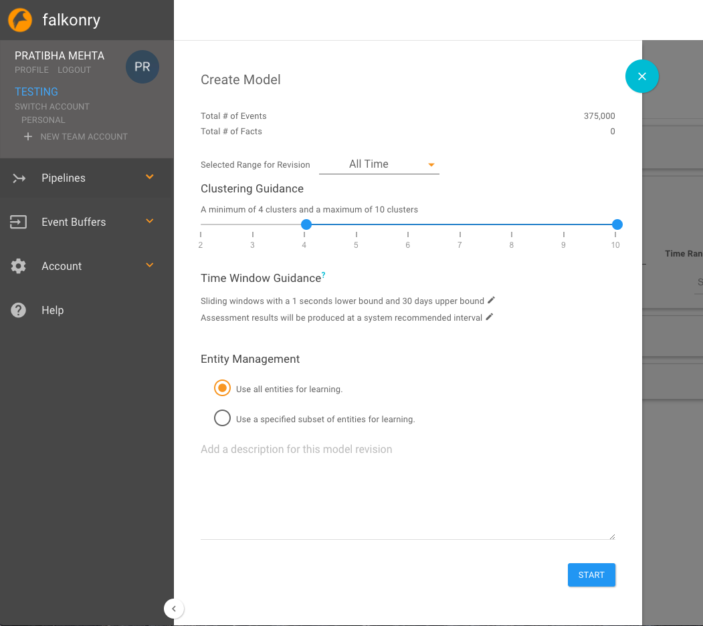

Learn
=====
Learning allows Falkonry to create a model of the assessments so it it able to generalize
results for future data.
A model can be created by clicking on Create Model button on the Learn Tab. The Create Model panel provides all the options before a model revision is started:

Clustering Guidance
-------------------

Clustering guidance helps you select no. of unlabeled conditions you want Falkonry to detect after learning.

Start Model Revision
--------------------

After creating the pipeline, the user instructs Falkonry to create a model revision from 
the data provided, and views the results.

.. raw:: html

   <iframe src="https://player.vimeo.com/video/168553122" width="500" height="281" frameborder="0" allowfullscreen=""></iframe>

Since no verified condition facts were provided, the pipeline gave placeholder names 
to different conditions in the data that it identified.

Learn some more
---------------

After the initial model was created, the user can add facts in the `Facts <./fact.html>`_ tab.
Then the user initiates another model revision that will incorporate the provided verified 
conditions.

The new results show labeled conditions across the whole time window.  At this point 
there are still a few conditions that are unrecognized and that maintain computer 
generated condition labels. 

Falkonry can also learn from data and facts in the  After the initial 
model was created, the user can add facts in the `monitor <./monitor.html>`_ stage by generating 
another revision.

