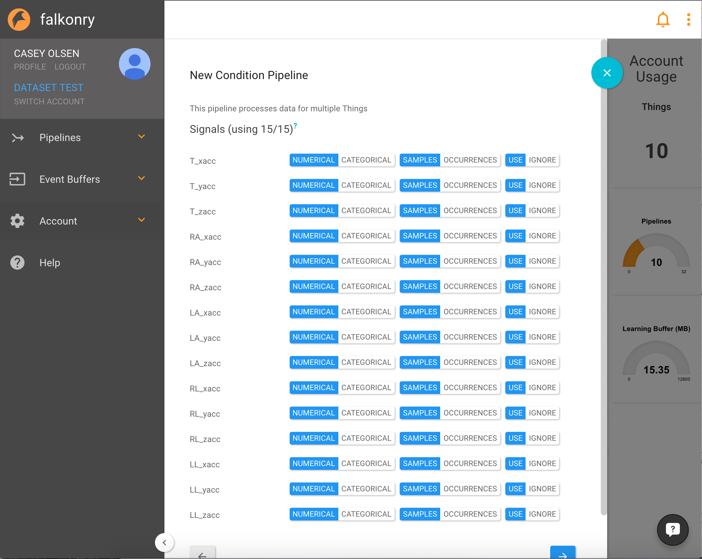
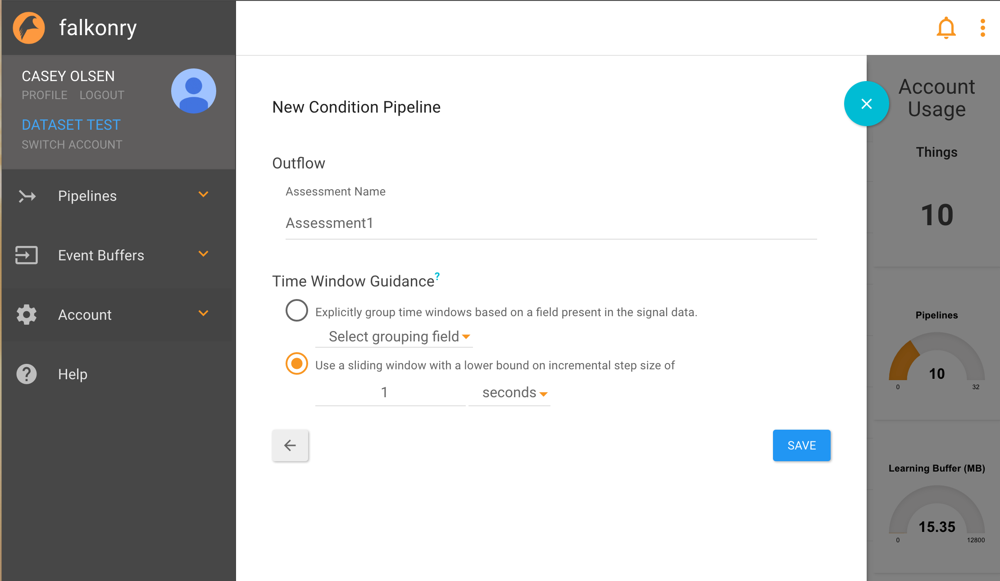

Pipeline Creation
=================

In order to create a pipeline, the user must select an event buffer. Multiple pipelines can share the same event buffer. After the event buffer is selected Falkonry will display the signals it analyzed.

Falkonry displays the characteristics of each signal it identifys and allows the user to **use** or **ignore** any of the sensors in the data. In the Human Activity data example, all the signals are numerical samples.

Falkonry asks what is being accessed, in the case of the Human Activity example, it is what activity is being performed. 

Time Window Guidance

Conditions Assessments can be based on either a Sliding or Fixed time window perspective.  A sliding window is typically most appropriate, and provides for continuous assessment across time.  The Falkonry engine automatically determines the window sizes used for feature recognition for each of the supplied signals. The user, however, can control lower and upper bound settings on window size in order to exclude ranges that aren’t useful for the analysis (e.g. if conditions can only be be used at an hourly arrival rate, there is no need to produce assessments every second).

If a Fixed Window perspective is chosen, a grouping field must be provided.  This perspective is appropriate when condition assessment comparison is only meaningful at particular reference points - e.g. looking at the condition of a rail switch after each switching event, or comparison of cycles of an operating machine
