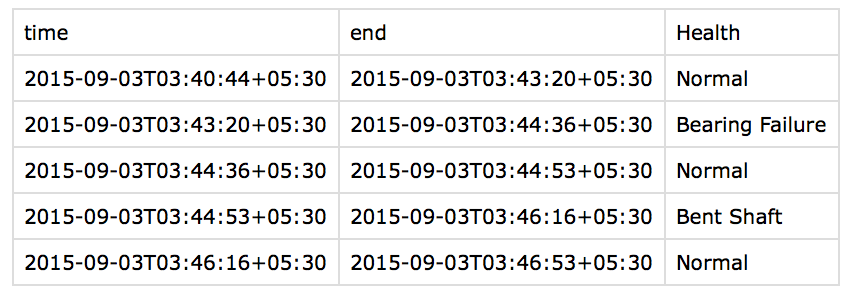

Verify
======

Verified condition examples are used by the Pipeline to apply meaningful names to 
conditions and to refine learning in order produce better condition recognition.

A condition example is simply a condition value (a label) for a given time interval, for a 
given Thing ID. 

Example conditions can be added to the Pipeline in the following ways:

- File upload via UI or API
- Direct entry into Falkonry Service UI
- Use of a client application like the Falkonry Splunk App

File upload via UI or API
-------------------------

A set of verified examples can be added to a Pipeline through a simple CSV file.  The file 
must contain a header row with the fields, 'time', 'end', the Thing field name (which must 
match the field name supplied to the Pipeline at setup), and one or more Assessment names 
(matching Assessments already configured in the Pipeline).

The figure below shows an example file to upload a set of verified conditions for the 
Assessment ``Health``.

For a more detail regarding how to format data files for use with Falkonry, 
please refer to `Data Formats <file:///Users/olsen/repos/support/docs/_build/html/using/data.html#data-formats>`_.

In the Falkonry Service UI the Manage Verification button (available on Learning and 
Outflow tabs) is used to view all previously entered examples and upload new examples 
contained in verification files. 

.. raw:: html

   <iframe src="https://player.vimeo.com/video/168553120" width="500" height="281" frameborder="0" allowfullscreen=""></iframe>

Direct entry into Falkonry Service UI
-------------------------------------

Sometimes it is most convenient to add verification directly while viewing detailed 
assessment results for a specific Thing. For example, the user examines the available 
maintenance or inspection logs and is able to verify some example conditions. Users 
are directly able to add individual example conditions from the Thing detail view as 
shown in the figure below.  This dialog is invoked by clicking the Add Verification 
Example button.

.. raw:: html

   <iframe src="https://player.vimeo.com/video/168709192" width="500" height="281" frameborder="0" allowfullscreen=""></iframe>

Via a client application like the Splunk App
--------------------------------------------

Falkonry's Splunk App provides a direct way for users to add verification from within their 
Splunk user experience.  **Add Verification** is an available action for any Event Buffer 
visible on the **Data Exports** list.  Invoking that action produces a dialog shown in the figure 
below that lets a user create a set of verified condition examples from a Splunk search query.

.. image:: ./images/splunk_verification.png
